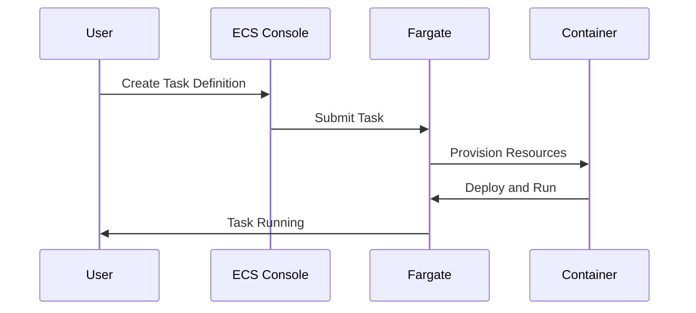

## Introduction to AWS Fargate

AWS Fargate is a serverless compute engine for containers that allows you to run Docker containers without having to manage the underlying infrastructure. This means you can focus on building and deploying applications rather than managing servers, clusters, or other infrastructure components. In this section, we will delve into the details of how Fargate works, its benefits, and how it integrates with Amazon Elastic Container Service (ECS).

### What is AWS Fargate?

AWS Fargate is a technology that enables you to run containers without having to provision or manage servers. Instead of creating and configuring EC2 instances, you simply provide your container image and specify the resources it requires. Fargate handles the rest, including provisioning the necessary resources and ensuring your containers are running smoothly.

#### How Does Fargate Work?

Fargate operates as a serverless compute engine, which means it abstracts away the underlying infrastructure management tasks. Here’s a step-by-step breakdown of how Fargate works:

1. **Container Definition**: You define your container using a task definition, which specifies the container image, CPU and memory requirements, and other parameters.
2. **Task Submission**: You submit the task to Fargate through the ECS console, CLI, or SDK.
3. **Resource Provisioning**: Fargate analyzes the task definition and provisions the required resources (CPU, memory, storage) on-demand.
4. **Container Execution**: Once the resources are provisioned, Fargate deploys and runs the container.
5. **Monitoring and Scaling**: Fargate continuously monitors the container and scales resources as needed.

### Benefits of Using Fargate

Using Fargate offers several advantages:

- **No Server Management**: You don’t need to manage servers, clusters, or other infrastructure components.
- **Scalability**: Fargate automatically scales resources based on demand.
- **Cost Efficiency**: You pay only for the resources used, with no upfront costs.
- **Ease of Use**: Simplifies the process of deploying and managing containerized applications.

### Integration with ECS

Fargate integrates seamlessly with Amazon ECS, which is a highly scalable, high-performance container management service. ECS manages the execution of Docker containers across a cluster of Amazon EC2 instances or Fargate. By using Fargate with ECS, you can leverage the benefits of both services.

#### Task Definitions

A task definition is a JSON document that describes one or more containers that form a task. It includes details such as the container image, CPU and memory requirements, environment variables, and more. Here is an example of a task definition:

```json
{
    "family": "web-app",
    "containerDefinitions": [
        {
            "name": "web",
            "image": "my-web-app:latest",
            "cpu": 256,
            "memory": 512,
            "portMappings": [
                {
                    "containerPort": 80,
                    "hostPort": 80
                }
            ]
        }
    ],
    "requiresCompatibilities": ["FARGATE"],
    "networkMode": "awsvpc"
}
```

### Deployment Process

To deploy a container using Fargate, you follow these steps:

1. **Create a Task Definition**: Define the container and its resource requirements.
2. **Submit the Task**: Use the ECS console, CLI, or SDK to submit the task to Fargate.
3. **Monitor the Task**: Use the ECS console or CLI to monitor the status of the task.

Here is an example of submitting a task using the AWS CLI:

```sh
aws ecs run-task --cluster my-cluster --task-definition my-task-definition --launch-type FARGATE --network-configuration "awsvpcConfiguration={subnets=[subnet-12345678],securityGroups=[sg-12345678]}"
```

### Mermaid Diagram: Fargate Workflow

Below is a mermaid diagram illustrating the workflow of deploying a container using Fargate:



### Real-World Example: CVE-2021-20225

CVE-2021-20225 is a critical vulnerability affecting Docker containers. This vulnerability could allow an attacker to execute arbitrary code on the host system. While Fargate abstracts away many of the underlying infrastructure concerns, it is still important to understand how vulnerabilities like this can affect your deployments.

#### Secure Coding Practices

To mitigate risks associated with vulnerabilities like CVE-2021-20225, follow these secure coding practices:

1. **Use Latest Images**: Always use the latest and most secure versions of container images.
2. **Least Privilege Principle**: Ensure containers run with the least privileges necessary.
3. **Regular Updates**: Keep your container images and dependencies up to date.

Here is an example of a vulnerable and secure task definition:

**Vulnerable Task Definition:**

```json
{
    "family": "web-app",
    "containerDefinitions": [
        {
            "name": "web",
            "image": "my-web-app:old-version",
            "cpu": 256,
            "memory": 512,
            "portMappings": [
                {
                    "containerPort": 80,
                    "hostPort": 80
                }
            ]
        }
    ],
    "requiresCompatibilities": ["FARGATE"],
    "networkMode": "awsvpc"
}
```

**Secure Task Definition:**

```json
{
    "family": "web-app",
    "containerDefinitions": [
        {
            "name": "web",
            "image": "my-web-app:latest",
            "cpu": 256,
            "memory": 512,
            "portMappings": [
                {
                    "containerPort": 80,
                    "hostPort": 80
                }
            ],
            "environment": [
                {
                    "name": "SECURE_ENV_VAR",
                    "value": "secure_value"
                }
            ],
            "privileged": false
        }
    ],
    "requiresCompatibilities": ["FARGATE"],
    "networkMode": "awsvpc"
}
```

### How to Prevent / Defend

#### Detection

To detect potential issues, regularly scan your container images for vulnerabilities using tools like Trivy or Clair.

#### Prevention

1. **Use Secure Images**: Always use the latest and most secure versions of container images.
2. **Least Privilege Principle**: Ensure containers run with the least privileges necessary.
3. **Regular Updates**: Keep your container images and dependencies up to date.

#### Secure-Coding Fixes

Compare the vulnerable and secure task definitions above to see the differences in securing your deployment.

### Hands-On Labs

For hands-on practice with AWS Fargate, consider the following labs:

- **PortSwigger Web Security Academy**: Offers practical exercises on securing web applications.
- **OWASP Juice Shop**: A deliberately insecure web application for practicing security skills.
- **CloudGoat**: A series of labs designed to help you learn about cloud security on AWS.

By following these detailed explanations and examples, you should have a comprehensive understanding of how to effectively use AWS Fargate for container management.

---
<!-- nav -->
[[03-Introduction to AWS Elastic Kubernetes Service (EKS)|Introduction to AWS Elastic Kubernetes Service (EKS)]] | [[DevOps/DevOps Bootcamp/05-Containerization (Docker)/01-AWS Container Services Overview (2)/00-Overview|Overview]] | [[05-Introduction to Container Orchestration Tools|Introduction to Container Orchestration Tools]]
