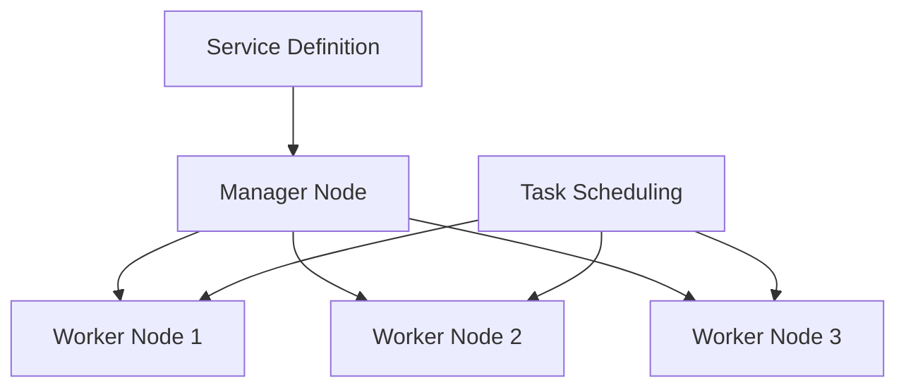
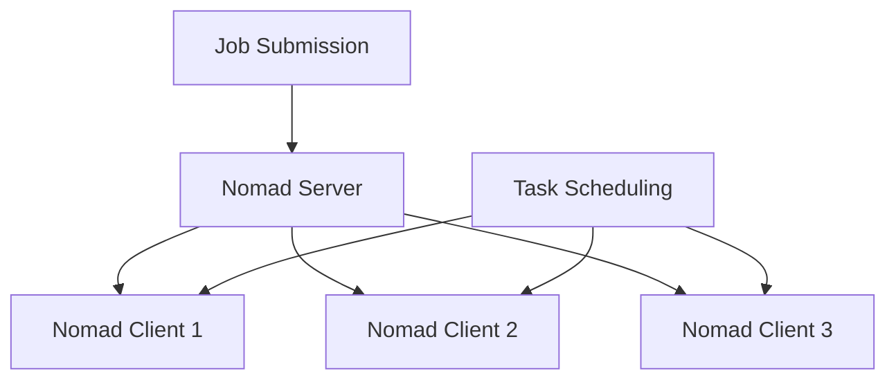
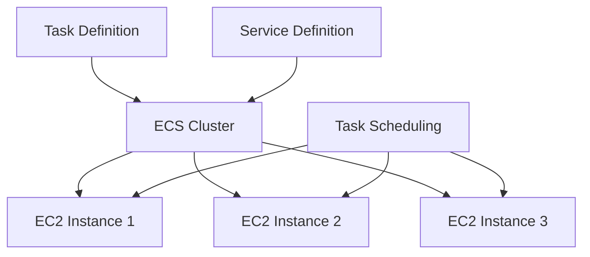

## Introduction to Container Orchestration Tools

Container orchestration tools are essential for managing the deployment, scaling, and management of containerized applications. These tools automate the processes involved in deploying and managing containers across multiple hosts, ensuring high availability, scalability, and efficient resource utilization. In this section, we will delve into several popular container orchestration tools, including Docker Swarm, Apache Mesos, HashiCorp Nomad, and Amazon Elastic Container Service (ECS).

### Docker Swarm

Docker Swarm is a native clustering and scheduling solution for Docker containers. It is designed to be simple and easy to use, making it ideal for smaller-scale applications or environments where simplicity is preferred. Docker Swarm allows you to create a swarm of Docker nodes, which can be managed as a single logical unit.

#### How Docker Swarm Works

When you set up a Docker Swarm, you create a manager node and worker nodes. The manager node is responsible for orchestrating the deployment and management of containers across the worker nodes. Here’s a step-by-step breakdown:

1. **Initialization**: You initialize a Docker Swarm using the `docker swarm init` command on the manager node.
2. **Joining Nodes**: Worker nodes join the swarm using a token provided by the manager node.
3. **Service Definition**: You define services using Docker Compose files or directly through the Docker CLI.
4. **Deployment**: The manager node schedules tasks (containers) on the worker nodes based on the defined services.
5. **Scaling and Management**: You can scale services up or down, and the manager node ensures that the desired state is maintained.



#### Real-World Example

Consider a scenario where a small startup uses Docker Swarm to deploy a microservices-based application. They might have a few services such as a web frontend, a backend API, and a database. Using Docker Swarm, they can easily manage these services across multiple nodes, ensuring that the application remains available even if one node fails.

### Apache Mesos

Apache Mesos is a distributed systems kernel that provides efficient resource management and isolation across distributed applications. It is more complex than Docker Swarm but offers greater flexibility and scalability.

#### How Apache Mesos Works

Apache Mesos operates on a two-level architecture:

1. **Master-Slave Architecture**: The master node coordinates the allocation of resources among slave nodes.
2. **Framework Layer**: Frameworks such as Marathon or Chronos run on top of Mesos to manage specific types of workloads.

Here’s a detailed breakdown:

1. **Initialization**: Set up the Mesos master and slave nodes.
2. **Resource Allocation**: The master node allocates resources to frameworks.
3. **Task Execution**: Frameworks schedule tasks on slave nodes.
4. **Monitoring and Management**: Monitor the health and performance of tasks and nodes.

```mermaid
graph TD
    A[Mesos Master] --> B[Mesos Slave 1]
    A --> C[Mesos Slave 2]
    A --> D[Mesos Slave 3]
    E[Framework (Marathon)] --> B
    E --> C
    E --> D
```

#### Real-World Example

A large organization might use Apache Mesos to manage a diverse set of workloads, including batch processing jobs, real-time analytics, and containerized applications. By leveraging the flexibility of Mesos, they can efficiently allocate resources and ensure high availability.

### HashiCorp Nomad

HashiCorp Nomad is a flexible and scalable orchestration engine that can manage both containerized and non-containerized workloads. It is designed to be highly resilient and can handle a wide range of applications.

#### How Nomad Works

Nomad operates on a client-server architecture:

1. **Server Nodes**: Manage the cluster and coordinate task scheduling.
2. **Client Nodes**: Execute tasks.

Here’s a detailed breakdown:

1. **Cluster Initialization**: Set up server and client nodes.
2. **Job Submission**: Submit jobs (tasks) to the Nomad cluster.
3. **Task Scheduling**: Server nodes schedule tasks on client nodes.
4. **Health Monitoring**: Monitor the health and performance of tasks and nodes.



#### Real-World Example

An organization might use Nomad to manage a mix of containerized and non-containerized applications, such as a combination of Docker containers and traditional VMs. This flexibility allows them to leverage the strengths of both technologies.

### Amazon Elastic Container Service (ECS)

Amazon Elastic Container Service (ECS) is a fully managed container orchestration service provided by AWS. It simplifies the process of deploying, managing, and scaling containerized applications.

#### How ECS Works

ECS operates on a cluster-based architecture:

1. **Cluster Creation**: Create an ECS cluster to manage a group of EC2 instances or Fargate tasks.
2. **Task Definition**: Define tasks (groups of containers) using task definitions.
3. **Service Definition**: Define services to manage the desired number of tasks.
4. **Task Scheduling**: ECS manages the scheduling and scaling of tasks across the cluster.

Here’s a detailed breakdown:

1. **Cluster Initialization**: Create an ECS cluster using the AWS Management Console or the AWS CLI.
2. **Task Definition**: Define tasks using task definitions, specifying the container images and resources required.
3. **Service Definition**: Define services to manage the desired number of tasks.
4. **Task Scheduling**: ECS manages the scheduling and scaling of tasks across the cluster.



#### Real-World Example

A company might use ECS to deploy a microservices-based application across a fleet of EC2 instances. ECS handles the deployment, scaling, and management of the application, ensuring high availability and efficient resource utilization.

### Creating an ECS Cluster

To create an ECS cluster, follow these steps:

1. **Create an ECS Cluster**:
   - Use the AWS Management Console or the AWS CLI to create an ECS cluster.
   - Specify the type of cluster (EC2 or Fargate).

2. **Define Task Definitions**:
   - Create task definitions using the AWS Management Console or the AWS CLI.
   - Specify the container images, resources, and networking configurations.

3. **Define Services**:
   - Create services using the AWS Management Console or the AWS CLI.
   - Specify the desired number of tasks and the task definition to use.

4. **Task Scheduling**:
   - ECS automatically schedules tasks across the cluster based on the defined services.

#### Full Example

Here’s a complete example of creating an ECS cluster and deploying a service:

1. **Create an ECS Cluster**:
   ```sh
   aws ecs create-cluster --cluster-name my-cluster
   ```

2. **Define Task Definitions**:
   ```json
   {
     "family": "my-task",
     "containerDefinitions": [
       {
         "name": "my-container",
         "image": "nginx:latest",
         "cpu": 1024,
         "memory": 512,
         "portMappings": [
           {
             "containerPort": 80,
             "hostPort": 80
           }
         ]
       }
     ]
   }
   ```
   ```sh
   aws ecs register-task-definition --cli-input-json file://task-definition.json
   ```

3. **Define Services**:
   ```json
   {
     "serviceName": "my-service",
     "cluster": "my-cluster",
     "desiredCount": 2,
     "taskDefinition": "my-task"
   }
   ```
   ```sh
   aws ecs create-service --cli-input-json file://service-definition.json
   ```

4. **Task Scheduling**:
   ECS automatically schedules tasks across the cluster based on the defined services.

### Pitfalls and Best Practices

#### Common Pitfalls

1. **Over-provisioning Resources**: Over-provisioning resources can lead to inefficiencies and increased costs.
2. **Under-provisioning Resources**: Under-provisioning resources can lead to performance issues and downtime.
3. **Inconsistent Configuration**: Inconsistent configuration across services can lead to unexpected behavior and errors.

#### Best Practices

1. **Provision Resources Efficiently**: Use monitoring and scaling policies to provision resources efficiently.
2. **Consistent Configuration**: Use consistent configuration across services to avoid unexpected behavior.
3. **Regular Maintenance**: Regularly maintain and update the cluster to ensure optimal performance.

### How to Prevent / Defend

#### Detection

1. **Monitoring**: Use monitoring tools to detect anomalies and performance issues.
2. **Logging**: Use logging tools to track events and diagnose issues.

#### Prevention

1. **Secure Configuration**: Use secure configuration practices to prevent unauthorized access.
2. **Regular Updates**: Regularly update the cluster to ensure security and performance.

#### Secure Coding Fixes

1. **Vulnerable Code**:
   ```json
   {
     "family": "my-task",
     "containerDefinitions": [
       {
         "name": "my-container",
         "image": "nginx:latest",
         "cpu": 1024,
         "memory": 512,
         "portMappings": [
           {
             "containerPort": 80,
             "hostPort": 80
           }
         ]
       }
     ]
   }
   ```

2. **Fixed Code**:
   ```json
   {
     "family": "my-task",
     "containerDefinitions": [
       {
         "name": "my-container",
         "image": "nginx:latest",
         "cpu": 1024,
         "memory": 512,
         "portMappings": [
           {
             "containerPort": 80,
             "hostPort": 80
           }
         ],
         "logConfiguration": {
           "logDriver": "awslogs",
           "options": {
             "awslogs-group": "/ecs/my-task",
             "awslogs-region": "us-west-2",
             "awslogs-stream-prefix": "ecs"
           }
         }
       }
     ]
   }
   ```

### Conclusion

Container orchestration tools are essential for managing the deployment, scaling, and management of containerized applications. Each tool has its own strengths and weaknesses, and the choice depends on the specific requirements of the environment. Whether you choose Docker Swarm, Apache Mesos, HashiCorp Nomad, or Amazon ECS, understanding how these tools work and how to use them effectively is crucial for ensuring the success of your containerized applications.

### Hands-On Labs

For hands-on practice with AWS ECS, consider the following labs:

- **PortSwigger Web Security Academy**: Focuses on web application security but includes sections on container security.
- **OWASP Juice Shop**: A deliberately insecure web application for practicing web security skills.
- **DVWA (Damn Vulnerable Web Application)**: Another web application for practicing web security skills.
- **WebGoat**: An interactive web application for learning about web application security.

These labs provide practical experience in deploying and managing containerized applications using various orchestration tools.

---
<!-- nav -->
[[04-Introduction to AWS Fargate|Introduction to AWS Fargate]] | [[DevOps/DevOps Bootcamp/05-Containerization (Docker)/01-AWS Container Services Overview (2)/00-Overview|Overview]] | [[06-Introduction to Container Orchestration|Introduction to Container Orchestration]]
