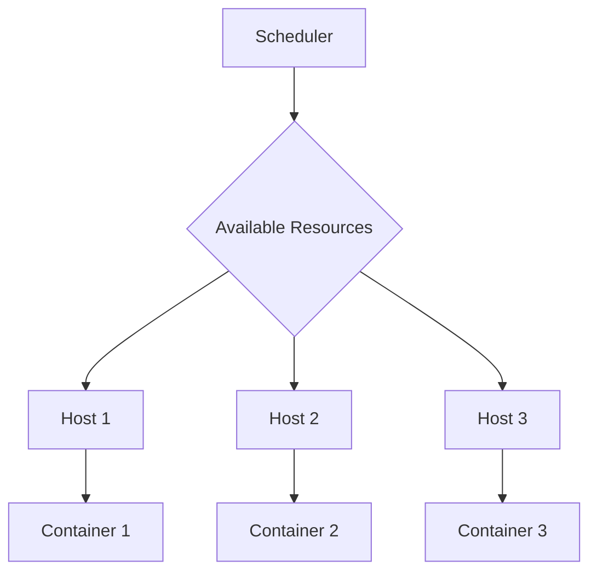
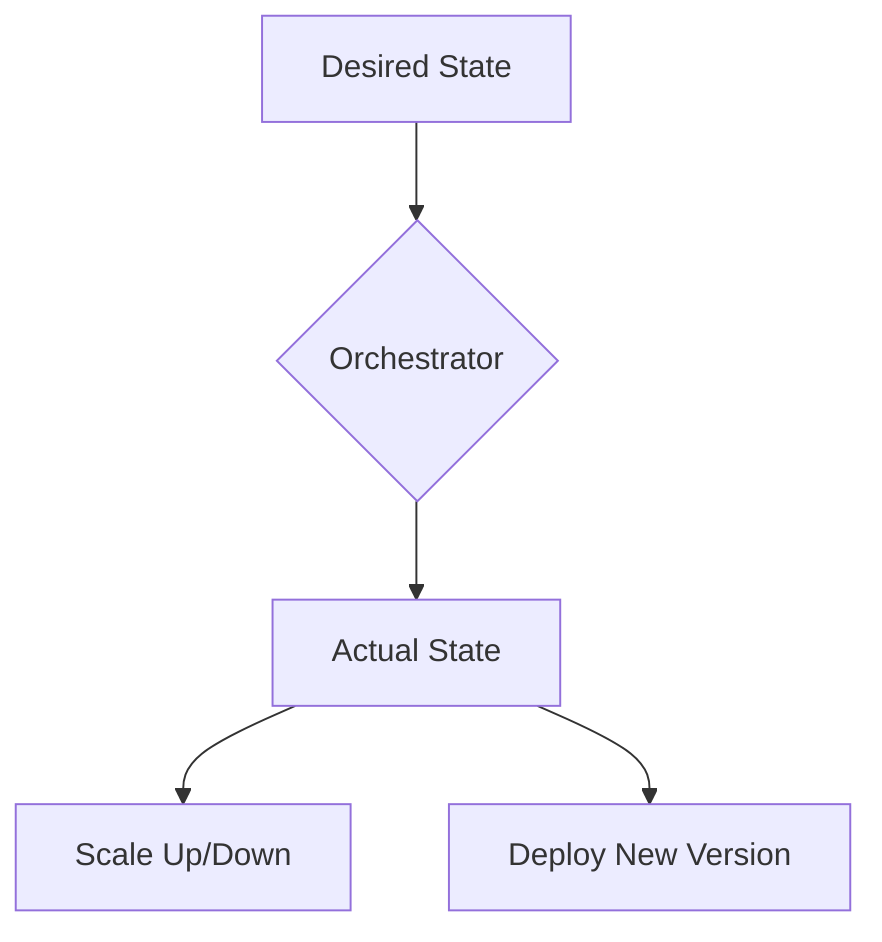
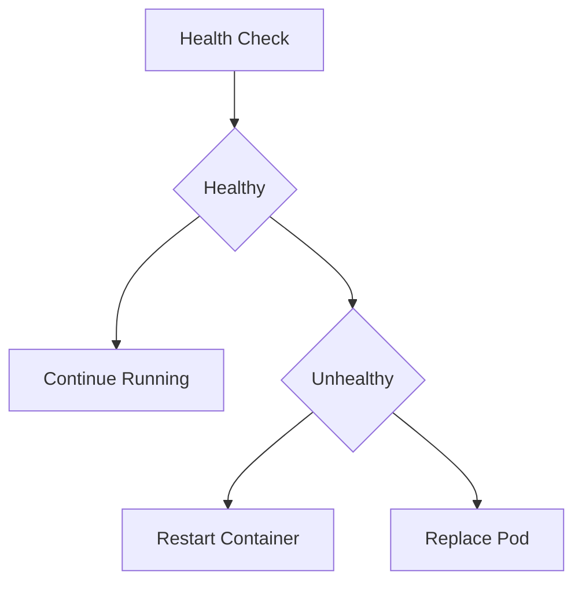
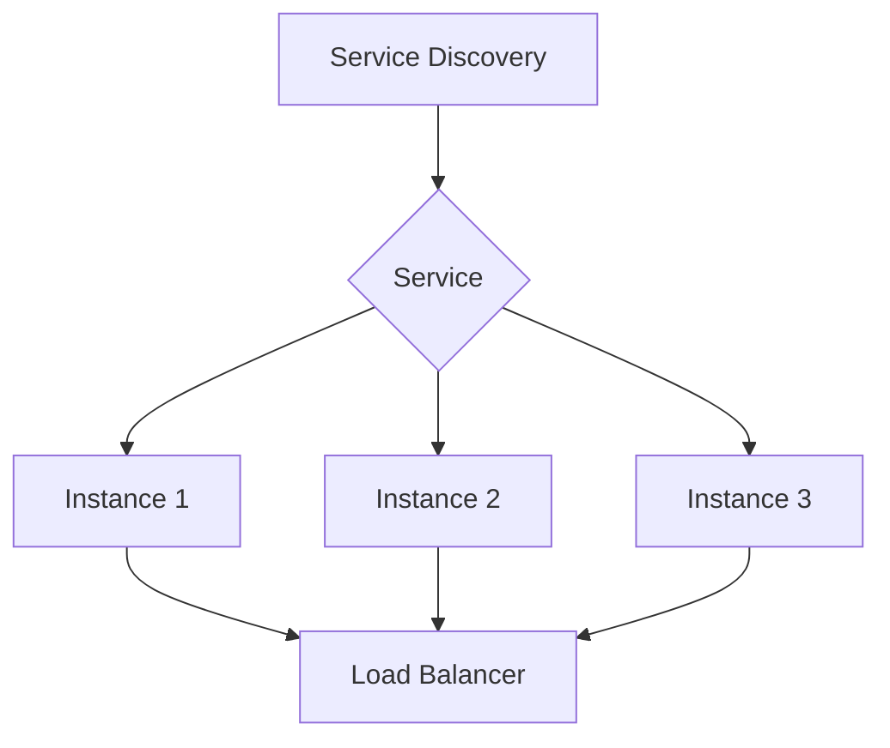

## Introduction to Container Orchestration

Container orchestration is a critical component in modern DevOps practices, especially when managing large-scale applications deployed across multiple servers. Containers provide a lightweight and portable way to package and run applications, but as the number of containers grows, managing them becomes increasingly complex. This is where container orchestration tools come into play. These tools automate the deployment, scaling, and management of containerized applications, ensuring that the desired state of the system is maintained.

### What is Container Orchestration?

Container orchestration is the automated management and coordination of containerized applications across multiple hosts. It involves scheduling, deploying, scaling, and managing the lifecycle of containers. The primary goal of container orchestration is to ensure that the desired state of the application is maintained, regardless of the underlying infrastructure.

#### Why is Container Orchestration Important?

Without orchestration, managing a large number of containers would be extremely challenging. Here are some key reasons why container orchestration is important:

1. **Resource Management**: Orchestrators can dynamically allocate and deallocate resources based on the current workload, ensuring efficient use of resources.
2. **Scalability**: Orchestrators can automatically scale applications up or down based on demand, ensuring optimal performance and availability.
3. **Fault Tolerance**: Orchestrators can detect and recover from failures, ensuring high availability and reliability.
4. **Consistency**: Orchestrators ensure that the desired state of the application is maintained across all nodes, providing consistency and predictability.

### Key Features of Container Orchestration Tools

Container orchestration tools typically offer several key features to manage containerized applications effectively. Let's explore these features in detail:

1. **Resource Management**
2. **Deployment and Scaling**
3. **Health Monitoring and Recovery**
4. **Service Discovery and Load Balancing**

#### Resource Management

One of the primary challenges in managing containerized applications is resource management. As the number of containers increases, it becomes essential to monitor and manage the available resources on each host. Container orchestration tools provide mechanisms to track and allocate resources dynamically.

##### How Resource Management Works

Container orchestration tools use a scheduler to determine where to deploy containers based on available resources. The scheduler takes into account factors such as CPU usage, memory usage, disk space, and network bandwidth to make informed decisions about where to place containers.



##### Real-World Example: Kubernetes Resource Management

Kubernetes, one of the most popular container orchestration tools, uses a sophisticated scheduler to manage resources. The Kubernetes scheduler evaluates the resource requirements of each pod (a group of one or more containers) and determines the best node to deploy the pod based on available resources.

```yaml
apiVersion: v1
kind: Pod
metadata:
  name: my-pod
spec:
  containers:
  - name: my-container
    image: my-image
    resources:
      requests:
        cpu: "200m"
        memory: "128Mi"
      limits:
        cpu: "500m"
        memory: "256Mi"
```

In this example, the pod specifies resource requests and limits for CPU and memory. The Kubernetes scheduler will ensure that the pod is deployed on a node that can meet these resource requirements.

##### Common Pitfalls and How to Prevent Them

One common pitfall in resource management is over-provisioning or under-provisioning resources. Over-provisioning can lead to wasted resources, while under-provisioning can result in performance degradation or even crashes.

**How to Prevent Over-Provisioning:**

- Use resource quotas to limit the amount of resources that can be allocated to a namespace.
- Monitor resource usage and adjust quotas as needed.

**How to Prevent Under-Provisioning:**

- Set appropriate resource requests and limits based on the application's needs.
- Use horizontal pod autoscaling to automatically scale the number of pods based on resource usage.

#### Deployment and Scaling

Another critical aspect of container orchestration is the ability to deploy and scale applications efficiently. Container orchestration tools provide mechanisms to deploy new versions of applications and scale them up or down based on demand.

##### How Deployment and Scaling Work

Container orchestration tools allow you to define the desired state of your application using declarative configuration files. These files specify the number of replicas, resource requirements, and other details about the application. The orchestrator then ensures that the actual state of the application matches the desired state.



##### Real-World Example: Kubernetes Deployment and Scaling

Kubernetes provides powerful mechanisms for deploying and scaling applications. You can define a deployment object that specifies the desired state of the application, including the number of replicas and resource requirements.

```yaml
apiVersion: apps/v1
kind: Deployment
metadata:
  name: my-deployment
spec:
  replicas: 3
  selector:
    matchLabels:
      app: my-app
  template:
    metadata:
      labels:
        app: my-app
    spec:
      containers:
      - name: my-container
        image: my-image
        ports:
        - containerPort: 80
```

In this example, the deployment specifies three replicas of the `my-app` container. Kubernetes will ensure that exactly three replicas are running at all times.

To scale the deployment, you can update the `replicas` field and apply the changes.

```bash
kubectl scale deployment/my-deployment --replicas=5
```

This command scales the deployment to five replicas.

##### Common Pitfalls and How to Prevent Them

One common pitfall in deployment and scaling is not properly handling rolling updates. Rolling updates involve gradually replacing old pods with new ones, ensuring that the application remains available during the update process.

**How to Prevent Rolling Update Issues:**

- Use rolling updates instead of recreating deployments.
- Set appropriate update strategies, such as `RollingUpdate`, to control the update process.

#### Health Monitoring and Recovery

Ensuring the health and availability of containerized applications is crucial. Container orchestration tools provide mechanisms to monitor the health of containers and recover from failures.

##### How Health Monitoring and Recovery Work

Container orchestration tools continuously monitor the health of containers and take action if a container fails. They can restart failed containers, replace unhealthy pods, and perform other recovery actions to maintain the desired state of the application.



##### Real-World Example: Kubernetes Health Monitoring and Recovery

Kubernetes provides built-in mechanisms for health monitoring and recovery. You can define liveness and readiness probes to check the health of containers.

```yaml
apiVersion: v1
kind: Pod
metadata:
  name: my-pod
spec:
  containers:
  - name: my-container
    image: my-image
    livenessProbe:
      httpGet:
        path: /healthz
        port: 80
      initialDelaySeconds: 30
      periodSeconds: 10
    readinessProbe:
      httpGet:
        path: /ready
        port: 80
      initialDelaySeconds: 5
      periodSeconds: 5
```

In this example, the pod defines liveness and readiness probes to check the health of the container. If the container fails the liveness probe, Kubernetes will restart the container. If the container fails the readiness probe, Kubernetes will mark the pod as not ready and stop sending traffic to it.

##### Common Pitfalls and How to Prevent Them

One common pitfall in health monitoring and recovery is not properly configuring probes. Misconfigured probes can lead to false positives or negatives, causing unnecessary restarts or failing to detect actual issues.

**How to Prevent Misconfigured Probes:**

- Test probes thoroughly in a staging environment before deploying them to production.
- Use appropriate timeouts and intervals to avoid false positives or negatives.

#### Service Discovery and Load Balancing

As the number of containers grows, it becomes essential to manage service discovery and load balancing. Container orchestration tools provide mechanisms to discover services and distribute traffic evenly across multiple instances.

##### How Service Discovery and Load Balancing Work

Container orchestration tools use service discovery mechanisms to find and communicate with other services. They also provide load balancing capabilities to distribute traffic evenly across multiple instances of a service.



##### Real-World Example: Kubernetes Service Discovery and Load Balancing

Kubernetes provides built-in mechanisms for service discovery and load balancing. You can define a service object that specifies the endpoints of a service and how to access them.

```yaml
apiVersion: v1
kind: Service
metadata:
  name: my-service
spec:
  selector:
    app: my-app
  ports:
  - protocol: TCP
    port: 80
    targetPort: 8080
  type: LoadBalancer
```

In this example, the service specifies the endpoints of the `my-app` service and how to access them. Kubernetes will automatically create a load balancer to distribute traffic evenly across the instances of the service.

##### Common Pitfalls and How to Prevent Them

One common pitfall in service discovery and load balancing is not properly configuring the service. Misconfigured services can lead to incorrect routing or load distribution.

**How to Prevent Misconfigured Services:**

- Test services thoroughly in a staging environment before deploying them to production.
- Use appropriate selectors and port mappings to ensure correct routing and load distribution.

### Conclusion

Container orchestration is a critical component in modern DevOps practices, enabling efficient management of containerized applications. By automating resource management, deployment and scaling, health monitoring and recovery, and service discovery and load balancing, container orchestration tools ensure that the desired state of the application is maintained. Kubernetes is one of the most popular container orchestration tools, providing powerful mechanisms to manage containerized applications at scale.

### Hands-On Labs

To gain practical experience with container orchestration, consider the following hands-on labs:

- **Kubernetes Goat**: A hands-on lab for learning Kubernetes security.
- **OWASP WrongSecrets**: A hands-on lab for learning Kubernetes security and DevSecOps practices.
- **Pacu**: A hands-on lab for learning AWS security, including container orchestration with ECS and EKS.

These labs provide real-world scenarios and challenges to help you master container orchestration and DevOps practices.

---

This expanded section covers the core concepts of container orchestration in depth, providing detailed explanations, real-world examples, and practical guidance. The next sections will delve further into specific aspects of container orchestration, such as advanced resource management, scaling strategies, and security considerations.

---
<!-- nav -->
[[05-Introduction to Container Orchestration Tools|Introduction to Container Orchestration Tools]] | [[DevOps/DevOps Bootcamp/05-Containerization (Docker)/01-AWS Container Services Overview (2)/00-Overview|Overview]] | [[07-Worker Node Infrastructure Management in AWS|Worker Node Infrastructure Management in AWS]]
