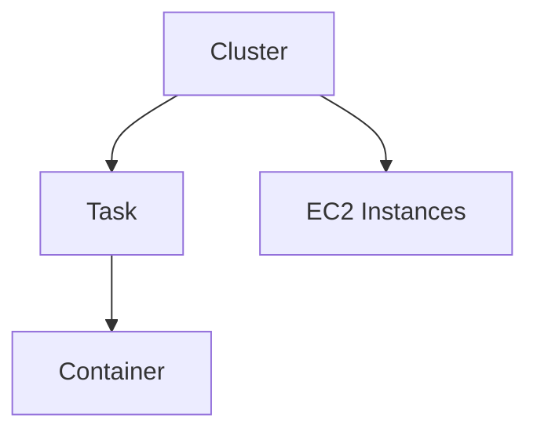
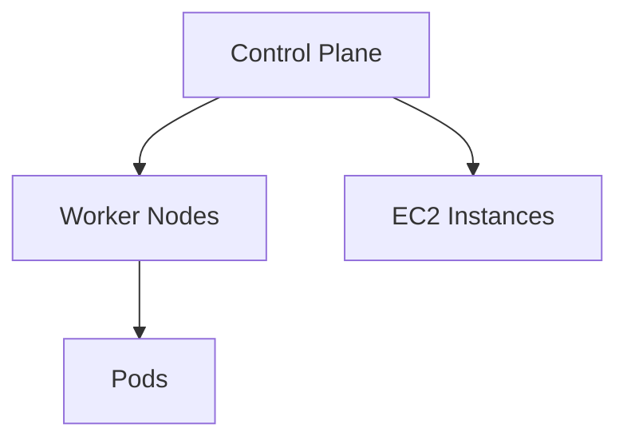

## Introduction to AWS Container Services

In the modern DevOps landscape, containerization has become a cornerstone technology, enabling developers to package their applications along with all dependencies into lightweight, portable containers. This approach significantly simplifies the deployment and management of applications across different environments. One of the most popular container technologies is Docker, which allows developers to create, deploy, and run applications in containers.

### Background Theory

Containerization addresses several key challenges in software development and deployment:

1. **Consistency**: Containers ensure that applications run consistently across different environments by encapsulating all dependencies within the container.
2. **Portability**: Containers can be easily moved between different systems, making them ideal for cloud-based deployments.
3. **Efficiency**: Containers share the host operating system kernel, reducing overhead and improving resource utilization compared to traditional virtual machines.

### Traditional Approach: EC2 Instances with Docker

Until recently, many organizations used Amazon EC2 instances to run Docker containers. This involved manually provisioning EC2 instances, installing Docker runtime, and managing the lifecycle of containers. While this approach was functional, it had several drawbacks:

1. **Complexity**: Managing multiple EC2 instances and Docker installations required significant operational effort.
2. **Scalability**: Scaling applications required manual intervention to launch new instances and install Docker.
3. **Maintenance**: Keeping Docker and the underlying OS up-to-date was a continuous challenge.

### Real-World Example: Netflix and Docker

Netflix is a prime example of a company that leverages Docker and containerization extensively. They use Docker to manage their microservices architecture, which consists of hundreds of individual services. By using Docker, Netflix ensures that each service runs consistently across different environments, from development to production.

### AWS Container Services Overview

To address the challenges associated with managing Docker containers on EC2 instances, AWS offers several specialized services designed specifically for container orchestration and management. These services provide a higher level of abstraction, automating many of the tasks involved in deploying and managing containerized applications.

#### Key AWS Container Services

1. **Amazon Elastic Container Service (ECS)**: A managed service that makes it easy to run and scale containerized applications on AWS.
2. **Amazon Elastic Kubernetes Service (EKS)**: A managed Kubernetes service that makes it easy to run Kubernetes on AWS without needing to install and operate your own Kubernetes control plane.
3. **AWS Fargate**: A serverless compute engine for containers that allows you to run containers without having to manage servers or clusters.

### Detailed Explanation of Each Service

#### Amazon Elastic Container Service (ECS)

**What is ECS?**
Amazon ECS is a highly scalable, fast, and fully managed container orchestration service that supports Docker containers. It allows you to run and scale containerized applications on a cluster of Amazon EC2 instances.

**Why Use ECS?**
ECS provides a simple and intuitive way to manage containerized applications without the need to set up and maintain your own cluster management infrastructure. It integrates seamlessly with other AWS services, such as Auto Scaling, CloudWatch, and IAM, providing robust monitoring, logging, and security capabilities.

**How Does ECS Work?**
ECS operates at two levels: the cluster and the task. A cluster is a group of EC2 instances that form the computing environment for your containers. Tasks define the containers to be run and the resources they require. ECS manages the scheduling and placement of tasks across the cluster.



**Real-World Example: Airbnb and ECS**
Airbnb uses ECS to manage their containerized applications. By leveraging ECS, they can easily scale their services based on demand, ensuring high availability and performance.

**Pitfalls and How to Prevent**
One common pitfall when using ECS is misconfiguring task definitions, leading to resource allocation issues. To prevent this, ensure that task definitions are properly configured with appropriate CPU and memory limits.

**Secure Configuration Example**

```yaml
# Vulnerable Task Definition
{
  "family": "web-service",
  "containerDefinitions": [
    {
      "name": "web-container",
      "image": "my-web-image:latest",
      "cpu": 1024,
      "memory": 2048,
      "portMappings": [
        {
          "containerPort": 80,
          "hostPort": 80
        }
      ]
    }
  ]
}

# Secure Task Definition
{
  "family": "web-service",
  "containerDefinitions": [
    {
      "name": "web-container",
      "image": "my-web-image:latest",
      "cpu": 1024,
      "memory": 2048,
      "portMappings": [
        {
          "containerPort": 80,
          "hostPort": 80
        }
      ],
      "logConfiguration": {
        "logDriver": "awslogs",
        "options": {
          "awslogs-group": "/ecs/web-service",
          "awslogs-region": "us-west-2",
          "awslogs-stream-prefix": "ecs"
        }
      },
      "environment": [
        {
          "name": "SECRET_KEY",
          "value": "secure-value"
        }
      ]
    }
  ]
}
```

#### Amazon Elastic Kubernetes Service (EKS)

**What is EKS?**
Amazon EKS is a managed service that makes it easy to run Kubernetes on AWS without needing to install and operate your own Kubernetes control plane. EKS supports all Kubernetes workloads and features, including rolling updates, self-healing, and horizontal scaling.

**Why Use EKS?**
EKS provides a fully managed Kubernetes experience, allowing you to focus on developing and deploying your applications rather than managing the underlying infrastructure. It integrates with other AWS services, such as IAM, VPC, and CloudWatch, providing robust security and monitoring capabilities.

**How Does EKS Work?**
EKS operates at the cluster level, where a cluster consists of worker nodes (EC2 instances) and a control plane managed by AWS. You define your applications using Kubernetes manifests, which are applied to the cluster.



**Real-World Example: Shopify and EKS**
Shopify uses EKS to manage their containerized applications. By leveraging EKS, they can easily scale their services based on demand, ensuring high availability and performance.

**Pitfalls and How to Prevent**
One common pitfall when using EKS is misconfiguring security settings, leading to unauthorized access. To prevent this, ensure that IAM roles and policies are properly configured to restrict access to the EKS cluster.

**Secure Configuration Example**

```yaml
# Vulnerable Deployment
apiVersion: apps/v1
kind: Deployment
metadata:
  name: web-deployment
spec:
  replicas: 3
  selector:
    matchLabels:
      app: web
  template:
    metadata:
      labels:
        app: web
    spec:
      containers:
      - name: web-container
        image: my-web-image:latest
        ports:
        - containerPort: 80

# Secure Deployment
apiVersion: apps/v1
kind: Deployment
metadata:
  name: web-deployment
spec:
  replicas: 3
  selector:
    matchLabels:
      app:
```

---
<!-- nav -->
[[DevOps/DevOps Bootcamp/05-Containerization (Docker)/02-AWS Container Services Overview/00-Overview|Overview]] | [[DevOps/DevOps Bootcamp/05-Containerization (Docker)/02-AWS Container Services Overview/02-Practice Questions & Answers|Practice Questions & Answers]]
