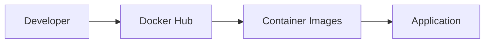
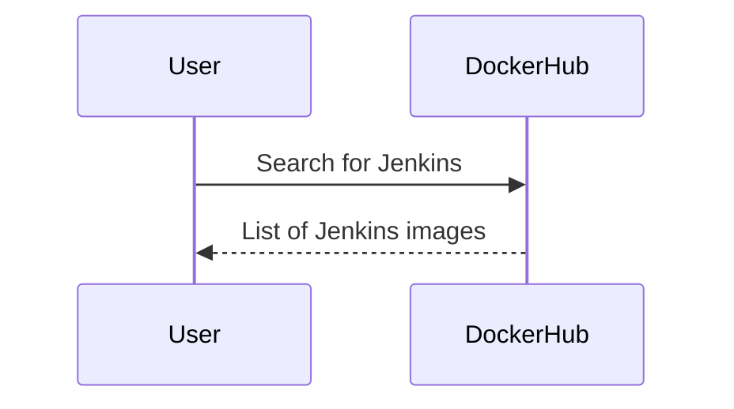
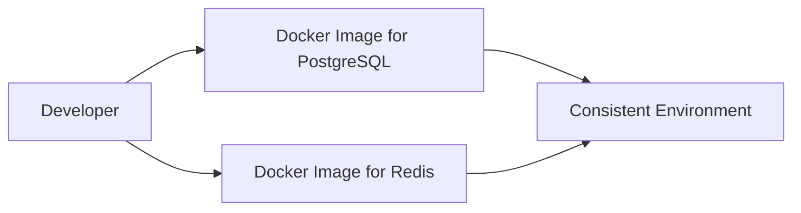
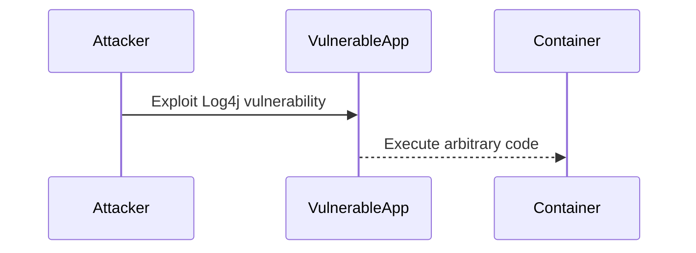

## Containerization Fundamentals and Repository Management

### Introduction to Containerization

Containerization is a method of packaging software applications into lightweight, portable, and self-sufficient containers that can run consistently across different computing environments. Containers encapsulate an application along with its dependencies, libraries, and configurations, ensuring that the application runs reliably regardless of the underlying infrastructure.

#### Why Containerization Matters

Before containerization, developers faced significant challenges in ensuring that applications would run consistently across different environments. This was due to differences in operating systems, libraries, and configurations. Containerization solves these issues by providing a standardized environment that isolates the application from the underlying host system.

#### How Containerization Works

Containers are built using container images, which are essentially snapshots of the application and its dependencies. These images are then deployed into containers, which are runtime instances of the images. Containers share the host operating system kernel but run in isolated user spaces, ensuring that they do not interfere with each other.

### Public Repositories for Docker Containers

One of the key components of containerization is the availability of public repositories where container images can be stored and shared. The most popular public repository for Docker containers is Docker Hub.

#### Docker Hub Overview

Docker Hub is a cloud-based registry service provided by Docker. It allows users to store and distribute container images. Docker Hub hosts a vast collection of container images contributed by both official sources and community members. As of the latest statistics, Docker Hub contains over 100,000 container images of various applications.



#### Examples of Container Images on Docker Hub

Docker Hub provides a wide range of container images for different applications. Here are a few examples:

- **Jenkins**: Jenkins is a widely used open-source automation server. Docker Hub offers both official and community-contributed Jenkins container images.
- **PostgreSQL**: PostgreSQL is a powerful, open-source relational database management system. Docker Hub provides official PostgreSQL container images.
- **Redis**: Redis is an in-memory data structure store, used as a database, cache, and message broker. Docker Hub includes official Redis container images.

#### Searching for Container Images

To find a specific container image on Docker Hub, you can use the search functionality. For example, searching for "Jenkins" will return both official and community-contributed Jenkins images.



### Improving Development Process with Containers

Containers significantly improve the development process by providing a consistent and isolated environment for applications. This ensures that applications behave the same way in development, testing, and production environments.

#### Pre-Containerization Development Challenges

Before containerization, developers often had to install and configure services directly on their operating systems. This led to inconsistencies and compatibility issues across different environments. For example, a developer might need to install PostgreSQL and Redis for a JavaScript application, leading to potential conflicts and configuration issues.

#### Example: Developing a JavaScript Application

Consider a scenario where a team of developers is working on a JavaScript application that requires PostgreSQL for data storage and Redis for messaging. Without containerization, each developer would need to install and configure these services on their local machines, leading to potential discrepancies.

#### Using Containers for Development

With containerization, developers can use container images for PostgreSQL and Redis, ensuring that the environment remains consistent across all machines. This is achieved by using Docker containers, which provide isolated and consistent environments.



### Real-World Examples and Recent Breaches

Recent breaches and vulnerabilities highlight the importance of using secure and up-to-date container images. For instance, the Log4j vulnerability (CVE-2021-44228) affected many containerized applications, emphasizing the need for regular updates and security patches.

#### Example: Log4j Vulnerability

The Log4j vulnerability, discovered in December 2021, affected numerous applications, including those running in containerized environments. This vulnerability allowed attackers to execute arbitrary code on affected systems, leading to severe security risks.



#### How to Prevent / Defend Against Vulnerabilities

To prevent and defend against such vulnerabilities, it is crucial to follow best practices for container security:

1. **Use Official and Trusted Images**: Always prefer official and trusted container images from reputable sources like Docker Hub.
2. **Regular Updates and Patching**: Keep container images up-to-date with the latest security patches.
3. **Security Scanning**: Use tools like Trivy or Clair to scan container images for known vulnerabilities.
4. **Least Privilege Principle**: Run containers with the least privileges necessary to minimize the attack surface.

#### Secure Coding Practices

Here is an example of how to securely manage container images:

**Vulnerable Code:**

```yaml
version: '3'
services:
  app:
    image: myapp:latest
    ports:
      - "8080:80"
```

**Secure Code:**

```yaml
version: '3'
services:
  app:
    image: myapp:latest
    ports:
      - "8080:80"
    security_opt:
      - seccomp:unconfined
    cap_drop:
      - ALL
```

In the secure version, additional security options are added to restrict the capabilities of the container, reducing the risk of exploitation.

### Hands-On Practice Labs

For hands-on practice with containerization and repository management, consider the following labs:

- **PortSwigger Web Security Academy**: Offers practical exercises on container security and vulnerabilities.
- **OWASP Juice Shop**: Provides a vulnerable web application that can be containerized and tested for security.
- **Docker Hub**: Explore and experiment with different container images available on Docker Hub.

By following these guidelines and practicing with real-world examples, you can gain a deep understanding of containerization fundamentals and repository management, ensuring that your applications are secure and reliable.

---
<!-- nav -->
[[DevOps/DevOps Bootcamp/05-Containerization (Docker)/03-Containerization Fundamentals And Repository Management/00-Overview|Overview]] | [[02-Introduction to Containerization Fundamentals and Repository Management|Introduction to Containerization Fundamentals and Repository Management]]
