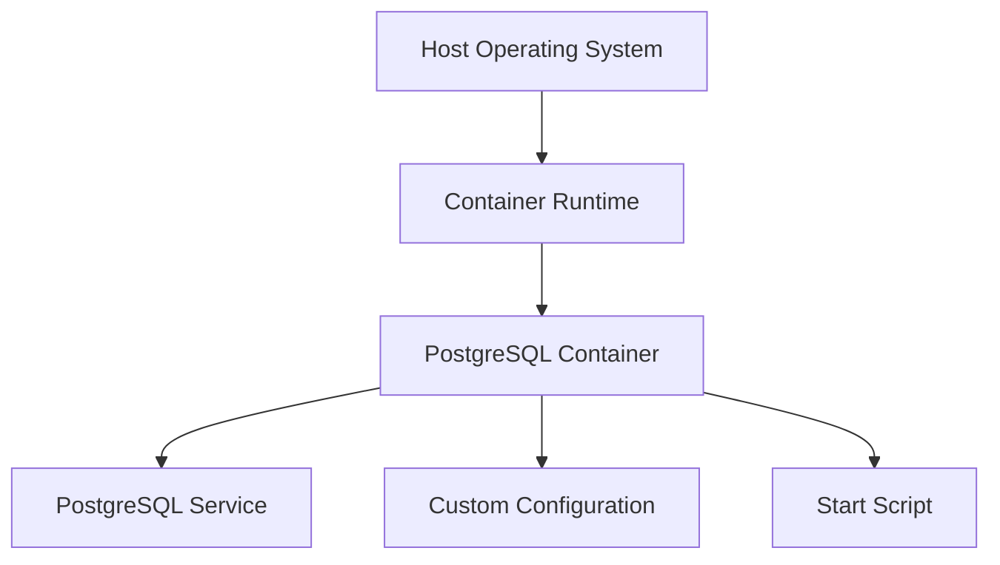

## Introduction to Containerization Fundamentals and Repository Management

### Background Theory

Containerization is a method of virtualizing an operating system so that multiple isolated user-space instances can run on a single host. Each container shares the host's operating system kernel but runs in isolation from other containers. This approach provides a lightweight, portable, and consistent environment for applications, making it easier to develop, test, and deploy software across different environments.

### Problem with Traditional Installation Methods

In traditional development environments, developers often face significant challenges when setting up their local development environments. These challenges include:

1. **Operating System Dependencies**: Different operating systems (Windows, macOS, Linux) require different installation procedures for the same software. This leads to inconsistencies and potential errors during setup.
   
2. **Complex Installation Processes**: Installing and configuring multiple services can be time-consuming and error-prone. Each service may require several steps, such as downloading binaries, configuring settings, and starting the service. The likelihood of encountering errors increases with the number of steps involved.

3. **Tedious Setup**: Setting up a complex application with multiple services can be extremely tedious. For instance, if an application uses 10 different services, each service must be installed and configured individually on each developer's machine. This process becomes even more cumbersome when dealing with different operating systems.

### How Containers Solve These Problems

Containers provide a solution to these issues by encapsulating an application and its dependencies into a single, isolated environment. This environment includes the application code, runtime, system tools, libraries, and settings needed to run the application. Here’s how containers address the problems mentioned:

1. **Isolation**: Containers run in isolation from each other and from the host system. This means that the application inside a container does not affect the host system or other containers, ensuring consistency across different environments.

2. **Portability**: Containers are platform-independent. Once an application is containerized, it can run on any system that supports the container runtime, regardless of the underlying operating system. This eliminates the need for developers to worry about OS-specific installation procedures.

3. **Consistency**: Since containers package everything needed to run an application, they ensure that the application behaves consistently across different environments. This reduces the "works on my machine" problem, where an application works locally but fails in a different environment.

### Example: PostgreSQL in a Container

Let’s consider a concrete example: packaging PostgreSQL with a specific version, configuration, and start script inside a container. This ensures that every developer has the exact same environment, reducing the chances of configuration-related issues.

#### Dockerfile Example

Here’s a simple `Dockerfile` for a PostgreSQL container:

```dockerfile
# Use the official PostgreSQL image as the base image
FROM postgres:13

# Set the environment variable for PostgreSQL
ENV POSTGRES_USER=myuser
ENV POSTGRES_PASSWORD=mypassword
ENV POSTGRES_DB=mydb

# Copy the configuration file to the container
COPY postgresql.conf /etc/postgresql/postgresql.conf

# Copy the start script to the container
COPY start.sh /usr/local/bin/start.sh
RUN chmod +x /usr/local/bin/start.sh

# Expose the default PostgreSQL port
EXPOSE 5432

# Run the start script when the container starts
CMD ["start.sh"]
```

#### Explanation of the Dockerfile

- **Base Image**: The `FROM postgres:13` line specifies that we are using the official PostgreSQL image with version 13 as our base image.
  
- **Environment Variables**: The `ENV` lines set environment variables for the PostgreSQL user, password, and database name. These variables are used by PostgreSQL during initialization.
  
- **Configuration File**: The `COPY postgresql.conf /etc/postgresql/postgresql.conf` line copies a custom PostgreSQL configuration file into the container. This allows us to customize the behavior of PostgreSQL.
  
- **Start Script**: The `COPY start.sh /usr/local/bin/start.sh` and `chmod +x /usr/local/bin/start.sh` lines copy and make executable a start script that initializes and starts PostgreSQL.
  
- **Exposed Port**: The `EXPOSE 5432` line specifies that the container exposes port 5432, which is the default PostgreSQL port.
  
- **Command**: The `CMD ["start.sh"]` line specifies the command to run when the container starts, which is the start script.

#### start.sh Example

Here’s an example of the `start.sh` script:

```bash
#!/bin/bash
set -e

# Initialize PostgreSQL
pg_ctl initdb -D /var/lib/postgresql/data

# Start PostgreSQL
pg_ctl -D /var/lib/postgresql/data -l /var/log/postgresql.log start

# Wait for PostgreSQL to start
while ! pg_isready -h localhost -U $POSTGRES_USER; do
  echo "Waiting for PostgreSQL to start..."
  sleep 1
done

# Run any additional setup commands
echo "PostgreSQL is ready!"

# Keep the container running
tail -f /dev/null
```

#### Explanation of the start.sh Script

- **Initialize PostgreSQL**: The `pg_ctl initdb` command initializes the PostgreSQL data directory.
  
- **Start PostgreSQL**: The `pg_ctl start` command starts the PostgreSQL server.
  
- **Wait for PostgreSQL**: The `while` loop waits until PostgreSQL is ready to accept connections.
  
- **Additional Setup**: Any additional setup commands can be added here.
  
- **Keep Running**: The `tail -f /dev/null` command keeps the container running indefinitely.

### Building and Running the Container

To build and run the container, follow these steps:

1. **Build the Docker Image**:

    ```bash
    docker build -t my-postgres .
    ```

2. **Run the Docker Container**:

    ```bash
    docker run -d --name my-postgres-container -p 5432:5432 my-postgres
    ```

### Diagram: Container Architecture

A mermaid diagram illustrating the architecture of a containerized PostgreSQL setup:



### Real-World Examples and Recent CVEs

Recent vulnerabilities in container management systems highlight the importance of securing container environments. For example, CVE-2021-41773 (also known as "Dirty Pipe") affected Linux kernels and could allow attackers to escalate privileges within a container. This underscores the need for regular updates and security patches.

### Pitfalls and Common Mistakes

1. **Insecure Configuration**: Using default configurations or weak passwords can lead to security vulnerabilities. Always use strong, unique passwords and secure configurations.

2. **Outdated Images**: Using outdated images can expose your application to known vulnerabilities. Regularly update your images to the latest versions.

3. **Privilege Escalation**: Running containers with unnecessary privileges can increase the risk of attacks. Use the least privilege principle and avoid running containers as root.

### How to Prevent / Defend

#### Detection

- **Regular Scanning**: Use tools like Trivy or Clair to scan your container images for vulnerabilities.
  
- **Logging and Monitoring**: Implement logging and monitoring to detect unusual activity within your containers.

#### Prevention

- **Secure Configurations**: Use secure configurations and strong passwords. Avoid using default configurations.

- **Regular Updates**: Keep your container images and base images up to date with the latest security patches.

- **Least Privilege Principle**: Run containers with the minimum necessary privileges. Avoid running containers as root.

#### Secure Coding Fixes

##### Vulnerable Code Example

```dockerfile
FROM postgres:13

ENV POSTGRES_USER=root
ENV POSTGRES_PASSWORD=weakpassword
```

##### Secure Code Example

```dockerfile
FROM postgres:13

ENV POSTGRES_USER=myuser
ENV POSTGRES_PASSWORD=strongpassword
```

### Conclusion

Containerization provides a powerful solution to the challenges of setting up and maintaining development environments. By encapsulating applications and their dependencies into isolated, portable environments, containers ensure consistency and reduce the likelihood of configuration-related issues. However, it is crucial to follow best practices for securing container environments to protect against potential vulnerabilities.

### Hands-On Labs

For hands-on practice with containerization fundamentals and repository management, consider the following labs:

- **Kubernetes Goat**: A hands-on lab for learning Kubernetes security.
- **OWASP WrongSecrets**: A series of challenges to learn about secrets management and secure coding practices.
- **kube-hunter**: A tool for discovering and exploiting misconfigurations in Kubernetes clusters.

These labs provide practical experience in setting up and securing containerized environments, helping you master the concepts covered in this chapter.

---
<!-- nav -->
[[01-Containerization Fundamentals and Repository Management|Containerization Fundamentals and Repository Management]] | [[DevOps/DevOps Bootcamp/05-Containerization (Docker)/03-Containerization Fundamentals And Repository Management/00-Overview|Overview]] | [[03-Introduction to Containerization|Introduction to Containerization]]
