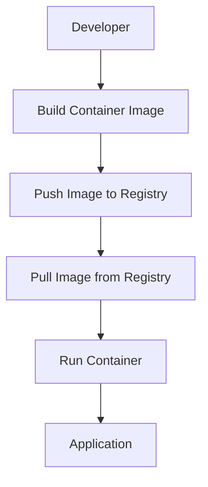

## Introduction to Containerization

Containerization is a method of virtualizing computing environments to run applications in isolated, portable units called containers. Containers provide a consistent and reproducible environment for applications, ensuring that they behave the same way across different computing environments. This is particularly useful in DevOps practices, where continuous integration and deployment (CI/CD) pipelines require consistent and reliable environments.

### What is Containerization?

Containerization involves packaging an application along with its dependencies into a single unit, known as a container. This container can then be deployed and run consistently across different environments, such as development, testing, and production. The key benefits of containerization include:

- **Isolation**: Each container runs in isolation from others, ensuring that changes in one container do not affect others.
- **Portability**: Containers can be easily moved between environments, reducing the "works on my machine" problem.
- **Consistency**: Containers ensure that the application behaves the same way across different environments.

### Why Containerization Matters

Containerization simplifies the process of deploying and managing applications by abstracting away the underlying infrastructure. This abstraction allows developers and operations teams to work together seamlessly, as they can focus on the application itself rather than the environment in which it runs.

#### Simplified Deployment Process

In traditional deployment models, setting up the environment on the server can be complex and error-prone. With containerization, the environment is encapsulated within the container, eliminating the need for manual configuration on the server. Instead, the only requirement is to install and set up the container runtime (such as Docker) on the server.

### How Containerization Works

Containers are built using images, which are essentially snapshots of the application and its dependencies. These images are stored in a container registry, from which they can be pulled and run on any compatible system.

#### Key Components

1. **Container Image**: A read-only template containing the application and its dependencies.
2. **Container Registry**: A service for storing and distributing container images.
3. **Container Runtime**: Software responsible for running containerized applications.

### Example: Docker

Docker is one of the most popular container technologies. Let's explore how Docker works in detail.

#### Docker Architecture



1. **Build Container Image**: Developers create a `Dockerfile` that defines the steps to build the container image.
2. **Push Image to Registry**: The built image is pushed to a container registry, such as Docker Hub.
3. **Pull Image from Registry**: The image is pulled from the registry onto the target server.
4. **Run Container**: The container is started using the `docker run` command.

#### Dockerfile Example

A `Dockerfile` is a text file that contains instructions for building a Docker image. Here is an example `Dockerfile` for a simple Node.js application:

```Dockerfile
# Use an official Node.js runtime as a parent image
FROM node:14

# Set the working directory in the container
WORKDIR /usr/src/app

# Copy the package.json and package-lock.json files to the working directory
COPY package*.json ./

# Install the application's dependencies
RUN npm install

# Copy the rest of the application code to the working directory
COPY . .

# Expose port 3000 to the outside world
EXPOSE 3000

# Define the command to run the application
CMD ["npm", "start"]
```

#### Building and Running a Docker Image

To build and run the Docker image, follow these steps:

1. **Build the Image**:
    ```sh
    docker build -t my-node-app .
    ```

2. **Run the Container**:
    ```sh
    docker run -p 3000:3000 my-node-app
    ```

### Other Popular Container Technologies

While Docker is the most widely used container technology, there are other alternatives available:

- **ContainerD**: A container runtime that can be used as a backend for Docker.
- **Crio**: Another container runtime that is compatible with Kubernetes.

### Real-World Examples and Recent CVEs

Containerization has been widely adopted in various industries, but it is not immune to security vulnerabilities. Here are some recent examples:

- **CVE-2021-21363**: A vulnerability in Docker that allowed attackers to execute arbitrary commands on the host system.
- **CVE-2021-41580**: A vulnerability in Kubernetes that allowed attackers to bypass authentication and gain unauthorized access.

### How to Prevent / Defend

#### Detection

To detect potential issues with containerized applications, use tools like:

- **Trivy**: A vulnerability scanner for container images.
- **Clair**: A static analysis tool for container images.

#### Prevention

To prevent security vulnerabilities in containerized applications, follow these best practices:

1. **Use Secure Base Images**: Ensure that base images are from trusted sources and are regularly updated.
2. **Scan for Vulnerabilities**: Regularly scan container images for known vulnerabilities.
3. **Limit Privileges**: Run containers with the least privileges necessary.
4. **Use Network Policies**: Implement network policies to restrict communication between containers.

#### Secure Coding Fixes

Here is an example of a vulnerable Dockerfile and its secure version:

**Vulnerable Dockerfile**:
```Dockerfile
FROM node:14
WORKDIR /usr/src/app
COPY . .
RUN npm install
CMD ["npm", "start"]
```

**Secure Dockerfile**:
```Dockerfile
FROM node:14-alpine
WORKDIR /usr/src/app
COPY package*.json ./
RUN npm install --production
COPY . .
USER node
CMD ["npm", "start"]
```

### Conclusion

Containerization simplifies the deployment and management of applications by providing a consistent and portable environment. By understanding the key components and best practices, you can effectively leverage containerization in your DevOps workflows.

### Practice Labs

For hands-on experience with containerization, consider the following labs:

- **PortSwigger Web Security Academy**: Offers labs on securing containerized applications.
- **OWASP Juice Shop**: Provides a vulnerable web application that can be containerized and tested.
- **Kubernetes Goat**: A lab for learning Kubernetes security.

By completing these labs, you can gain practical experience in containerization and its security implications.

---
<!-- nav -->
[[02-Introduction to Containerization Fundamentals and Repository Management|Introduction to Containerization Fundamentals and Repository Management]] | [[DevOps/DevOps Bootcamp/05-Containerization (Docker)/03-Containerization Fundamentals And Repository Management/00-Overview|Overview]] | [[04-What is a Container|What is a Container]]
