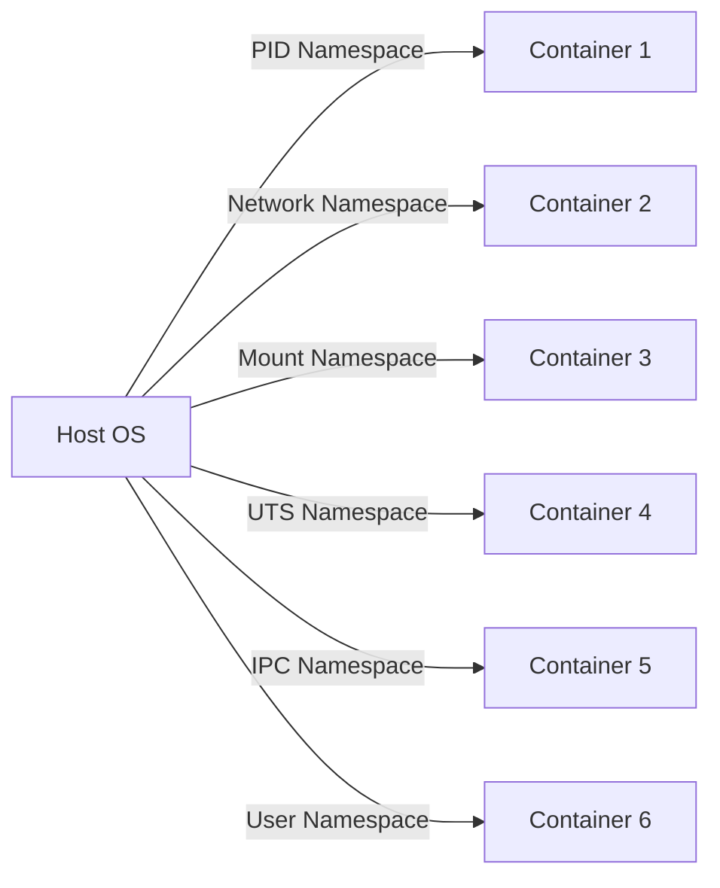
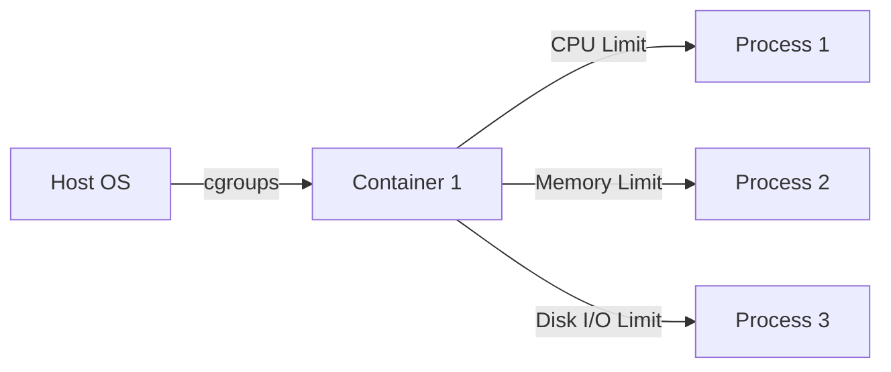

## What is a Container?

A container is a lightweight, stand-alone, executable package that includes everything needed to run a piece of software: code, runtime, system tools, system libraries, and settings. Containers allow developers to package up applications with all of their dependencies into a standardized unit for software development. This ensures that the application works seamlessly in any environment.

### Why Containers Matter

Containers solve several critical issues in software development and deployment:

1. **Portability**: Containers ensure that an application runs the same way regardless of the underlying infrastructure. This is crucial for consistent behavior across different environments such as development, testing, staging, and production.
   
2. **Isolation**: Each container operates in its own isolated environment, preventing conflicts between different applications or versions of the same application. This isolation helps in managing dependencies and avoiding "dependency hell."

3. **Efficiency**: Containers are lightweight compared to virtual machines (VMs). They share the host OS kernel, reducing overhead and improving performance.

4. **Consistency**: Containers provide a consistent environment for development, testing, and production, ensuring that "it works on my machine" is no longer an issue.

### How Containers Work Under the Hood

Containers rely on two key technologies: namespaces and control groups (cgroups).

#### Namespaces

Namespaces provide isolation by creating separate views of the operating system resources. There are several types of namespaces:

- **PID Namespace**: Isolates process IDs.
- **Network Namespace**: Isolates network interfaces.
- **Mount Namespace**: Isolates filesystem mount points.
- **UTS Namespace**: Isolates hostname and domain name.
- **IPC Namespace**: Isolates inter-process communication resources.
- **User Namespace**: Isolates user and group IDs.



#### Control Groups (cgroups)

Control groups limit, account for, and isolate resource usage (CPU, memory, disk I/O, etc.) by groups of processes. This ensures that containers do not consume more resources than allocated.



### Real-World Example: Docker

Docker is one of the most popular containerization platforms. It uses these underlying Linux features to create and manage containers.

#### Dockerfile Example

Here’s a simple `Dockerfile` that defines a container:

```dockerfile
# Use an official Python runtime as a parent image
FROM python:3.9-slim

# Set the working directory in the container
WORKDIR /app

# Copy the current directory contents into the container at /app
COPY . /app

# Install any needed packages specified in requirements.txt
RUN pip install --no-cache-dir -r requirements.txt

# Make port 80 available to the world outside this container
EXPOSE 80

# Define environment variable
ENV NAME World

# Run app.py when the container launches
CMD ["python", "app.py"]
```

This `Dockerfile` specifies the base image, copies the application code into the container, installs dependencies, exposes a port, sets an environment variable, and defines the command to run the application.

### Common Mistakes and Pitfalls

1. **Over-provisioning Resources**: Allocating too many resources to a container can lead to inefficiencies and increased costs.
   
2. **Under-provisioning Resources**: Not allocating enough resources can cause the application to fail or perform poorly.

3. **Security Risks**: Running containers with elevated privileges (e.g., root) can expose the host system to vulnerabilities.

### How to Prevent / Defend

1. **Resource Limits**: Use cgroups to set appropriate limits on CPU, memory, and disk I/O.
   
2. **Least Privilege Principle**: Run containers with non-root users to minimize potential damage in case of a breach.

3. **Regular Audits**: Regularly review and update container images to ensure they are secure and up-to-date.

---
<!-- nav -->
[[03-Introduction to Containerization|Introduction to Containerization]] | [[DevOps/DevOps Bootcamp/05-Containerization (Docker)/03-Containerization Fundamentals And Repository Management/00-Overview|Overview]] | [[05-Container Repository Management|Container Repository Management]]
