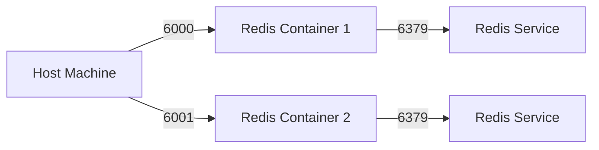

## Introduction to Docker Basics: Commands and Concepts

Docker is an open-source platform used to build, package, and deploy applications inside lightweight, portable containers. Containers provide a consistent environment for applications to run, regardless of the underlying infrastructure. This consistency is achieved through containerization, which isolates applications from their host environments and ensures that they run consistently across different systems.

### What is Containerization?

Containerization is the process of packaging an application along with its dependencies into a single unit called a container. This container can then be deployed and run on any system that supports Docker. The key benefits of containerization include:

- **Isolation**: Each container runs in isolation from others, ensuring that changes in one container do not affect others.
- **Portability**: Containers can be easily moved between different environments (development, testing, production) without compatibility issues.
- **Consistency**: Containers ensure that the application runs the same way in all environments, reducing the "works on my machine" problem.

### Why Use Docker?

Docker simplifies the deployment and management of applications by providing a consistent and reproducible environment. It allows developers to focus on writing code rather than worrying about the underlying infrastructure. Additionally, Docker enables efficient resource utilization by sharing the operating system kernel among multiple containers.

### Basic Docker Commands

To effectively use Docker, it is essential to understand some basic commands. These commands allow you to manage Docker images, containers, and networks. In this section, we will cover the following commands:

- `docker run`
- `docker ps`
- `docker stop`
- `docker rm`

#### `docker run`

The `docker run` command is used to create and start a new container. It takes several parameters to configure the container's behavior. One of the most important parameters is `-p`, which binds a port on the host to a port in the container.

##### Binding Ports with `-p`

When running a container, you might want to expose a service running inside the container to the outside world. This is done by binding a port on the host to a port in the container. The `-p` flag is used for this purpose.

**Syntax:**
```bash
docker run -p <host_port>:<container_port> <image_name>
```

- `<host_port>`: The port on the host machine that will be mapped to the container port.
- `<container_port>`: The port inside the container that will be exposed.

For example, if you are running a Redis server inside a container and want to access it from the host machine, you would use the following command:

```bash
docker run -p 6000:6379 redis
```

In this command:
- `6000` is the port on the host machine.
- `6379` is the port inside the container where Redis listens.

##### Running Multiple Containers with Different Port Bindings

If you want to run multiple instances of the same service (e.g., Redis) on the same host, you need to bind each instance to a different port on the host. For example, to run two Redis instances, you could use the following commands:

```bash
docker run -p 6000:6379 redis
docker run -p 6001:6379 redis
```

This will start two Redis containers, each listening on port 6379 inside the container but exposed on different ports (6000 and 6001) on the host.

### Managing Containers with `docker ps`

The `docker ps` command lists all the running containers on the host. This command is useful for monitoring the status of your containers and identifying any issues.

**Syntax:**
```bash
docker ps
```

By default, `docker ps` shows only the running containers. To list all containers (both running and stopped), you can use the `-a` flag:

```bash
docker ps -a
```

### Stopping and Removing Containers

Once a container is no longer needed, you can stop and remove it using the `docker stop` and `docker rm` commands.

#### `docker stop`

The `docker stop` command sends a SIGTERM signal to the container, allowing it to gracefully shut down.

**Syntax:**
```bash
docker stop <container_id_or_name>
```

#### `docker rm`

The `docker rm` command removes a stopped container from the host.

**Syntax:**
```bash
docker rm <container_id_or_name>
```

### Example: Running Multiple Redis Containers

Let's walk through an example of running multiple Redis containers with different port bindings.

1. **Start the First Redis Container:**

```bash
docker run -p 6000:6379 --name redis1 redis
```

2. **Start the Second Redis Container:**

```bash
docker run -p 6001:6379 --name redis2 redis
```

3. **List Running Containers:**

```bash
docker ps
```

Output:
```plaintext
CONTAINER ID   IMAGE     COMMAND                  CREATED         STATUS         PORTS                    NAMES
abc123def456   redis     "docker-entrypoint.s…"   2 minutes ago   Up 2 minutes   0.0.0.0:6001->6379/tcp   redis2
ghi789jkl012   redis     "docker-entrypoint.s…"   3 minutes ago   Up 3 minutes   0.0.0.0:6000->6379/tcp   redis1
```

4. **Stop and Remove Containers:**

```bash
docker stop redis1
docker rm redis1
docker stop redis2
docker rm redis2
```

### Mermaid Diagram: Container Network Topology

A mermaid diagram can help visualize the network topology of the containers.



### Common Pitfalls and How to Avoid Them

#### Port Conflicts

One common issue when running multiple containers is port conflicts. If two containers try to bind to the same port on the host, Docker will fail to start the second container. Always ensure that each container is bound to a unique port.

#### Resource Overuse

Running too many containers can lead to resource overuse, causing performance degradation. Monitor the resource usage of your containers and limit the number of running containers based on the available resources.

### How to Prevent / Defend

#### Detection

To detect issues with container port bindings, regularly monitor the output of `docker ps`. Look for duplicate port mappings or unexpected container states.

#### Prevention

- **Use Unique Port Bindings:** Always bind containers to unique ports on the host.
- **Resource Management:** Limit the number of running containers based on the available resources.
- **Automated Monitoring:** Set up automated monitoring tools to alert you of any issues with container port bindings or resource usage.

#### Secure Coding Fixes

When working with Docker, ensure that your Dockerfiles and run commands are secure. Here is an example of a vulnerable and secure Dockerfile:

**Vulnerable Dockerfile:**
```Dockerfile
FROM redis:latest
EXPOSE 6379
CMD ["redis-server"]
```

**Secure Dockerfile:**
```Dockerfile
FROM redis:latest
EXPOSE 6379
CMD ["redis-server", "--requirepass", "your_secure_password"]
```

In the secure version, a password is required to access the Redis server, enhancing security.

### Conclusion

Understanding the basics of Docker commands and concepts is crucial for effective container management. By mastering commands such as `docker run`, `docker ps`, `docker stop`, and `docker rm`, you can efficiently manage your containers and ensure a consistent and secure environment for your applications.

### Practice Labs

For hands-on practice with Docker basics, consider the following labs:

- **PortSwigger Web Security Academy:** Offers a variety of labs covering Docker and container security.
- **OWASP Juice Shop:** Provides a vulnerable web application that can be run in a Docker container for security testing.
- **Docker Documentation:** Official Docker documentation includes numerous tutorials and examples for getting started with Docker.

By combining theoretical knowledge with practical experience, you can become proficient in using Docker for your DevOps workflows.

---
<!-- nav -->
[[01-Docker Basics Commands and Concepts|Docker Basics Commands and Concepts]] | [[DevOps/DevOps Bootcamp/05-Containerization (Docker)/04-Docker Basics Commands And Concepts/00-Overview|Overview]] | [[03-Introduction to Docker Basics Containers and Images|Introduction to Docker Basics Containers and Images]]
