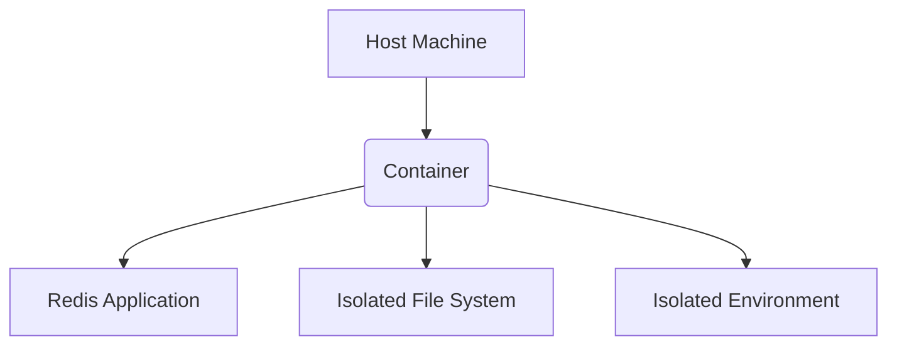
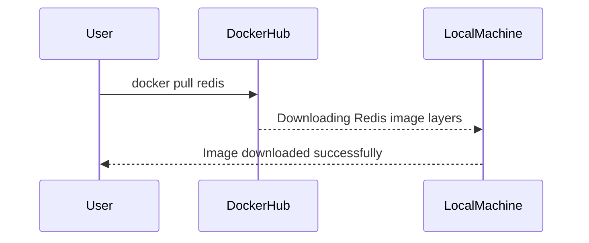
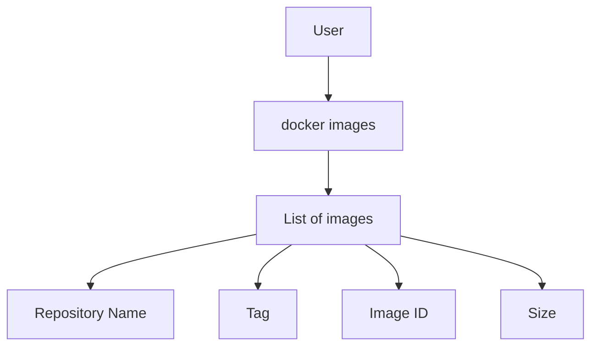

## Introduction to Docker Basics: Containers, Images, and Actions

Docker is a platform that allows developers to package applications into containers—standardized executable packages containing software and all of its dependencies. This ensures that the application will run consistently across different environments. Understanding the core concepts of Docker, such as containers, images, and actions, is crucial for effective use of the platform.

### Containers vs. Host Machine

A **container** is a lightweight, standalone, executable package that includes everything needed to run a piece of software: code, runtime, system tools, system libraries, and settings. Containers are isolated from the host machine but share the same kernel. This isolation means that the container has its own abstraction of an operating system, including the file system and environment, which is different from the file system and environment of the host machine.

#### Why Isolation Matters

Isolation is essential because it ensures that the application runs consistently regardless of the underlying infrastructure. Without isolation, changes to the host machine could affect the application's behavior, leading to inconsistencies and potential security risks.

#### Example: Redis Container

Let's consider a practical example using Redis, an open-source in-memory data structure store. Redis can be used as a database, cache, and message broker. To run Redis in a Docker container, we need to pull a Redis image from the Docker Hub.



### Docker Hub: Repository of Images

The **Docker Hub** is a public registry where users can store and distribute Docker images. All the artifacts in the Docker Hub are images, not containers. An image is a read-only template that contains the instructions necessary to create a container. When you pull an image from the Docker Hub, you are downloading a set of layers that make up the image.

#### Pulling a Redis Image

To pull a Redis image from the Docker Hub, you can use the `docker pull` command:

```bash
docker pull redis
```

This command downloads the Redis image from the Docker Hub. The image consists of multiple layers, each representing a part of the image. These layers are cached locally, so subsequent pulls of the same image will be faster.



### Checking Existing Images

Once the image is downloaded, you can check the list of existing images on your local machine using the `docker images` command:

```bash
docker images
```

This command lists all the images available on your machine along with their details, such as the repository name, tag, image ID, and size.



### Tags and Versions

Images in the Docker Hub can have multiple versions, identified by tags. Tags are labels that indicate different versions of the same image. The most common tag is `latest`, which refers to the most recent version of the image. However, you can also specify a specific version by using a tag.

For example, to pull a specific version of the Redis image, you can use:

```bash
docker pull redis:6.2.6
```

Here, `6.2.6` is the tag indicating the specific version of the Redis image.

#### Why Specify Tags?

Specifying tags is important because it ensures that you are using a consistent version of the image. Without specifying a tag, you might end up with different versions of the image, leading to inconsistencies in your application's behavior.

### Real-World Examples and Security Considerations

#### CVE-2021-22555: Redis Unauthorized Access

In 2021, a critical vulnerability was discovered in Redis, allowing unauthorized access to the server. This vulnerability highlights the importance of securing your Docker images and containers.

To mitigate such vulnerabilities, ensure that your Docker images are up-to-date and that you use secure configurations. For example, you can configure Redis to require authentication and restrict access to specific IP addresses.

#### Secure Configuration Example

Here is an example of a secure Redis configuration:

```yaml
# Redis configuration file
requirepass your_secure_password
bind 127.0.0.1
```

In this configuration, Redis requires a password for authentication and binds to the localhost interface, preventing remote access.

### How to Prevent / Defend

#### Detection

To detect vulnerabilities in your Docker images, you can use tools like Trivy, which scans images for known vulnerabilities:

```bash
trivy image redis:latest
```

#### Prevention

To prevent vulnerabilities, ensure that you:

1. **Use secure base images**: Choose base images from trusted sources.
2. **Keep images up-to-date**: Regularly update your images to the latest versions.
3. **Configure securely**: Use secure configurations for your applications.

#### Secure Coding Fixes

Here is an example of a vulnerable Redis configuration and its secure counterpart:

**Vulnerable Configuration:**

```yaml
# Vulnerable Redis configuration
requirepass ""
bind 0.0.0.0
```

**Secure Configuration:**

```yaml
# Secure Redis configuration
requirepass your_secure_password
bind 127.0.0.1
```

### Hands-On Practice

To practice working with Docker images and containers, you can use the following labs:

- **PortSwigger Web Security Academy**: Offers hands-on labs for web application security.
- **OWASP Juice Shop**: A deliberately insecure web application for security training.
- **DVWA (Damn Vulnerable Web Application)**: A PHP/MySQL web application that is riddled with vulnerabilities.

These labs provide a controlled environment to experiment with Docker and learn best practices.

### Conclusion

Understanding the core concepts of Docker, such as containers, images, and actions, is essential for effective use of the platform. By isolating applications in containers, you ensure consistency and security. Using Docker Hub to manage images and specifying tags for specific versions helps maintain consistency in your applications. Finally, securing your Docker images and containers is crucial to prevent vulnerabilities and ensure the integrity of your applications.

---
<!-- nav -->
[[03-Introduction to Docker Basics Containers and Images|Introduction to Docker Basics Containers and Images]] | [[DevOps/DevOps Bootcamp/05-Containerization (Docker)/04-Docker Basics Commands And Concepts/00-Overview|Overview]] | [[05-Introduction to Docker Basics|Introduction to Docker Basics]]
