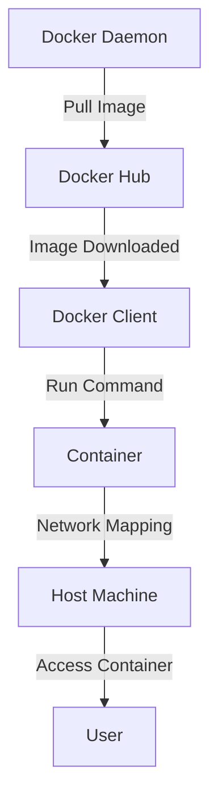

## Introduction to Docker Basics

Docker is an open-source platform that automates the deployment, scaling, and management of applications inside lightweight containers. Containers allow developers to package up their applications with all of their dependencies into a standardized unit for software development. This ensures that the application works seamlessly in any environment.

### What is Docker?

Docker is a containerization technology that allows developers to package applications and their dependencies into a portable container. These containers can run consistently across different environments, such as local development machines, testing servers, and production systems. Docker uses the Linux kernel's features like namespaces and cgroups to create isolated environments for applications.

### Why Use Docker?

1. **Consistency Across Environments**: Docker ensures that the application runs the same way in development, testing, and production environments.
2. **Portability**: Applications packaged in Docker containers can run on any system that supports Docker, including Windows, macOS, and various Linux distributions.
3. **Resource Efficiency**: Containers share the host operating system's resources, making them more efficient than traditional virtual machines.
4. **Scalability**: Docker makes it easy to scale applications horizontally by deploying multiple instances of containers.

### How Does Docker Work?

Docker operates using a client-server architecture. The Docker daemon (`dockerd`) runs on the host machine and manages the building, running, and distributing of Docker containers. The Docker client (`docker`) communicates with the daemon through a REST API or CLI.

#### Docker Components

1. **Docker Daemon**: Manages Docker objects such as images, containers, networks, and volumes.
2. **Docker Client**: The primary user interface to Docker, used to interact with the Docker daemon.
3. **Docker Images**: Read-only templates that contain the necessary components to run an application.
4. **Docker Containers**: Running instances of Docker images.
5. **Docker Registries**: Stores Docker images, allowing users to download and upload images. The most popular registry is Docker Hub.

### Docker Commands and Concepts

#### Docker Pull

The `docker pull` command downloads a Docker image from a registry. By default, it pulls the latest version of the image. You can specify a specific version by appending the tag to the image name.

```bash
docker pull redis:4.0
```

This command pulls the Redis image version 4.0 from Docker Hub.

#### Docker Run

The `docker run` command starts a new container from an image. It combines the `docker pull` and `docker start` commands into one. If the image is not available locally, Docker will automatically pull it from the registry.

```bash
docker run redis:4.0
```

This command pulls the Redis image version 4.0 and starts a new container from it.

### Managing Multiple Containers

When you run multiple containers, Docker assigns unique identifiers to each container. You can list all running containers using the `docker ps` command.

```bash
docker ps
```

This command lists all running containers along with their IDs, names, and other details.

### Container Networking

Containers can communicate with each other and with the outside world through networking. Each container has its own network stack, and Docker provides several ways to manage container networking.

#### Port Mapping

When a container listens on a specific port, you can map that port to a port on the host machine using the `-p` flag.

```bash
docker run -p 6379:6379 redis:4.0
```

This command maps port 6379 of the container to port 6379 of the host machine.

### Handling Multiple Containers on the Same Port

Running multiple containers on the same port can lead to conflicts. Docker resolves this issue by mapping each container's port to a unique port on the host machine.

```bash
docker run -p 6379:6379 --name redis1 redis:4.
docker run -p 6380:6379 --name redis2 redis:4.0
```

In this example, `redis1` listens on port 6379 of the host machine, while `redis2` listens on port 6380 of the host machine.

### Docker Logs

You can view the logs of a running container using the `docker logs` command.

```bash
docker logs <container_id>
```

This command displays the logs of the specified container.

### Docker Compose

Docker Compose is a tool for defining and running multi-container Docker applications. With Compose, you use a YAML file to configure your application’s services. Then, with a single command, you create and start all the services from your configuration.

```yaml
version: '3'
services:
  redis1:
    image: redis:4.0
    ports:
      - "6379:6379"
  redis2:
    image: redis:4.0
    ports:
      - "6380:6379"
```

This YAML file defines two Redis services, each running on a different port.

### Real-World Examples

#### CVE-2021-21315: Docker API Unauthorized Access

CVE-2021-21315 is a critical vulnerability in Docker that allows unauthorized access to the Docker API. An attacker can exploit this vulnerability to gain full control over the Docker daemon, leading to potential data theft or system compromise.

**Detection**:
Monitor Docker API access logs for unauthorized requests.

**Prevention**:
1. **Secure Docker API**: Restrict access to the Docker API using firewall rules and authentication mechanisms.
2. **Use TLS**: Enable TLS encryption for the Docker API to ensure secure communication.
3. **Least Privilege Principle**: Ensure that only authorized users have access to the Docker API.

**Secure Code Fix**:

Vulnerable Code:
```bash
docker run -p 6379:6379 -v /var/run/docker.sock:/var/run/docker.sock redis:4.0
```

Fixed Code:
```bash
docker run -p 6379:6379 -v /var/run/docker.sock:/var/run/docker.sock --network=none redis:4.0
```

By disabling network access, you reduce the risk of unauthorized access to the Docker API.

### Hands-On Labs

To practice Docker basics, consider the following labs:

- **PortSwigger Web Security Academy**: Offers interactive labs to learn about Docker and container security.
- **OWASP Juice Shop**: A deliberately insecure web application that includes Docker-based challenges.
- **Docker Documentation**: Provides comprehensive tutorials and examples for learning Docker.

### Conclusion

Docker simplifies the process of deploying and managing applications by providing a consistent and portable environment. Understanding Docker commands and concepts is essential for effective use of the platform. By following best practices and securing your Docker setup, you can ensure the reliability and security of your applications.

### Further Reading

- **Docker Documentation**: Official documentation for Docker.
- **Docker Security Best Practices**: Guidelines for securing Docker deployments.
- **CVE Database**: Information on vulnerabilities affecting Docker and other software.

### Diagrams



This diagram illustrates the flow of Docker operations, from pulling an image to running a container and accessing it from the host machine.

### Summary

Docker is a powerful tool for containerizing applications, ensuring consistency across different environments. By understanding Docker commands and concepts, you can effectively deploy and manage applications using Docker. Always follow best practices to secure your Docker setup and prevent potential vulnerabilities.

---
<!-- nav -->
[[04-Introduction to Docker Basics Containers, Images, and Actions|Introduction to Docker Basics Containers, Images, and Actions]] | [[DevOps/DevOps Bootcamp/05-Containerization (Docker)/04-Docker Basics Commands And Concepts/00-Overview|Overview]] | [[06-Introduction to Docker Containers|Introduction to Docker Containers]]
