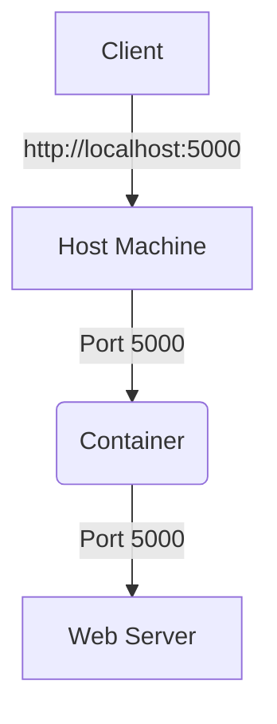

## Introduction to Docker Networking and Port Binding

Docker is a powerful platform for building, packaging, and deploying applications in lightweight, portable containers. One of the key concepts in Docker networking is port binding, which allows containers to communicate with the outside world through specific ports on the host machine. This chapter will delve deep into the mechanics of port binding, its importance, potential pitfalls, and how to secure it effectively.

### What is Port Binding?

Port binding is the process of mapping a port on the host machine to a port inside a Docker container. This allows external applications to communicate with the services running inside the container. For instance, if a web server inside a container listens on port 5000, you can map this port to port 5000 on the host machine, allowing external clients to access the web server via `http://localhost:5000`.

#### Why is Port Binding Important?

Port binding is crucial for several reasons:

1. **External Access**: It enables external applications and users to interact with services running inside the container.
2. **Isolation**: By mapping specific ports, you can isolate the services running in different containers, even if they use the same internal port.
3. **Flexibility**: You can dynamically change the port mappings without modifying the container's internal configuration.

### How Port Binding Works

When you run a Docker container, you can specify port bindings using the `-p` flag. The general syntax is:

```bash
docker run -p <host_port>:<container_port> <image_name>
```

For example, to run a container with a web server listening on port 5000 inside the container and map it to port 5000 on the host machine, you would use:

```bash
docker run -p 5000:5000 my_web_server_image
```

This command tells Docker to map port 5000 on the host machine to port 5000 inside the container.

#### Detailed Example

Let's consider a more detailed example. Suppose you have a Flask web application running inside a Docker container on port 5000. You want to access this application from your local machine. The following steps illustrate how to set up the port binding:

1. **Build the Docker Image**:
    ```bash
    docker build -t my_flask_app .
    ```

2. **Run the Container with Port Binding**:
    ```bash
    docker run -p 5000:5000 my_flask_app
    ```

3. **Access the Application**:
    Open a browser and navigate to `http://localhost:5000`. You should see the Flask application running.

### Multiple Containers and Port Conflicts

One of the challenges with port binding is managing conflicts when multiple containers try to use the same port on the host machine. Docker allows you to resolve these conflicts by mapping different host ports to the same container port.

For example, suppose you have two containers running the same Flask application but on different host ports:

```bash
docker run -p 5000:5000 my_flask_app
docker run -p 5001:5000 my_flask_app
```

In this case, both containers are listening on port 5000 internally, but they are mapped to different ports (5000 and 5001) on the host machine. This setup prevents port conflicts and allows both applications to run simultaneously.

### Real-World Examples and CVEs

Port binding vulnerabilities can lead to serious security issues. For example, CVE-2019-14287 is a vulnerability in Docker that allowed an attacker to bypass the port binding restrictions and gain unauthorized access to the host machine.

#### CVE-2019-14287

CVE-2019-14287 was a critical vulnerability in Docker that allowed an attacker to bypass the port binding restrictions and potentially gain unauthorized access to the host machine. This vulnerability was due to a flaw in the way Docker handled port bindings, allowing an attacker to map a container port to a privileged port on the host machine.

To mitigate such vulnerabilities, it is essential to follow best practices for securing Docker environments, including proper port binding configurations and regular updates.

### Diagramming Port Binding

A visual representation can help understand the flow of traffic between the host machine and the container. Below is a `mermaid` diagram illustrating the port binding process:



### Common Pitfalls and Best Practices

#### Common Pitfalls

1. **Port Conflicts**: Failing to manage port conflicts can lead to service disruptions.
2. **Security Risks**: Exposing unnecessary ports can increase the attack surface.
3. **Misconfiguration**: Incorrectly configuring port bindings can result in inaccessible services.

#### Best Practices

1. **Use Unique Host Ports**: Always use unique host ports to avoid conflicts.
2. **Limit Exposed Ports**: Only expose the necessary ports to reduce the attack surface.
3. **Regular Audits**: Regularly audit your port bindings to ensure they are correctly configured.

### How to Prevent / Defend

#### Detection

To detect misconfigured port bindings, you can use tools like `docker ps` to list all running containers and their port mappings:

```bash
docker ps
```

This command will display a list of all running containers along with their port bindings.

#### Prevention

1. **Secure Configuration**: Ensure that only necessary ports are exposed and that they are properly mapped.
2. **Network Policies**: Implement network policies to restrict access to specific ports.
3. **Regular Updates**: Keep Docker and related components up to date to patch known vulnerabilities.

#### Secure Code Fix

Here is an example of a vulnerable configuration and its secure counterpart:

**Vulnerable Configuration**:
```bash
docker run -p 80:8080 my_web_server
```

**Secure Configuration**:
```bash
docker run -p 8080:80 my_web_server
```

In the secure configuration, port 8080 on the host machine is mapped to port 80 inside the container, reducing the risk of exposing sensitive ports.

### Complete Example with Raw HTTP Messages

Consider a scenario where a web server inside a container listens on port 8000, and you map it to port 8000 on the host machine. The following example shows the complete HTTP request and response:

#### HTTP Request

```http
GET / HTTP/1.1
Host: localhost:8000
User-Agent: curl/7.64.1
Accept: */*
```

#### HTTP Response

```http
HTTP/1.1 200 OK
Date: Mon, 20 Mar 2023 12:00:00 GMT
Server: Apache/2.4.41 (Ubuntu)
Content-Type: text/html; charset=UTF-8
Content-Length: 12

Hello, World!
```

### Hands-On Labs

To practice Docker networking and port binding, you can use the following labs:

- **PortSwigger Web Security Academy**: Offers exercises on Docker networking and port binding.
- **OWASP Juice Shop**: Provides a vulnerable web application that you can run in a Docker container and practice port binding.

### Conclusion

Port binding is a fundamental aspect of Docker networking that allows external applications to interact with services running inside containers. Understanding how to configure and secure port bindings is crucial for maintaining a robust and secure Docker environment. By following best practices and regularly auditing your configurations, you can minimize the risk of port-related vulnerabilities.

---
<!-- nav -->
[[06-Introduction to Docker Containers|Introduction to Docker Containers]] | [[DevOps/DevOps Bootcamp/05-Containerization (Docker)/04-Docker Basics Commands And Concepts/00-Overview|Overview]] | [[DevOps/DevOps Bootcamp/05-Containerization (Docker)/04-Docker Basics Commands And Concepts/08-Practice Questions & Answers|Practice Questions & Answers]]
