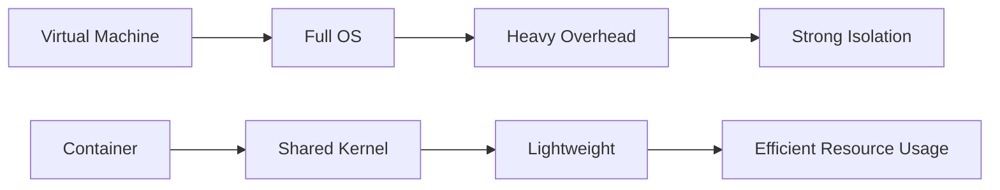

## Introduction to Containers and Docker

### What Are Containers?

Containers are a lightweight form of operating system virtualization that allow multiple isolated user-space instances to run on a single host operating system. Each container shares the host's kernel but runs its own user space, providing a level of isolation and resource control that is more efficient than traditional virtual machines (VMs).

#### Why Use Containers?

Containers offer several advantages:

1. **Portability**: Applications can run consistently across different environments (development, testing, production).
2. **Efficiency**: Containers share the host OS kernel, reducing overhead and improving performance.
3. **Isolation**: Each container runs in its own isolated environment, minimizing conflicts between applications.
4. **Scalability**: Containers can be easily scaled up or down based on demand.

### What Is Docker?

Docker is one of the most popular containerization platforms. It provides tools and services to package, ship, and run applications inside containers. Docker simplifies the process of creating and managing containers, making it easier for developers and operations teams to collaborate.

#### Problems Solved by Containers and Docker

1. **Consistency Across Environments**: Containers ensure that an application runs the same way in development, testing, and production.
2. **Resource Utilization**: Containers are more efficient than VMs, allowing better utilization of hardware resources.
3. **Rapid Deployment**: Containers can be quickly deployed and scaled, enabling faster time-to-market for applications.

### Difference Between Docker and Virtual Machines

Virtual machines provide full hardware virtualization, where each VM runs its own complete operating system. This provides strong isolation but comes with significant overhead.

Containers, on the other hand, share the host OS kernel, providing a lighter and more efficient solution. Here’s a comparison:



### Installing Docker

To get started with Docker, you need to install it on your system. Docker is available for Windows, macOS, and Linux. Here’s how to install Docker on Ubuntu:

```bash
# Update the apt package index
sudo apt-get update

# Install packages to allow apt to use a repository over HTTPS
sudo apt-get install \
    apt-transport-https \
    ca-certificates \
    curl \
    gnupg \
    lsb-release

# Add Docker’s official GPG key
curl -fsSL https://download.docker.com/linux/ubuntu/gpg | sudo gpg --dearmor -o /usr/share/keyrings/docker-archive-keyring.gpg

# Set up the stable repository
echo \
  "deb [arch=amd64 signed-by=/usr/share/keyrings/docker-archive-keyring.gpg] https://download.docker.com/linux/ubuntu \
  $(lsb_release -cs) stable" | sudo tee /etc/apt/sources.list.d/docker.list > /dev/null

# Update the apt package index again
sudo apt-get update

# Install Docker CE
sudo apt-get install docker-ce docker-ce-cli containerd.io
```

### Main Docker Commands

Once Docker is installed, you can start using it with various commands. Here are some essential commands:

1. **Running a Container**:
   ```bash
   docker run -it ubuntu:latest /bin/bash
   ```

2. **Listing Running Containers**:
   ```bash
   docker ps
   ```

3. **Stopping a Container**:
   ```bash
   docker stop <container_id>
   ```

4. **Inspecting a Container**:
   ```bash
   docker inspect <container_id>
   ```

5. **Building a Docker Image**:
   ```bash
   docker build -t myimage .
   ```

6. **Pushing an Image to a Registry**:
   ```bash
   docker push myimage:latest
   ```

### Using Docker in Practice

Let’s walk through a complete workflow using Docker. We’ll create a simple Node.js application and containerize it.

#### Step 1: Develop with Containers

Create a `Dockerfile` in your project directory:

```Dockerfile
# Use an official Node runtime as a parent image
FROM node:14

# Set the working directory in the container
WORKDIR /app

# Copy the current directory contents into the container at /app
COPY . /app

# Install any needed packages specified in package.json
RUN npm install

# Make port 8080 available to the world outside this container
EXPOSE 8080

# Define environment variable
ENV NAME World

# Run app.py when the container launches
CMD ["npm", "start"]
```

#### Step 2: Running Multiple Containers and Services with Docker Compose

Create a `docker-compose.yml` file:

```yaml
version: '3'
services:
  web:
    build: .
    ports:
      - "8080:8080"
  redis:
    image: "redis:alpine"
```

Run the services:

```bash
docker-compose up
```

#### Step 3: Building Your Own Docker Image

Build the Docker image:

```bash
docker build -t mynodeapp .
```

#### Step 4: Pushing Your Built Image into a Private Docker Repository

First, log in to your Docker registry:

```bash
docker login myregistry.example.com
```

Then, tag and push the image:

```bash
docker tag mynodeapp:latest myregistry.example.com/myorg/mynodeapp:latest
docker push myregistry.example.com/myorg/mynodeapp:latest
```

#### Step 5: Deploying and Running Your Containerized Application

Deploy the application:

```bash
docker run -d -p 8080:8080 myregistry.example.com/myorg/mynodeapp:latest
```

### Persisting Data in Docker

Data persistence is crucial for applications that require persistent storage. Docker supports several ways to manage data:

1. **Volumes**: Persistent storage that exists independently of the container lifecycle.
2. **Bind Mounts**: Directly mount a host directory into the container.
3. **Temporary Storage**: Data stored in the container itself, lost when the container is removed.

#### Configuring Persistence for Your Demo Project

Using volumes:

```bash
docker run -d -v /mydata:/app/data -p 8080:8080 myregistry.example.com/myorg/mynodeapp:latest
```

### Real-World Examples and CVEs

One notable example is the `CVE-2019-14287`, which affected Docker versions prior to 19.03. This vulnerability allowed an attacker to escalate privileges and execute arbitrary code on the host system. Proper configuration and regular updates can mitigate such risks.

### How to Prevent / Defend

#### Detection

Regularly scan your Docker images for vulnerabilities using tools like `Trivy`:

```bash
trivy image myregistry.example.com/myorg/mynodeapp:latest
```

#### Prevention

1. **Use Secure Base Images**: Always use trusted base images.
2. **Keep Docker Updated**: Regularly update Docker to the latest version.
3. **Limit Privileges**: Run containers with the least privilege necessary.
4. **Secure Configuration**: Harden Docker configurations to minimize attack surfaces.

#### Secure Coding Fixes

Vulnerable Code:
```Dockerfile
FROM node:latest
RUN npm install express
CMD ["node", "app.js"]
```

Secure Code:
```Dockerfile
FROM node:14-alpine
RUN apk add --no-cache bash
RUN npm install express
CMD ["node", "app.js"]
```

### Conclusion

Containers and Docker have revolutionized modern software development by providing a portable, efficient, and scalable way to deploy applications. By understanding the fundamentals and practical use of Docker, you can leverage these powerful tools to enhance your DevOps capabilities.

### Hands-On Labs

For hands-on experience with Docker, consider the following labs:

- **PortSwigger Web Security Academy**: Offers practical exercises on securing web applications using Docker.
- **OWASP Juice Shop**: A deliberately insecure web application for practicing security skills, including containerization.
- **Docker Documentation Tutorials**: Official Docker tutorials provide comprehensive guides on using Docker effectively.

By completing these labs, you can gain deeper insights into the practical aspects of using Docker in real-world scenarios.

---
<!-- nav -->
[[DevOps/DevOps Bootcamp/05-Containerization (Docker)/06-Docker Containers Fundamentals And Practical Use/00-Overview|Overview]] | [[02-Introduction to Docker Containers and Nexus Repository Manager|Introduction to Docker Containers and Nexus Repository Manager]]
