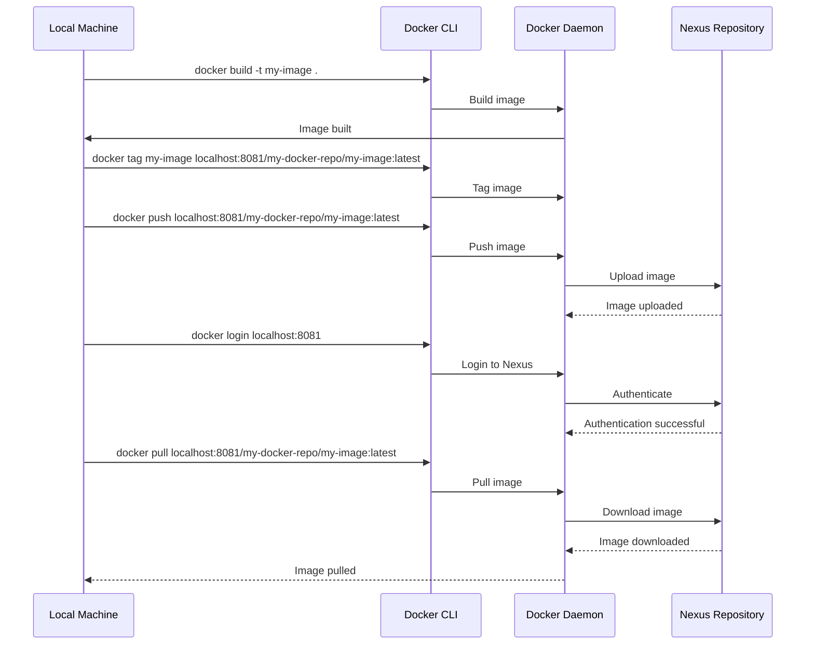

## Pushing and Fetching Docker Images to/from Nexus

### Prerequisites

Ensure you have completed the steps to set up Nexus as a Docker container and created a private Docker repository.

### Step-by-Step Guide

#### Step 1: Build a Docker Image

First, build a Docker image locally. For example, create a `Dockerfile` with the following content:

```Dockerfile
FROM alpine:latest
CMD ["echo", "Hello, World!"]
```

Build the image:

```bash
docker build -t my-image .
```

#### Step 2: Tag the Image for Nexus

Tag the image with the Nexus repository URL:

```bash
docker tag my-image localhost:8081/my-docker-repo/my-image:latest
```

#### Step 3: Push the Image to Nexus

Push the image to the Nexus repository:

```bash
docker push localhost:8081/my-docker-repo/my-image:latest
```

#### Step 4: Fetch the Image from Nexus

To fetch the image from Nexus, first log in to the Nexus repository:

```bash
docker login localhost:8081
```

Enter the username and password when prompted.

Then, pull the image:

```bash
docker pull localhost:8081/my-docker-repo/my-image:latest
```

### Diagram: Pushing and Fetching Docker Images



### Common Pitfalls and How to Prevent Them

#### Pitfall 1: Incorrect Tagging

**Problem**: Incorrect tagging can result in the image being pushed to the wrong repository or with the wrong tag.

**Solution**: Double-check the tag format and ensure that it matches the repository URL and desired tag.

#### Pitfall 2: Insufficient Permissions

**Problem**: Insufficient permissions can prevent you from pushing or pulling images.

**Solution**: Ensure that the user has the necessary permissions in Nexus to perform these actions.

### How to Prevent / Defend

#### Detection

- **Audit Logs**: Review audit logs in Nexus to track who performed what actions.
- **Error Messages**: Pay attention to error messages during push and pull operations.

#### Prevention

- **Role-Based Access Control (RBAC)**: Implement RBAC in Nexus to control who can perform certain actions.
- **Regular Audits**: Perform regular audits to ensure that permissions are correctly configured.

---
<!-- nav -->
[[DevOps/DevOps Bootcamp/05-Containerization (Docker)/06-Docker Containers Fundamentals And Practical Use/04-Hands-On Practice|Hands-On Practice]] | [[DevOps/DevOps Bootcamp/05-Containerization (Docker)/06-Docker Containers Fundamentals And Practical Use/00-Overview|Overview]] | [[06-Real-World Examples and Recent CVEs|Real-World Examples and Recent CVEs]]
