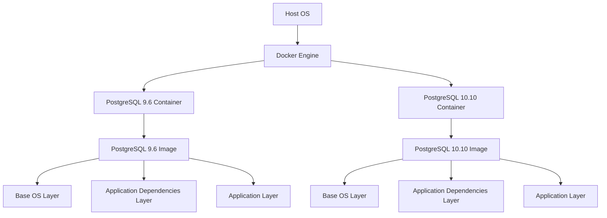

## Introduction to Container Architecture and Docker Usage

### What Are Containers?

Containers are lightweight, standalone, executable packages that include everything needed to run a piece of software, including the code, runtime, system tools, libraries, and settings. They provide a consistent environment for developing, testing, and deploying applications across different computing environments. This consistency ensures that an application will behave the same way regardless of where it is deployed.

### Why Use Containers?

Containers offer several advantages:

1. **Isolation**: Each container runs in isolation from others, ensuring that applications do not interfere with each other.
2. **Portability**: Containers can be moved between different environments (development, testing, production) without compatibility issues.
3. **Efficiency**: Containers share the host operating system kernel, making them more efficient than virtual machines.
4. **Consistency**: Containers ensure that the application behaves consistently across different environments.

### How Containers Work

Containers are built using images, which are read-only templates that define the environment in which the application will run. An image consists of multiple layers, each representing a specific aspect of the environment. These layers are stacked on top of each other to form the final image.

#### Layers in Container Images

Container images are composed of layers, which are essentially filesystem snapshots. Each layer represents a change made to the filesystem. For example, one layer might contain the base operating system, another might contain the application dependencies, and yet another might contain the application itself.

The key benefits of using layers include:

1. **Efficiency**: Only the changed layers need to be downloaded when updating an image.
2. **Reuse**: Multiple images can share common layers, reducing storage requirements.
3. **Version Control**: Different versions of an application can be managed by simply changing the layers.

### Example: Running Multiple Versions of PostgreSQL

Let's consider the scenario of running multiple versions of PostgreSQL using Docker containers. We will walk through the process step-by-step.

#### Step 1: Pulling the Docker Images

To pull the Docker images for PostgreSQL 9.6 and 10.10, we use the following commands:

```sh
docker pull postgres:9.6
docker pull postgres:10.10
```

These commands download the specified versions of PostgreSQL from the Docker Hub.

#### Step 2: Running the Containers

Once the images are pulled, we can run the containers using the `docker run` command. Here’s how to run both versions:

```sh
docker run --name postgres96 -e POSTGRES_PASSWORD=mysecretpassword -d postgres:9.6
docker run --name postgres1010 -e POSTGRES_PASSWORD=mysecretpassword -d postgres:10.10
```

In these commands:

- `--name` specifies the name of the container.
- `-e POSTGRES_PASSWORD` sets the password for the PostgreSQL database.
- `-d` runs the container in detached mode (in the background).

#### Step 3: Verifying the Containers

To verify that both containers are running, we can use the `docker ps` command:

```sh
docker ps
```

This command lists all the running containers along with their details.

### Diagram: Container Architecture

Here is a mermaid diagram illustrating the architecture of running multiple PostgreSQL versions in Docker containers:



### Benefits of Running Multiple Versions

Running multiple versions of the same application allows developers to:

1. **Test Compatibility**: Ensure that the application works correctly with different versions of the database.
2. **Rollback**: Easily roll back to a previous version if a new version introduces issues.
3. **Parallel Development**: Develop and test features against different versions simultaneously.

### Common Pitfalls and How to Avoid Them

#### Pitfall 1: Port Conflicts

When running multiple instances of the same service, port conflicts can occur. To avoid this, specify unique ports for each instance.

**Example:**

```sh
docker run --name postgres96 -e POSTGRES_PASSWORD=mysecretpassword -p 5432:5432 -d postgres:9.6
docker run --name postgres1010 -e POSTGRES_PASSWORD=mysecretpassword -p 5433:5432 -d postgres:10.10
```

In this example, the first container uses port 5432, and the second container uses port 5433.

#### Pitfall 2: Data Persistence

By default, data in Docker containers is ephemeral. To persist data, use volumes.

**Example:**

```sh
docker run --name postgres96 -e POSTGRES_PASSWORD=mysecretpassword -v /path/to/volume:/var/lib/postgresql/data -d postgres:9.6
docker run --name postgres1010 -e POSTGRES_PASSWORD=mysecretpassword -v /path/to/volume:/var/lib/postgresql/data -d postgres:10.10
```

In this example, `/path/to/volume` is a directory on the host machine that persists the data.

### How to Prevent / Defend

#### Detection

To detect issues with containerized applications, use monitoring tools such as Prometheus and Grafana. These tools can help identify performance bottlenecks, resource usage, and other issues.

#### Prevention

1. **Use Secure Images**: Always use trusted and secure images from reputable sources.
2. **Regular Updates**: Keep the images up-to-date with the latest security patches.
3. **Network Isolation**: Use network policies to isolate containers and prevent unauthorized access.

#### Secure Coding Fixes

Here is an example of a vulnerable and secure version of a Dockerfile:

**Vulnerable Dockerfile:**

```Dockerfile
FROM postgres:latest
COPY . /app
WORKDIR /app
EXPOSE 5432
CMD ["postgres"]
```

**Secure Dockerfile:**

```Dockerfile
FROM postgres:latest
COPY . /app
WORKDIR /app
EXPOSE 5432
RUN apt-get update && apt-get install -y <necessary-packages>
CMD ["postgres", "-c", "listen_addresses='localhost'"]
```

In the secure version, we ensure that the container listens only on localhost to prevent external access.

### Real-World Examples

#### Recent CVEs and Breaches

One notable example is the CVE-2021-21285, which affected Docker and allowed attackers to execute arbitrary code on the host system. This vulnerability was due to improper validation of user input in the Docker daemon.

To mitigate such vulnerabilities, always keep Docker and related components up-to-date and apply security patches promptly.

### Conclusion

Containers provide a powerful and efficient way to manage and deploy applications. By understanding the architecture and usage of containers, developers can leverage Docker to run multiple versions of the same application, ensuring consistency and efficiency across different environments.

### Practice Labs

For hands-on experience with container architecture and Docker usage, consider the following labs:

- **PortSwigger Web Security Academy**: Offers practical exercises on container security.
- **OWASP Juice Shop**: Provides a vulnerable web application that can be containerized and tested.
- **Kubernetes Goat**: Focuses on Kubernetes security and can be used to practice container orchestration.

These labs will help you gain a deeper understanding of container architecture and Docker usage in real-world scenarios.

---
<!-- nav -->
[[DevOps/DevOps Bootcamp/05-Containerization (Docker)/07-Container Architecture and Docker Usage/00-Overview|Overview]] | [[02-Introduction to Docker and Container Architecture|Introduction to Docker and Container Architecture]]
