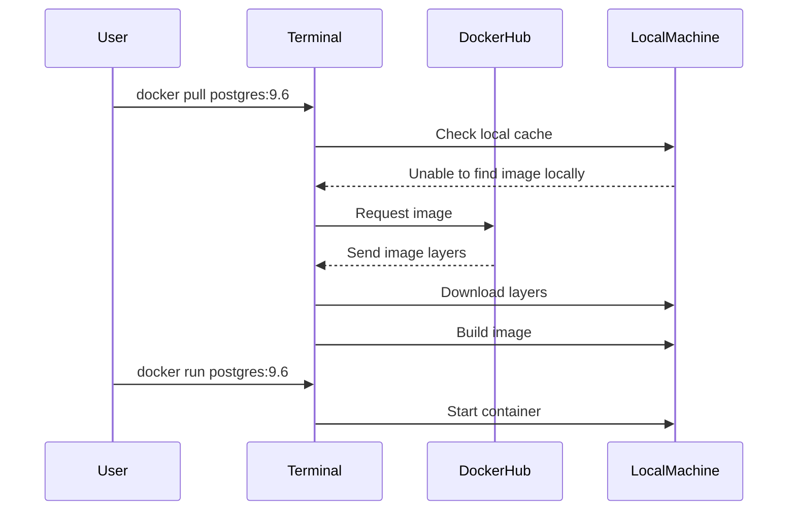

## Introduction to Docker and Container Architecture

### What is Docker?

Docker is an open-source platform that automates the deployment, scaling, and management of applications inside lightweight containers. Containers allow developers to package up their applications with all of the parts it needs, such as libraries and other dependencies, and ship them out as one package. This ensures that the application will run on any other Linux machine regardless of any customized settings that machine might have that could differ from the machine used for writing and testing the code.

### Why Use Docker?

Docker simplifies the process of deploying applications by providing a consistent environment across different machines. This consistency helps in reducing the "works on my machine" problem, where an application works fine on the developer's machine but fails on the production server due to differences in the environment. Additionally, Docker allows for efficient resource utilization by sharing the operating system kernel and isolating processes.

### How Does Docker Work?

At its core, Docker uses containerization technology to create isolated environments for applications. These containers are lightweight and portable, allowing applications to run consistently across different environments. Docker achieves this through the following components:

1. **Docker Images**: Pre-built packages that contain the application and all its dependencies.
2. **Docker Containers**: Running instances of Docker images.
3. **Docker Registry**: A service that stores and distributes Docker images.

### Docker Repository and Docker Hub

A Docker repository is a collection of Docker images. Docker Hub is a public registry where developers can store and share their Docker images. Docker Hub provides a centralized location for storing and distributing Docker images, making it easy for developers to access and use pre-built images.

#### Public vs. Private Repositories

- **Public Repositories**: Anyone can access and use the images stored in a public repository. Docker Hub is an example of a public repository.
- **Private Repositories**: Access to these repositories is restricted to authorized users. Private repositories are useful for storing sensitive or proprietary images.

### Pulling Docker Images

To use a Docker image, you need to pull it from a Docker repository. The `docker pull` command is used to download the image from the repository to your local machine.

```bash
docker pull <image_name>
```

If you don't specify a version, Docker will pull the latest version of the image. To specify a version, you can append the version number to the image name using a colon (`:`).

```bash
docker pull postgres:9.6
```

### Running Docker Containers

Once you have pulled the Docker image, you can run it using the `docker run` command. This command starts a new container based on the specified image.

```bash
docker run postgres:9.6
```

### Understanding Layers in Docker

Docker images are built using layers. Each layer represents a change to the image. For example, the base layer might be a minimal Linux distribution, and subsequent layers might add libraries, configuration files, and the application itself.

When you pull a Docker image, Docker downloads each layer separately. This allows for efficient storage and transfer of images, as only the changed layers need to be downloaded.

### Example: Pulling and Running a PostgreSQL Image

Let's walk through the process of pulling and running a PostgreSQL image from Docker Hub.

1. **Pull the Image**:
   
   ```bash
   docker pull postgres:9.6
   ```

   This command will download the PostgreSQL image version 9.6 from Docker Hub. The output will show the layers being downloaded.

   ```
   Unable to find image 'postgres:9.6' locally
   9.6: Pulling from library/postgres
   1b2c3d4e5f6g7h8i9j0k1l2m3n4o5p6q7r8s9t0u1v2w3x4y5z6a7b8c9d0e1f2g3h4i5j6k7l8m9n0o1p2q3r4s5t6u7v8w9x0y1z2a3b4c5d6e7f8g9h0i1j2k3l4m5n6o7p8q9r0s1t2u3v4w5x6y7z8a9b0c1d2e3f4g5h6i7j8k9l0m1n2o3p4q5r6s7t8u9v0w1x2y3z4a5b6c7d8e9f0g1h2i3j4k5l6m7n8o9p0q1r2s3t4u5v6w7x8y9z0a1b2c3d4e5f6g7h8i9j0k1l2m3n4o5p6q7r8s9t0u1v2w3x4y5z6a7b8c9d0e1f2g3h4i5j6k7l8m9n0o1p2q3r4s5t6u7v8w9x0y1z2a3b4c5d6e7f8g9h0i1j2k3l4m5n6o7p8q9r0s1t2u3v4w5x6y7z8a9b0c1d2e3f4g5h6i7j8k9l0m1n2o3p4q5r6s7t8u9v0w1x2y3z4a5b6c7d8e9f0g1h2i3j4k5l6m7n8o9p0q1r2s3t4u5v6w7x8y9z0a1b2c3d4e5f6g7h8i9j0k1l2m3n4o5p6q7r8s9t0u1v2w3x4y5z6a7b8c9d0e1f2g3h4i5j6k7l8m9n0o1p2q3r4s5t6u7v8w9x0y1z2a3b4c5d6e7f8g9h0i1j2k3l4m5n6o7p8q9r0s1t2u3v4w5x6y7z8a9b0c1d2e3f4g5h6i7j8k9l0m1n2o3p4q5r6s7t8u9v0w1x2y3z4a5b6c7d8e9f0g1h2i3j4k5l6m7n8o9p0q1r2s3t4u5v6w7x8y9z0a1b2c3d4e5f6g7h8i9j0k1l2m3n4o5p6q7r8s9t0u1v2w3x4y5z6a7b8c9d0e1f2g3h4i5j6k7l8m9n0o1p2q3r4s5t6u7v8w9x0y1z2a3b4c5d6e7f8g9h0i1j2k3l4m5n6o7p8q9r0s1t2u3v4w5x6y7z8a9b0c1d2e3f4g5h6i7j8k9l0m1n2o3p4q5r6s7t8u9v0w1x2y3z4a5b6c7d8e9f0g1h2i3j4k5l6m7n8o9p0q1r2s3t4u5v6w7x8y9z0a1b2c3d4e5f6g7h8i9j0k1l2m3n4o5p6q7r8s9t0u1v2w3x4y5z6a7b8c9d0e1f2g3h4i5j6k7l8m9n0o1p2q3r4s5t6u7v8w9x0y1z2a3b4c5d6e7f8g9h0i1j2k3l4m5n6o7p8q9r0s1t2u3v4w5x6y7z8a9b0c1d2e3f4g5h6i7j8k9l0m1n2o3p4q5r6s7t8u9v0w1x2y3z4a5b6c7d8e9f0g1h2i3j4k5l6m7n8o9p0q1r2s3t4u5v6w7x8y9z0a1b2c3d4e5f6g7h8i9j0k1l2m3n4o5p6q7r8s9t0u1v2w3x4y5z6a7b8c9d0e1f2g3h4i5j6k7l8m9n0o1p2q3r4s5t6u7v8w9x0y1z2a3b4c5d6e7f8g9h0i1j2k3l4m5n6o7p8q9r0s1t2u3v4w5x6y7z8a9b0c1d2e3f4g5h6i7j8k9l0m1n2o3p4q5r6s7t8u9v0w1x2y3z4a5b6c7d8e9f0g1h2i3j4k5l6m7n8o9p0q1r2s3t4u5v6w7x8y9z0a1b2c3d4e5f6g7h8i9j0k1l2m3n4o5p6q7r8s9t0u1v2w3x4y5z6a7b8c9d0e1f2g3h4i5j6k7l8m9n0o1p2q3r4s5t6u7v8w9x0y1z2a3b4c5d6e7f8g9h0i1j2k3l4m5n6o7p8q9r0s1t2u3v4w5x6y7z8a9b
```

### Diagramming the Process

We can visualize the process of pulling and running a Docker image using a mermaid diagram.



### Common Pitfalls and Best Practices

#### Pitfall: Using Latest Tags

Using the `latest` tag can lead to unexpected behavior if the underlying image changes. Always specify a version to ensure consistency.

#### Best Practice: Specify Versions

Always specify a version when pulling Docker images to avoid issues with changing images.

```bash
docker pull postgres:9.6
```

### How to Prevent / Defend

#### Detection

Regularly check the versions of Docker images used in your environment to ensure they match the intended versions.

#### Prevention

1. **Use Version-Specific Tags**: Always use version-specific tags to avoid pulling unintended versions.
2. **Automate Image Scanning**: Use tools like Docker Security Scanning to automatically scan images for vulnerabilities.
3. **Secure Configuration**: Ensure that Docker daemon and container configurations are secure. Use tools like `docker scan` to identify potential security issues.

#### Secure Coding Fixes

Compare the vulnerable and secure versions of Docker commands:

**Vulnerable:**

```bash
docker pull postgres:latest
```

**Secure:**

```bash
docker pull postgres:9.6
```

### Real-World Examples

#### CVE-2021-21366

In 2021, a vulnerability was discovered in Docker that allowed attackers to escalate privileges and execute arbitrary code. This highlights the importance of keeping Docker and its images up-to-date and secure.

#### Example Breach: Docker Hub Compromise

In 2021, Docker Hub experienced a compromise where unauthorized images were pushed to repositories. This underscores the importance of using private repositories for sensitive images and regularly auditing image sources.

### Conclusion

Understanding Docker and container architecture is crucial for modern DevOps practices. By leveraging Docker, developers can ensure consistent and reliable application deployments. Proper use of version-specific tags and regular security checks can help mitigate risks associated with Docker usage.

### Hands-On Labs

For practical experience with Docker and container architecture, consider the following labs:

- **PortSwigger Web Security Academy**: Offers hands-on labs for web application security, including Docker-based exercises.
- **OWASP Juice Shop**: A deliberately insecure web application for security training, which can be deployed using Docker.
- **DVWA (Damn Vulnerable Web Application)**: Another web application for security training, deployable via Docker.
- **Kubernetes Goat**: A lab for learning Kubernetes security, which involves working with Docker containers.

These labs provide real-world scenarios to practice and reinforce the concepts learned in this chapter.

---
<!-- nav -->
[[01-Introduction to Container Architecture and Docker Usage|Introduction to Container Architecture and Docker Usage]] | [[DevOps/DevOps Bootcamp/05-Containerization (Docker)/07-Container Architecture and Docker Usage/00-Overview|Overview]] | [[03-Container Architecture and Docker Usage|Container Architecture and Docker Usage]]
