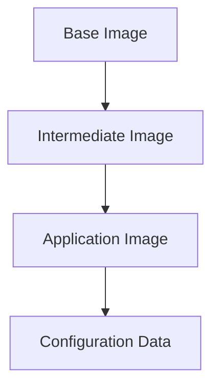

## Container Architecture and Docker Usage

### Introduction to Containers

Containers are a lightweight, portable, and self-sufficient way to package and run applications. They encapsulate an application along with its dependencies, libraries, and configurations, ensuring consistent behavior across different environments. This consistency is crucial in modern DevOps practices, where applications need to be deployed quickly and reliably across various stages of development, testing, and production.

### Technical Composition of Containers

Technically, a container is composed of layers of stacked images. These images form the building blocks of a container, providing a hierarchical structure that ensures efficiency and modularity.

#### Base Image

At the base of most containers, you would find a Linux base image. This base image is typically a minimal Linux distribution designed to be as small as possible while still providing the necessary functionalities. Common choices for base images include:

- **Alpine Linux**: Known for its small footprint, Alpine Linux is a popular choice for base images. It includes only the essential components needed to run an application, making it highly efficient in terms of disk space and memory usage.
  
- **Ubuntu**: Another popular choice, especially for more complex applications that require a broader set of pre-installed packages.

The importance of a small base image cannot be overstated. A smaller base image reduces the overall size of the container, leading to faster build times, quicker deployment, and lower resource consumption. This is particularly beneficial in cloud environments where resources are often metered and billed based on usage.



### Layered Architecture

The layered architecture of containers allows for efficient reuse of images. Each layer represents a specific aspect of the application, such as the operating system, libraries, and the application itself.

#### Intermediate Images

On top of the base image, you might have intermediate images that contain additional libraries or configurations required by the application. These intermediate layers ensure that the final application image is modular and maintainable.

#### Application Image

The application image is the final layer that contains the actual application code and its dependencies. This layer is built on top of the base and intermediate layers, inheriting their functionalities and configurations.

#### Configuration Data

Finally, configuration data is added on top of the application image. This data includes environment variables, configuration files, and other runtime settings that customize the behavior of the application.

### Practical Example: Using Docker

To understand how containers work in practice, let's walk through an example using Docker, a popular containerization platform.

#### Searching for Docker Images

Docker Hub is a repository of Docker images that can be used to build and run containers. To illustrate this, let's search for a PostgreSQL image on Docker Hub.

1. **Navigate to Docker Hub**: Open your browser and go to [Docker Hub](https://hub.docker.com/).

2. **Search for PostgreSQL**: In the search bar, type `postgres` and press Enter.

3. **Select a Version**: You will see a list of available versions of the PostgreSQL image. For this example, let's choose an older version, such as `9.6`.

#### Pulling the Docker Image

Once you've selected the desired version, you can pull the image to your local machine using the `docker pull` command.

```sh
docker pull postgres:9.6
```

This command downloads the specified version of the PostgreSQL image from Docker Hub to your local machine.

### Detailed Breakdown of the PostgreSQL Image

Let's take a closer look at the PostgreSQL image and understand its composition.

#### Base Image

The PostgreSQL image is built on top of a base image, typically a minimal Linux distribution. For example, the `postgres:9.6` image might be built on top of an Alpine Linux base image.

#### Intermediate Layers

Intermediate layers might include additional libraries or configurations required by PostgreSQL. These layers ensure that the final image is modular and maintainable.

#### Application Layer

The application layer contains the PostgreSQL database server and its dependencies. This layer is built on top of the base and intermediate layers, inheriting their functionalities and configurations.

#### Configuration Data

Configuration data includes environment variables, configuration files, and other runtime settings that customize the behavior of the PostgreSQL server.

### Running the Docker Container

Once the image is pulled, you can run it as a container using the `docker run` command.

```sh
docker run --name my-postgres -e POSTGRES_PASSWORD=mysecretpassword -d postgres:9.6
```

This command starts a new container named `my-postgres`, sets the `POSTGRES_PASSWORD` environment variable, and runs the container in detached mode (`-d`).

### Full HTTP Request and Response Example

While Docker commands do not involve HTTP requests directly, let's consider a scenario where you might interact with a PostgreSQL service running in a Docker container via HTTP.

#### Example: Connecting to PostgreSQL via HTTP

Suppose you have a web application that connects to a PostgreSQL database running in a Docker container. The web application might send an HTTP request to retrieve data from the database.

```http
GET /api/data HTTP/1.1
Host: localhost:8080
Authorization: Bearer <token>
```

The server running the web application would then connect to the PostgreSQL database and retrieve the requested data.

```http
HTTP/1.1 200 OK
Content-Type: application/json

{
  "data": [
    { "id": 1, "value": "example" },
    { "id": 2, "value": "another example" }
  ]
}
```

### Pitfalls and Best Practices

#### Avoiding Large Base Images

Using large base images can lead to bloated containers, increasing build times and resource consumption. Always opt for minimal base images like Alpine Linux.

#### Securing Environment Variables

Environment variables can expose sensitive information if not handled properly. Use Docker secrets or environment files to manage sensitive data securely.

#### Regularly Updating Images

Regularly updating your base and application images ensures that you have the latest security patches and bug fixes.

### How to Prevent / Defend

#### Detection

Monitor your container images for vulnerabilities using tools like Trivy or Clair. These tools can scan your images for known vulnerabilities and provide recommendations for mitigation.

#### Prevention

1. **Use Minimal Base Images**: Opt for minimal base images like Alpine Linux to reduce the size and potential attack surface of your containers.
  
2. **Secure Environment Variables**: Use Docker secrets or environment files to manage sensitive data securely. Avoid hardcoding sensitive information in your Dockerfiles or application code.

3. **Regular Updates**: Regularly update your base and application images to ensure you have the latest security patches and bug fixes.

4. **Network Isolation**: Use network isolation techniques to limit the exposure of your containers. For example, use Docker networks to isolate containers and restrict communication between them.

### Secure Coding Fixes

#### Vulnerable Code Example

```dockerfile
FROM ubuntu:latest
ENV POSTGRES_PASSWORD=secret
RUN apt-get update && apt-get install -y postgresql
EXPOSE 5432
CMD ["postgres", "-D", "/var/lib/postgresql/data"]
```

#### Secure Code Example

```dockerfile
FROM alpine:latest
COPY .env .
RUN apk add --no-cache postgresql
EXPOSE 5432
CMD ["postgres", "-D", "/var/lib/postgresql/data"]
```

In the secure example, we use a minimal base image (Alpine Linux) and store sensitive data in an environment file (`.env`) instead of hardcoding it in the Dockerfile.

### Real-World Examples

#### Recent CVEs and Breaches

- **CVE-2021-21277**: A vulnerability in the PostgreSQL server allowed attackers to execute arbitrary code. This highlights the importance of regularly updating your images and applying security patches.

- **Breaches involving Docker**: Several high-profile breaches have involved misconfigured Docker instances, leading to unauthorized access and data exfiltration. Proper network isolation and secure configuration are crucial to preventing such incidents.

### Hands-On Labs

For hands-on practice with container architecture and Docker usage, consider the following labs:

- **PortSwigger Web Security Academy**: Offers a series of labs focused on web application security, including container-related challenges.
- **OWASP Juice Shop**: A deliberately insecure web application for practicing web security skills, including container-based deployments.
- **Docker Official Workshops**: Provides comprehensive tutorials and exercises for learning Docker and containerization.

By following these guidelines and best practices, you can effectively leverage containers and Docker to build, deploy, and manage your applications in a secure and efficient manner.

---
<!-- nav -->
[[02-Introduction to Docker and Container Architecture|Introduction to Docker and Container Architecture]] | [[DevOps/DevOps Bootcamp/05-Containerization (Docker)/07-Container Architecture and Docker Usage/00-Overview|Overview]] | [[DevOps/DevOps Bootcamp/05-Containerization (Docker)/07-Container Architecture and Docker Usage/04-Practice Questions & Answers|Practice Questions & Answers]]
