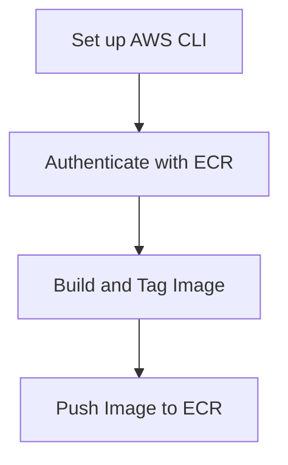

## Introduction to Docker Repositories and AWS ECR

Docker repositories are central locations where Docker images are stored and managed. These repositories allow developers to share and reuse images, as well as manage different versions of images through tagging. One popular service for hosting Docker repositories is Amazon Elastic Container Registry (ECR), which is a fully-managed Docker registry provided by AWS.

### What is a Docker Repository?

A Docker repository is essentially a collection of Docker images. Each image within a repository can have multiple tags, allowing for version control and easy management of different builds. Docker repositories can be public or private, depending on the access requirements.

### Why Use a Private Docker Repository?

Using a private Docker repository like AWS ECR offers several advantages:

1. **Security**: Private repositories ensure that your images are not accessible to unauthorized users, reducing the risk of exposure to vulnerabilities.
2. **Control**: You have full control over who can access and modify the images.
3. **Integration**: AWS ECR integrates seamlessly with other AWS services, such as ECS (Elastic Container Service) and EKS (Elastic Kubernetes Service).

### How Does AWS ECR Work?

AWS ECR is a managed service that allows you to store and manage Docker images securely. Here’s a high-level overview of how it works:

1. **Authentication**: Before you can interact with ECR, you need to authenticate using AWS credentials.
2. **Image Management**: Once authenticated, you can push, pull, and manage Docker images in your repository.
3. **Integration**: ECR integrates with other AWS services, making it easy to deploy containerized applications.

### Authentication with AWS ECR

To interact with AWS ECR, you need to authenticate using AWS credentials. This process involves setting up the AWS Command Line Interface (CLI) and configuring your credentials.

#### Setting Up AWS CLI

Before you can use AWS ECR, you need to install and configure the AWS CLI. Here’s how to do it:

1. **Install AWS CLI**:
    ```bash
    pip install awscli
    ```

2. **Configure AWS CLI**:
    ```bash
    aws configure
    ```
    You will be prompted to enter your AWS Access Key ID, Secret Access Key, region, and output format.

#### Authenticating with ECR

Once the AWS CLI is set up, you can authenticate with ECR using the following command:

```bash
aws ecr get-login-password --region <your-region> | docker login --username AWS --password-stdin <your-account-id>.dkr.ecr.<your-region>.amazonaws.com
```

This command retrieves a password from AWS and uses it to log in to the ECR repository.

### Tagging Docker Images

Before pushing an image to ECR, you need to tag it appropriately. The tag includes the repository URL, the image name, and the tag itself.

#### Image Naming Concepts

The naming convention for Docker images follows this structure:

```
<registry-domain>/<repository-name>:<tag>
```

For example:

```
<your-account-id>.dkr.ecr.<your-region>.amazonaws.com/my-repo:latest
```

Here’s a breakdown of the components:

- **Registry Domain**: The domain of the Docker registry, e.g., `<your-account-id>.dkr.ecr.<your-region>.amazonaws.com`.
- **Repository Name**: The name of the repository, e.g., `my-repo`.
- **Tag**: A label for the specific version of the image, e.g., `latest`.

#### Tagging an Image

To tag an image, use the following command:

```bash
docker tag <local-image-name>:<local-tag> <your-account-id>.dkr.ecr.<your-region>.amazonaws.com/<repository-name>:<tag>
```

For example:

```bash
docker tag my-local-image:latest 123456789012.dkr.ecr.us-west-2.amazonaws.com/my-repo:latest
```

### Pushing an Image to ECR

After tagging the image, you can push it to the ECR repository using the following command:

```bash
docker push <your-account-id>.dkr.ecr.<your-region>.amazonaws.com/<repository-name>:<tag>
```

For example:

```bash
docker push 123456789012.dkr.ecr.us-west-2.amazonaws.com/my-repo:latest
```

### Full Example

Let’s walk through a complete example of creating a private Docker repository on AWS ECR.

#### Step 1: Set Up AWS CLI

```bash
pip install awscli
aws configure
```

#### Step 2: Authenticate with ECR

```bash
aws ecr get-login-password --region us-west-2 | docker login --username AWS --password-stdin 123456789012.dkr.ecr.us-west-2.amazonaws.com
```

#### Step 3: Build and Tag the Image

```bash
docker build -t my-local-image .
docker tag my-local-image:latest 123456789012.dkr.ecr.us-west-2.amazonaws.com/my-repo:latest
```

#### Step 4: Push the Image to ECR

```bash
docker push 123456789012.dkr.ecr.us-west-2.amazonaws.com/my-repo:latest
```

### Mermaid Diagram: Workflow



### Common Pitfalls and How to Avoid Them

#### Incorrect Configuration of AWS CLI

Ensure that your AWS CLI is correctly configured with valid credentials. Misconfiguration can lead to authentication failures.

#### Incorrect Tagging

Make sure to tag your images correctly with the appropriate repository URL, name, and tag. Incorrect tagging can result in images being pushed to the wrong repository or version.

### Real-World Examples and Recent Breaches

#### Example: CVE-2021-21277

In 2021, a vulnerability was discovered in Docker that allowed attackers to bypass authentication and gain unauthorized access to Docker repositories. This highlights the importance of securing your Docker repositories and ensuring proper authentication mechanisms are in place.

### How to Prevent / Defend

#### Secure Configuration

1. **Use IAM Policies**: Restrict access to ECR repositories using IAM policies.
2. **Enable Encryption**: Enable encryption for your ECR repositories to protect data at rest.
3. **Regular Audits**: Regularly audit access logs and monitor for unauthorized access attempts.

#### Secure Coding Practices

1. **Validate Inputs**: Ensure that all inputs are validated to prevent injection attacks.
2. **Least Privilege Principle**: Grant the minimum necessary permissions to users and services.

### Detection and Prevention

#### Detection

Monitor your ECR repositories for unauthorized access attempts using AWS CloudTrail and CloudWatch Logs.

#### Prevention

1. **IAM Policies**: Use IAM policies to restrict access to ECR repositories.
2. **Encryption**: Enable encryption for your ECR repositories.
3. **Auditing**: Regularly audit access logs and monitor for suspicious activity.

### Conclusion

Creating a private Docker repository on AWS ECR involves setting up the AWS CLI, authenticating with ECR, building and tagging your images, and pushing them to the repository. By following best practices and securing your repositories, you can ensure that your Docker images are safe and easily manageable.

### Practice Labs

For hands-on practice, consider the following labs:

- **CloudGoat**: A cloud security training platform that includes exercises on AWS ECR.
- **flaws.cloud**: A platform for learning about cloud security, including ECR.
- **AWS Official Workshops**: AWS provides various workshops and labs that cover ECR and other AWS services.

By completing these labs, you can gain practical experience in managing Docker repositories on AWS ECR.

---
<!-- nav -->
[[01-Introduction to Docker Registries and AWS ECR|Introduction to Docker Registries and AWS ECR]] | [[DevOps/DevOps Bootcamp/05-Containerization (Docker)/08-Creating Private Docker Repositories on AWS ECR/00-Overview|Overview]] | [[03-Introduction to Docker Repositories on AWS ECR|Introduction to Docker Repositories on AWS ECR]]
