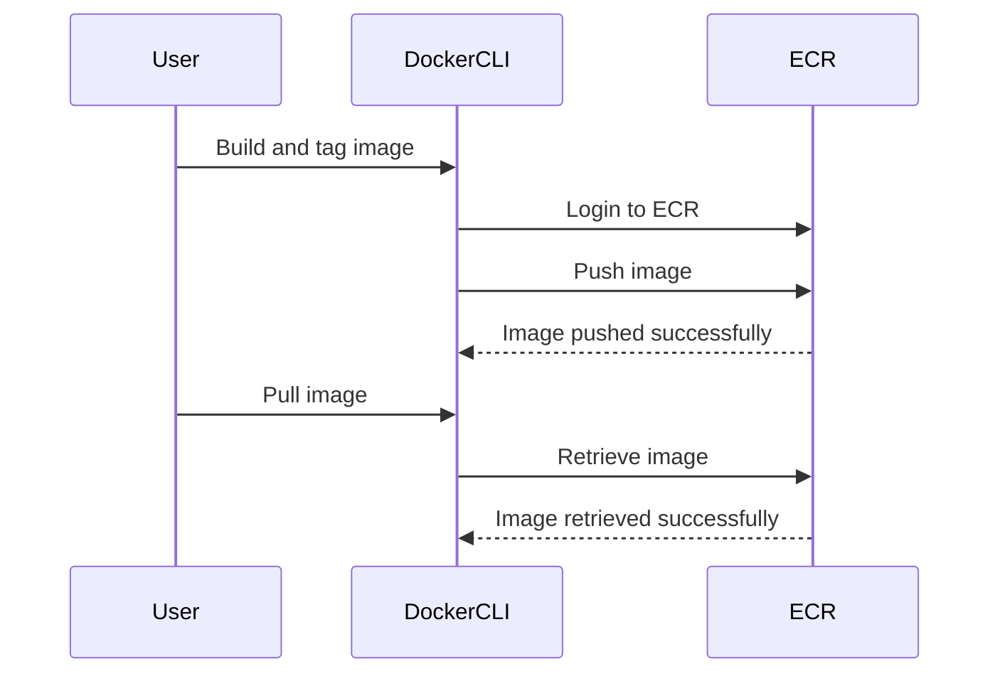

## Introduction to Docker Repositories on AWS ECR

In the realm of containerization and DevOps practices, Docker repositories play a crucial role in managing and distributing container images. Amazon Elastic Container Registry (ECR) is a fully managed Docker registry service provided by AWS. This chapter delves into creating private Docker repositories on AWS ECR, explaining the underlying concepts, steps involved, and best practices for securing these repositories.

### What is a Docker Repository?

A Docker repository is a collection of related Docker images. Each image within a repository can have multiple versions, identified by tags. For instance, a repository named `myapp` might contain images tagged as `v1.0`, `v1.1`, and so on. These tags allow developers to manage different versions of their applications, facilitating rollbacks and testing across various versions.

### Why Use AWS ECR?

AWS ECR offers several advantages over other Docker registries:

- **Integration with AWS Services**: Seamless integration with other AWS services such as ECS (Elastic Container Service) and EKS (Elastic Kubernetes Service).
- **Security**: Provides built-in security features like data encryption at rest and in transit, and integrates with AWS Identity and Access Management (IAM) for access control.
- **Scalability**: Automatically scales to meet your needs, ensuring high availability and performance.
- **Cost-Effective**: Pay-as-you-go pricing model, making it cost-effective for both small and large-scale deployments.

### Creating a Private Docker Repository on AWS ECR

To create a private Docker repository on AWS ECR, follow these steps:

1. **Log In to AWS Console**:
   - Navigate to the AWS Management Console and log in using your credentials.
   - Go to the ECR service dashboard.

2. **Create a New Repository**:
   - Click on the "Repositories" section.
   - Click on "Create repository".
   - Provide a name for your repository (e.g., `myapp`).
   - Optionally, enable image scanning and specify image tagging preferences.
   - Click "Create repository".

3. **Retrieve Repository URI**:
   - After creating the repository, note down the repository URI. This URI is used to push and pull images from the repository.

### Managing Docker Images in ECR

Once the repository is created, you can start pushing and pulling Docker images. Here’s a detailed walkthrough:

#### Building and Tagging Docker Images

Before pushing images to ECR, you need to build them and tag them appropriately. Consider the following example:

```bash
# Build the Docker image
docker build -t myapp .

# Tag the image with the ECR repository URI
docker tag myapp:latest <aws_account_id>.dkr.ecr.<region>.amazonaws.com/myapp:1.1
```

Here, `<aws_account_id>` is your AWS account ID, and `<region>` is the AWS region where your ECR repository is located.

#### Logging In to ECR

To push images to ECR, you need to authenticate using the AWS CLI:

```bash
# Log in to ECR
aws ecr get-login-password --region <region> | docker login --username AWS --password-stdin <aws_account_id>.dkr.ecr.<region>.amazonaws.com
```

This command retrieves a password from AWS and logs you into the ECR repository.

#### Pushing Images to ECR

After logging in, you can push the tagged image to ECR:

```bash
# Push the image to ECR
docker push <aws_account_id>.dkr.ecr.<region>.amazonaws.com/myapp:1.1
```

### Managing Multiple Versions

One of the key benefits of using ECR is the ability to manage multiple versions of the same image. You can tag images with different versions and push them to the same repository:

```bash
# Build and tag a new version
docker build -t myapp .
docker tag myapp:latest <aws_account_id>.dkr.ecr.<region>.amazonaws.com/myapp:1.2

# Push the new version
docker push <aws_account_id>.dkr.ecr.<region>.amazonaws.com/myapp:1.2
```

### Retrieving and Using Images

To retrieve and use images from ECR, you can pull them using the Docker CLI:

```bash
# Pull an image from ECR
docker pull <aws_account_id>.dkr.ecr.<region>.amazonaws.com/myapp:1.1
```

### Diagramming the Workflow

Let's visualize the workflow using a mermaid diagram:



### Real-World Example: Testing Different Versions

Consider a scenario where you are developing a web application and want to test different versions of the application. You can push multiple versions of the image to ECR and pull them as needed:

```bash
# Push version 1.1
docker push <aws_account_id>.dkr.ecr.<region>.amazonaws.com/myapp:1.1

# Push version 1.2
docker push <aws_account_id>.dkr.ecr.<region>.amazonaws.com/myapp:1.2

# Pull version 1.1
docker pull <aws_account_id>.dkr.ecr.<region>.amazonaws.com/myapp:1.1

# Pull version 1.2
docker pull <aws_account_id>.dkr.ecr.<region>.amazonaws.com/myapp:1.2
```

### Security Considerations

While ECR provides robust security features, it is essential to implement additional security measures to protect your repositories:

#### Secure Access Control

Use IAM policies to control access to your ECR repositories. For example, you can create an IAM policy that allows specific users or roles to push and pull images:

```json
{
    "Version": "2012-10-17",
    "Statement": [
        {
            "Effect": "Allow",
            "Action": [
                "ecr:GetDownloadUrlForLayer",
                "ecr:BatchCheckLayerAvailability",
                "ecr:BatchGetImage",
                "ecr:InitiateLayerUpload",
                "ecr:UploadLayerPart",
                "ecr:CompleteLayerUpload",
                "ecr:PutImage"
            ],
            "Resource": "*"
        }
    ]
}
```

#### Data Encryption

Ensure that your images are encrypted both at rest and in transit. ECR supports encryption using AWS Key Management Service (KMS):

```bash
# Enable encryption for the repository
aws ecr put-image-scanning-configuration --repository-name myapp --image-scanning-configuration scanOnPush=true --region <region>
```

#### Monitoring and Logging

Enable monitoring and logging to track access and usage of your ECR repositories. Use AWS CloudTrail to log API calls made to ECR:

```bash
# Enable CloudTrail for ECR
aws cloudtrail update-trail --name MyCloudTrail --include-global-service-events true --is-multi-region-trail true
```

### How to Prevent / Defend

#### Detection

Regularly monitor your ECR repositories for unauthorized access and suspicious activity. Use AWS CloudTrail to log and analyze API calls:

```bash
# List CloudTrail events related to ECR
aws cloudtrail lookup-events --lookup-attributes AttributeKey=EventName,AttributeValue=PutImage --region <region>
```

#### Prevention

Implement strict access controls using IAM policies and enable encryption for your repositories. Regularly review and audit your IAM policies to ensure they are up-to-date and secure.

#### Secure Coding Practices

Follow secure coding practices when building and deploying Docker images. Ensure that your images are free from vulnerabilities and that sensitive information is not included in the images.

### Conclusion

Creating and managing private Docker repositories on AWS ECR is a fundamental aspect of modern DevOps practices. By following the steps outlined in this chapter, you can effectively manage multiple versions of your Docker images, ensuring that your applications are secure and scalable. Remember to implement robust security measures to protect your repositories from unauthorized access and potential threats.

### Practice Labs

To gain hands-on experience with Docker repositories on AWS ECR, consider the following practice labs:

- **PortSwigger Web Security Academy**: Offers a comprehensive set of labs covering various aspects of web security, including container security.
- **OWASP Juice Shop**: A deliberately insecure web application designed for security training and research.
- **DVWA (Damn Vulnerable Web Application)**: A PHP/MySQL web application that is riddled with vulnerabilities for educational purposes.
- **WebGoat**: An interactive, gamified training application designed to teach web application security.

These labs provide a practical environment to apply the concepts learned in this chapter and gain a deeper understanding of Docker repositories on AWS ECR.

---
<!-- nav -->
[[02-Introduction to Docker Repositories and AWS ECR|Introduction to Docker Repositories and AWS ECR]] | [[DevOps/DevOps Bootcamp/05-Containerization (Docker)/08-Creating Private Docker Repositories on AWS ECR/00-Overview|Overview]] | [[04-Introduction to Docker and AWS ECR|Introduction to Docker and AWS ECR]]
