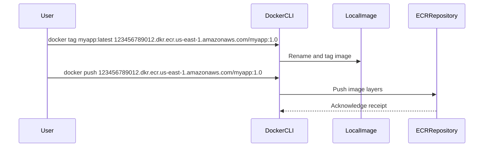

## Introduction to Docker and AWS ECR

Docker is an open-source platform used to build, package, and run applications inside lightweight, portable containers. Containers are isolated environments that encapsulate an application along with its dependencies, ensuring consistent behavior across different computing environments. Amazon Elastic Container Registry (ECR) is a fully managed Docker container registry service provided by AWS. ECR allows users to store, manage, and deploy Docker container images.

### Why Use Docker and ECR?

Using Docker and ECR offers several benefits:

1. **Consistency**: Docker ensures that applications run consistently across different environments.
2. **Scalability**: ECR integrates seamlessly with other AWS services, enabling scalable deployment and management of containerized applications.
3. **Security**: ECR provides features like image scanning and encryption, enhancing the security of your container images.

### Tagging Docker Images

Before pushing a Docker image to ECR, it must be tagged appropriately. Tagging involves associating metadata with the image, which includes the repository domain or address and the image name. This tagging process is crucial because it specifies where the image should be stored and how it should be identified.

#### How Tagging Works

When you tag a Docker image, you essentially rename it to include the repository domain and the image name. This is done using the `docker tag` command. For example, if you have a local image named `myapp`, you can tag it with the ECR repository URL and a version number:

```bash
docker tag myapp:latest <aws_account_id>.dkr.ecr.<region>.amazonaws.com/myapp:1.0
```

Here, `<aws_account_id>` is your AWS account ID, `<region>` is the AWS region where your ECR repository is located, and `myapp:1.0` is the new tag for the image.

### Example of Tagging a Docker Image

Let's walk through an example of tagging a Docker image and then pushing it to ECR.

1. **Build the Docker Image**:
   First, build your Docker image locally. For instance, if you have a `Dockerfile` in your project directory, you can build the image using:

   ```bash
   docker build -t myapp .
   ```

2. **Tag the Docker Image**:
   Next, tag the image with the appropriate ECR repository URL and version number. Suppose your AWS account ID is `123456789012` and your ECR repository is in the `us-east-1` region. You would tag the image as follows:

   ```bash
   docker tag myapp:latest 123456789012.dkr.ecr.us-east-1.amazonaws.com/myapp:1.0
   ```

3. **Push the Docker Image to ECR**:
   After tagging the image, you can push it to ECR using the `docker push` command:

   ```bash
   docker push 123456789012.dkr.ecr.us-east-1.amazonaws.com/myapp:1.0
   ```

### Detailed Explanation of the `docker tag` Command

The `docker tag` command renames an existing image and assigns a new tag to it. The general syntax is:

```bash
docker tag SOURCE_IMAGE[:TAG] TARGET_IMAGE[:TAG]
```

In our example:

- `SOURCE_IMAGE` is `myapp:latest`.
- `TARGET_IMAGE` is `123456789012.dkr.ecr.us-east-1.amazonaws.com/myapp:1.0`.

This command creates a new reference to the existing image, allowing you to specify the repository and version number.

### Detailed Explanation of the `docker push` Command

The `docker push` command uploads a Docker image to a registry. The general syntax is:

```bash
docker push [OPTIONS] NAME[:TAG]
```

In our example:

- `NAME` is `123456789012.dkr.ecr.us-east-1.amazonaws.com/myapp`.
- `TAG` is `1.0`.

When you execute the `docker push` command, Docker breaks down the image into layers and pushes each layer individually to the ECR repository. This process is similar to how Docker pulls images from a registry, but in reverse.

### Mermaid Diagram: Docker Image Tagging and Pushing Process



### Real-World Examples and Security Considerations

Recent breaches involving Docker and ECR highlight the importance of proper security practices. For example, in 2021, a misconfigured ECR repository led to unauthorized access to sensitive container images. To prevent such incidents, it is essential to follow best practices for securing your ECR repositories.

#### Secure Configuration of ECR

1. **Enable Image Scanning**: Enable image scanning to detect vulnerabilities in your container images.
2. **Use IAM Policies**: Restrict access to ECR repositories using IAM policies.
3. **Enable Encryption**: Encrypt your container images to protect them during transit and at rest.

### How to Prevent / Defend Against ECR Vulnerabilities

#### Detection

To detect potential vulnerabilities in your ECR repositories, regularly scan your images using tools like AWS Image Scanning. This helps identify known vulnerabilities and ensures that your images are secure.

#### Prevention

1. **IAM Policies**: Use IAM policies to restrict access to ECR repositories. For example, you can create a policy that allows only specific users or roles to push or pull images from a repository.

   ```json
   {
       "Version": "2012-10-17",
       "Statement": [
           {
               "Effect": "Allow",
               "Action": [
                   "ecr:GetDownloadUrlForLayer",
                   "ecr:BatchCheckLayerAvailability",
                   "ecr:BatchGetImage",
                   "ecr:InitiateLayerUpload",
                   "ecr:UploadLayerPart",
                   "ecr:CompleteLayerUpload",
                   "ecr:PutImage"
               ],
               "Resource": "arn:aws:ecr:<region>:<account-id>:repository/<repository-name>"
           }
       ]
   }
   ```

2. **Image Scanning**: Enable image scanning to detect vulnerabilities in your container images. This can be done using the AWS Management Console or the AWS CLI.

   ```bash
   aws ecr start-image-scan --repository-name myapp --image-id imageTag=1.0
   ```

3. **Encryption**: Enable encryption for your ECR repositories to protect your images during transit and at rest.

   ```bash
   aws ecr put-image --repository-name myapp --image-manifest "$(cat manifest.json)" --image-tag 1.0 --encryption-configuration file://encryption-config.json
   ```

   Here, `manifest.json` contains the image manifest, and `encryption-config.json` specifies the encryption settings.

### Conclusion

Creating private Docker repositories on AWS ECR involves tagging and pushing Docker images to the repository. Proper tagging ensures that the image is correctly identified and stored in the desired location. By following best practices for security and configuration, you can ensure that your ECR repositories remain secure and reliable.

### Practice Labs

For hands-on practice with Docker and ECR, consider the following labs:

- **PortSwigger Web Security Academy**: Offers labs on container security, including Docker and ECR.
- **AWS Official Workshops**: Provides detailed workshops on using ECR and other AWS services.
- **CloudGoat**: A cloud security training platform that includes exercises on managing ECR repositories.

By completing these labs, you can gain practical experience in creating and managing private Docker repositories on AWS ECR.

---
<!-- nav -->
[[03-Introduction to Docker Repositories on AWS ECR|Introduction to Docker Repositories on AWS ECR]] | [[DevOps/DevOps Bootcamp/05-Containerization (Docker)/08-Creating Private Docker Repositories on AWS ECR/00-Overview|Overview]] | [[05-Introduction to Private Docker Repositories on AWS ECR|Introduction to Private Docker Repositories on AWS ECR]]
