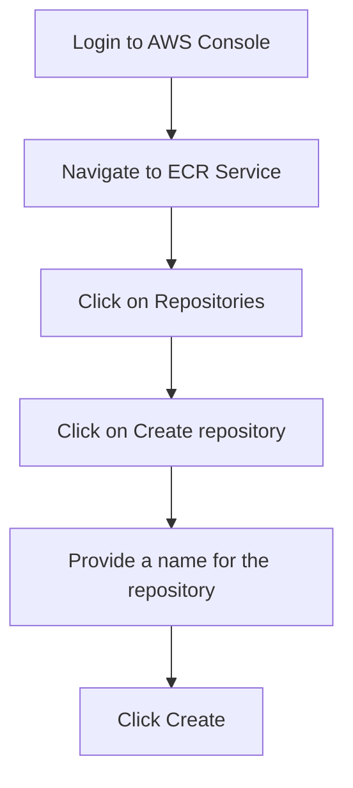

## Introduction to Private Docker Repositories on AWS ECR

In the world of DevOps and containerization, managing Docker images efficiently is crucial. One of the key components in this process is the Docker registry, which acts as a central storage location for Docker images. In this chapter, we will delve deep into creating and managing private Docker repositories using Amazon Elastic Container Registry (ECR).

### What is a Docker Registry?

A Docker registry is a service that stores and provides access to Docker images. These images can be pulled down and run on any machine that has Docker installed. Docker registries can be either public or private. Public registries, such as Docker Hub, allow anyone to push and pull images. Private registries, like AWS ECR, provide a secure way to store and manage Docker images within your organization.

### Why Use AWS ECR?

AWS ECR is a managed Docker registry service provided by Amazon Web Services (AWS). It allows you to store, manage, and deploy Docker container images. Here are some reasons why you might choose AWS ECR:

1. **Security**: AWS ECR integrates with AWS Identity and Access Management (IAM) to control access to your repositories.
2. **Scalability**: AWS ECR scales automatically to meet your needs, ensuring high availability and performance.
3. **Integration**: AWS ECR integrates seamlessly with other AWS services, such as Amazon ECS, AWS Fargate, and AWS Batch.
4. **Cost-Effective**: AWS ECR offers cost-effective storage and transfer options, making it ideal for large-scale deployments.

### How Does AWS ECR Work?

In AWS ECR, each repository can contain multiple images, each identified by a unique tag. Tags are used to label different versions of the same image. For example, you might have a repository named `myapp` with tags like `v1.0`, `v1.1`, and `latest`.

### Comparison with Other Docker Registries

While AWS ECR follows a model where each repository contains multiple images with different tags, other Docker registries may work differently. For instance, some registries allow you to store all your container images in a single repository. However, AWS ECR is designed to have a separate repository for each application, which helps in better organization and management.

### Setting Up a Private Docker Repository on AWS ECR

To set up a private Docker repository on AWS ECR, follow these steps:

1. **Create a Repository**:
   - Log in to the AWS Management Console.
   - Navigate to the ECR service.
   - Click on "Repositories" and then "Create repository".
   - Provide a name for your repository, such as `myapp`.
   - Click "Create".

2. **Pushing Images to the Repository**:
   - First, ensure you have Docker installed on your local machine.
   - Tag your local Docker image with the repository URI and tag.
   - Authenticate with the ECR repository.
   - Push the image to the repository.

Let's walk through these steps in detail.

#### Step 1: Create a Repository



#### Step 2: Tag Your Local Docker Image

Before pushing your image to the ECR repository, you need to tag it with the repository URI and a tag. The repository URI is provided by AWS and typically looks like `aws_account_id.dkr.ecr.region.amazonaws.com/repository_name`.

For example, if your AWS account ID is `123456789012`, the region is `us-east-1`, and the repository name is `myapp`, the repository URI would be `123456789012.dkr.ecr.us-east-1.amazonaws.com/myapp`.

Tag your local Docker image with the repository URI and a tag:

```bash
docker tag <local_image_name>:<tag> 123456789012.dkr.ecr.us-east-1.amazonaws.com/myapp:<tag>
```

#### Step 3: Authenticate with the ECR Repository

To push images to the ECR repository, you need to authenticate using the AWS CLI. Run the following command to authenticate:

```bash
aws ecr get-login-password --region us-east-1 | docker login --username AWS --password-stdin 12345
```

This command retrieves the password needed to log in to the ECR repository and uses it to authenticate with Docker.

#### Step 4: Push the Image to the Repository

Once authenticated, you can push the tagged image to the ECR repository:

```bash
docker push 123456789012.dkr.ecr.us-east-1.amazonaws.com/myapp:<tag>
```

### Example: Full Workflow

Let's assume you have a local Docker image named `myapp:v1.0`. Here is the complete workflow:

1. **Tag the Image**:

```bash
docker tag myapp:v1.0 123456789012.dkr.ecr.us-east-1.amazonaws.com/myapp:v1.0
```

2. **Authenticate**:

```bash
aws ecr get-login-password --region us-east-1 | docker login --username AWS --password-stdin 123456789012.dkr.ecr.us-east-1.amazonaws.com
```

3. **Push the Image**:

```bash
docker push 123456789012.dkr.ecr.us-east-1.amazonaws.com/myapp:v1.0
```

### Handling Authentication in CI/CD Pipelines

When pushing images from a CI/CD pipeline, such as Jenkins, you need to provide the necessary credentials to authenticate with the ECR repository. This can be done by configuring the Jenkins job to use the AWS CLI credentials.

Here is an example of how you might configure a Jenkins job to push an image to ECR:

1. **Install AWS CLI Plugin**:
   - Install the AWS CLI plugin in Jenkins.
   - Configure the plugin with your AWS credentials.

2. **Configure Jenkins Job**:
   - Add a build step to tag the image.
   - Add a build step to authenticate with ECR.
   - Add a build step to push the image.

Example Jenkinsfile:

```groovy
pipeline {
    agent any
    stages {
        stage('Build') {
            steps {
                sh 'docker build -t myapp .'
            }
        }
        stage('Tag Image') {
            steps {
                sh 'docker tag myapp 123456789012.dkr.ecr.us-east-1.amazonaws.com/myapp:v1.0'
            }
        }
        stage('Authenticate') {
            steps {
                script {
                    withCredentials([[$class: 'AmazonWebServicesCredentialsBinding', accessKeyVariable: 'AWS_ACCESS_KEY_ID', secretKeyVariable: 'AWS_SECRET_ACCESS_KEY']]) {
                        sh 'aws ecr get-login-password --region us-east-1 | docker login --username AWS --password-stdin 123456789012.dkr.ecr.us-east-1.amazonaws.com'
                    }
                }
            }
        }
        stage('Push Image') {
            steps {
                sh 'docker push 123456789012.dkr.ecr.us-east-1.amazonaws.com/myapp:v1.0'
            }
        }
    }
}
```

### Pitfalls and Common Mistakes

1. **Incorrect Tagging**: Ensure that the image is tagged correctly with the repository URI and tag.
2. **Authentication Issues**: Make sure you have the correct AWS credentials and permissions to access the ECR repository.
3. **Network Issues**: Ensure that your machine has network access to the ECR repository.

### Real-World Examples and Breaches

One notable breach involving Docker registries was the Docker Hub breach in 2019. Hackers gained unauthorized access to Docker Hub and were able to push malicious images to repositories. This highlights the importance of securing your Docker registries and using private repositories whenever possible.

### How to Prevent / Defend

1. **Use IAM Policies**: Restrict access to ECR repositories using IAM policies.
2. **Enable Image Scanning**: Use AWS ECR Image Scanning to identify vulnerabilities in your images.
3. **Secure Credentials**: Store AWS credentials securely using tools like AWS Secrets Manager or HashiCorp Vault.
4. **Regular Audits**: Regularly audit your ECR repositories to ensure that only authorized images are present.

### Conclusion

Creating and managing private Docker repositories on AWS ECR is a crucial aspect of modern DevOps practices. By following the steps outlined in this chapter, you can effectively set up and maintain your own private Docker repositories, ensuring the security and scalability of your containerized applications.

### Practice Labs

To gain hands-on experience with AWS ECR, consider the following practice labs:

- **PortSwigger Web Security Academy**: While primarily focused on web security, this platform also covers container security and can help you understand the broader context of securing your applications.
- **CloudGoat**: This lab provides a comprehensive set of scenarios to practice securing AWS services, including ECR.
- **flaws.cloud**: This lab focuses on finding and fixing security issues in AWS environments, including ECR.

By completing these labs, you will gain practical experience in setting up and managing private Docker repositories on AWS ECR.

---
<!-- nav -->
[[04-Introduction to Docker and AWS ECR|Introduction to Docker and AWS ECR]] | [[DevOps/DevOps Bootcamp/05-Containerization (Docker)/08-Creating Private Docker Repositories on AWS ECR/00-Overview|Overview]] | [[06-Building and Tagging Docker Images|Building and Tagging Docker Images]]
