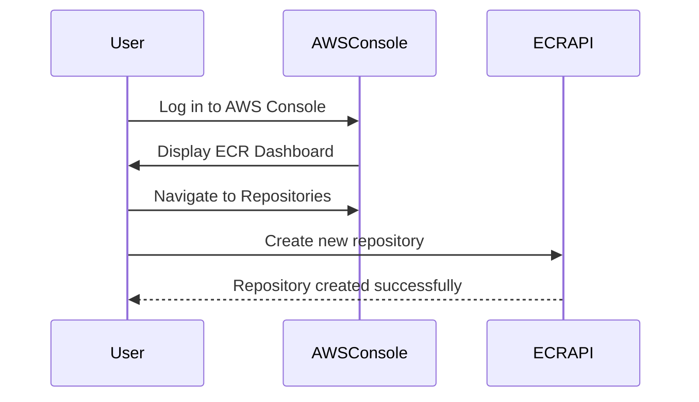

## Setting Up AWS ECR

To get started with AWS ECR, you need an AWS account. If you don't have one, you can sign up for a free tier account at the AWS website.

### Step 1: Create a Private Repository

Once you have an AWS account, navigate to the Elastic Container Registry (ECR) section in the AWS Management Console. Here are the detailed steps:

1. **Log in to AWS Management Console**:
    - Open your browser and go to https://aws.amazon.com/.
    - Click on the "Sign In to the Console" button.
    - Enter your AWS credentials and log in.

2. **Navigate to ECR**:
    - In the AWS Management Console, search for "ECR" in the services menu.
    - Click on "Elastic Container Registry".

3. **Create a New Repository**:
    - On the ECR dashboard, click on the "Repositories" tab.
    - Click on the "Create repository" button.
    - Enter a name for your repository. For example, `myapp`.
    - Leave the other settings as default unless you have specific requirements.
    - Click on "Create repository".



### Understanding the Repository Structure

When you create a repository in ECR, it is associated with a unique domain. The domain structure looks like this:

```
<aws_account_id>.dkr.ecr.<region>.amazonaws.com/<repository_name>
```

For example, if your AWS account ID is `123456789012` and you created a repository named `myapp` in the `us-east-1` region, the full domain would be:

```
123456789012.dkr.ecr.us-east-1.amazonaws.com/myapp
```

This domain is used to push and pull images from the repository.

---
<!-- nav -->
[[07-Logging into ECR|Logging into ECR]] | [[DevOps/DevOps Bootcamp/05-Containerization (Docker)/08-Creating Private Docker Repositories on AWS ECR/00-Overview|Overview]] | [[DevOps/DevOps Bootcamp/05-Containerization (Docker)/08-Creating Private Docker Repositories on AWS ECR/09-Practice Questions & Answers|Practice Questions & Answers]]
