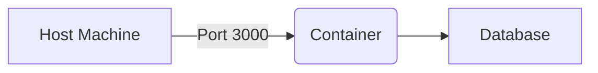
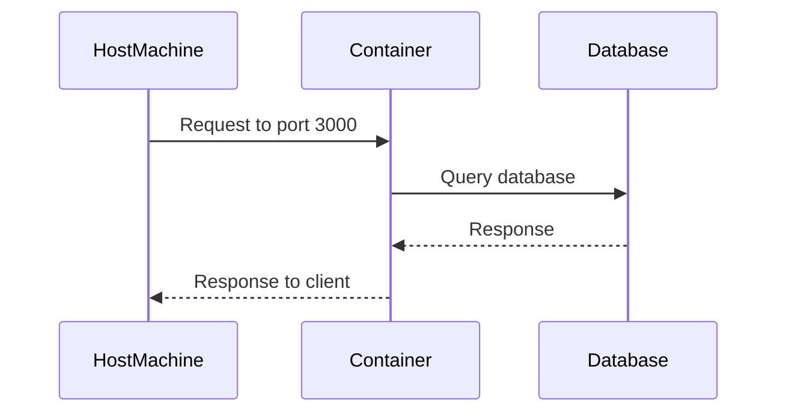

## Deploying Applications with Docker Compose

### Introduction to Docker Compose

Docker Compose is a tool for defining and running multi-container Docker applications. With Compose, you use a YAML file to configure your application’s services. Then, using a single command, you create and start all the services from your configuration. This makes it easier to manage complex applications that require multiple containers to run.

### Pulling Images from Docker Hub vs. Private Repositories

When deploying applications with Docker Compose, one of the first steps is to pull the necessary Docker images. These images can come from either Docker Hub or a private repository. Understanding the difference between these two sources is crucial for successful deployment.

#### Docker Hub

Docker Hub is a public registry where developers can store and share their Docker images. When you pull an image from Docker Hub, you do not need to specify a repository domain. For example, pulling the `mongo` image from Docker Hub can be done simply by specifying:

```yaml
services:
  db:
    image: mongo
```

This tells Docker to fetch the `mongo` image from Docker Hub. Since Docker Hub is publicly accessible, there is no need for authentication.

#### Private Repository

A private repository, on the other hand, requires authentication. If you are pulling images from a private repository, you must specify the repository domain explicitly. For instance, if your private repository is hosted on `myregistry.com`, you would specify the image as follows:

```yaml
services:
  db:
    image: myregistry.com/mongo
```

Without specifying the repository domain, Docker will attempt to pull the image from Docker Hub, which will fail since the image does not exist there.

### Authenticating to a Private Repository

To pull images from a private repository, the environment where you are executing the Docker Compose file must be authenticated to the private repository. This is typically done using the `docker login` command.

#### Docker Login Command

The `docker login` command allows you to authenticate to a Docker registry. For example, to log in to a private repository hosted at `myregistry.com`, you would run:

```bash
docker login myregistry.com
```

This command prompts you for your username and password. Once authenticated, Docker will be able to pull images from the specified repository.

### Configuring Ports in Docker Compose

Another important aspect of deploying applications with Docker Compose is configuring the ports. By default, containers run on isolated networks, and you need to map the container ports to the host machine's ports to access the services.

#### Example Application Running on Port 3000

Consider an application that runs on port 3000 within the container. To make this service accessible from the host machine, you need to map port 3000 of the container to port 3000 of the host machine. This can be done in the Docker Compose file as follows:

```yaml
version: '3'
services:
  app:
    image: myregistry.com/myapp
    ports:
      - "3000:3000"
```

In this configuration, the `ports` key maps the container port (3000) to the host port (3000).

### Environment Variables in Docker Compose

Environment variables can be used to pass configuration settings to your application. While you can define environment variables directly in the Dockerfile, it is often more flexible to define them in the Docker Compose file.

#### Example Configuration

Here is an example of how to define environment variables in the Docker Compose file:

```yaml
version: '3'
services:
  app:
    image: myregistry.com/myapp
    ports:
      - "3000:3000"
    environment:
      - DATABASE_URL=mongodb://db:27017/mydatabase
      - PORT=3000
```

In this example, the `DATABASE_URL` and `PORT` environment variables are passed to the `app` service.

### Real-World Examples and Recent Breaches

Understanding the practical implications of these concepts is essential. Here are some recent real-world examples and breaches related to Docker and container security:

#### CVE-2021-21315: Docker API Insecure Deserialization

CVE-2021-21315 is a critical vulnerability in Docker that affects versions prior to 20.10.6. This vulnerability allows an attacker to perform remote code execution by exploiting insecure deserialization in the Docker API. This highlights the importance of keeping Docker and related tools up to date.

#### Example: Docker Registry Authentication Bypass

In 2021, a vulnerability was discovered in Docker Registry that allowed unauthorized access to private repositories. This vulnerability was due to improper handling of authentication tokens. This underscores the importance of proper authentication and authorization mechanisms.

### How to Prevent / Defend

#### Detection

To detect potential issues with Docker Compose configurations, you can use tools like `hadolint` for linting Dockerfiles and `docker-compose-lint` for linting Docker Compose files. These tools help identify common mistakes and security issues.

#### Prevention

1. **Use Secure Repositories**: Always use secure repositories for storing Docker images. Ensure that your private repositories are properly authenticated and authorized.
   
2. **Keep Software Updated**: Regularly update Docker and related tools to ensure you have the latest security patches.

3. **Secure Environment Variables**: Avoid hardcoding sensitive information in your Docker Compose files. Use environment variable files or secrets management tools like Docker Secrets.

4. **Network Isolation**: Use Docker networks to isolate your services and limit exposure to the internet.

### Complete Example

Here is a complete example of a Docker Compose file with all the concepts covered:

```yaml
version: '3'
services:
  app:
    image: myregistry.com/myapp
    ports:
      - "3000:3000"
    environment:
      - DATABASE_URL=mongodb://db:27017/mydatabase
      - PORT=3000
    depends_on:
      - db
  db:
    image: myregistry.com/mongo
    environment:
      - MONGO_INITDB_ROOT_USERNAME=root
      - MONGO_INITDB_ROOT_PASSWORD=password
```

### Mermaid Diagrams

#### Network Topology



#### Sequence Diagram



### Practice Labs

For hands-on practice with Docker Compose, consider the following labs:

- **PortSwigger Web Security Academy**: Offers a section on container security, including Docker Compose.
- **OWASP Juice Shop**: Provides a Docker Compose setup for deploying the application.
- **DVWA**: Has a Docker Compose setup for deploying the vulnerable web application.

By following these guidelines and examples, you can effectively deploy applications using Docker Compose while ensuring security and reliability.

---
<!-- nav -->
[[DevOps/DevOps Bootcamp/05-Containerization (Docker)/09-Deploying Applications with Docker Compose/02-Introduction to Docker Compose|Introduction to Docker Compose]] | [[DevOps/DevOps Bootcamp/05-Containerization (Docker)/09-Deploying Applications with Docker Compose/00-Overview|Overview]] | [[DevOps/DevOps Bootcamp/05-Containerization (Docker)/09-Deploying Applications with Docker Compose/04-Practice Questions & Answers|Practice Questions & Answers]]
