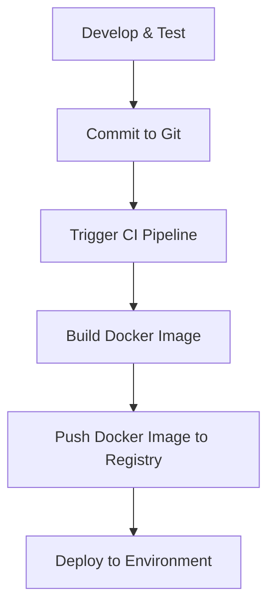

## Introduction to Deploying JavaScript Applications Using Docker

Deploying applications using Docker is a fundamental practice in modern DevOps workflows. This approach ensures consistency across development, testing, and production environments, reducing the "works on my machine" syndrome. In this chapter, we will focus on deploying a JavaScript application using Docker, covering the entire process from development to deployment.

### Background Theory

Before diving into the practical aspects, it's essential to understand the theoretical foundations of Docker and its role in the DevOps lifecycle.

#### What is Docker?

Docker is an open-source platform that automates the deployment, scaling, and management of applications inside lightweight containers. Containers are isolated environments that package up code and all its dependencies so the application runs quickly and reliably from one computing environment to another.

#### Why Use Docker?

1. **Consistency**: Docker ensures that the application runs the same way in different environments.
2. **Isolation**: Each container runs in isolation, preventing conflicts between applications.
3. **Portability**: Docker images can be easily moved between different systems.
4. **Scalability**: Docker makes it easy to scale applications horizontally.

### Scenario Overview

In this scenario, we have developed a JavaScript application and tested it locally. Now, we are ready to deploy it. The application uses MongoDB as its database, and both the application and the database are packaged into Docker containers.

### Steps Involved

1. **Committing Code to Git**
2. **Continuous Integration (CI)**
3. **Building the Docker Image**
4. **Pushing the Docker Image to a Repository**

### Committing Code to Git

The first step in the deployment process is committing the code to a version control system like Git. This ensures that the codebase is versioned and can be tracked over time.

```bash
git add .
git commit -m "Add new feature"
git push origin main
```

### Continuous Integration (CI)

Once the code is committed, a CI pipeline is triggered. This pipeline typically involves several stages:

1. **Build**: Compiling the code and running tests.
2. **Package**: Creating a distributable package.
3. **Test**: Running automated tests.
4. **Deploy**: Deploying the application to a staging or production environment.

For this scenario, we will focus on the build and packaging stages.

### Building the Docker Image

To build a Docker image, we need a `Dockerfile`. A `Dockerfile` is a text file that contains instructions for building a Docker image.

#### Example `Dockerfile`

```dockerfile
# Use an official Node.js runtime as a parent image
FROM node:14-alpine

# Set the working directory in the container
WORKDIR /usr/src/app

# Copy package.json and package-lock.json to the working directory
COPY package*.json ./

# Install app dependencies
RUN npm install

# Bundle app source
COPY . .

# Expose port 3000 to the outside world
EXPOSE 3000

# Define environment variable
ENV NODE_ENV=production

# Run the app
CMD ["npm", "start"]
```

#### Explanation of the `Dockerfile`

1. **Base Image**: We start with an official Node.js runtime (`node:14-alpine`). Alpine Linux is chosen because it is lightweight.
2. **Working Directory**: We set the working directory to `/usr/src/app`.
3. **Copy Dependencies**: We copy `package.json` and `package-lock.json` to the working directory and run `npm install` to install the dependencies.
4. **Copy Application Source**: We copy the rest of the application source code to the working directory.
5. **Expose Port**: We expose port 3000, which is the default port for many Node.js applications.
6. **Environment Variable**: We set the `NODE_ENV` environment variable to `production`.
7. **Command to Run**: We define the command to run the application (`npm start`).

### Building the Docker Image Locally

To build the Docker image, we use the `docker build` command.

```bash
docker build -t my-javascript-app .
```

This command builds the Docker image and tags it as `my-javascript-app`.

### Pushing the Docker Image to a Repository

Once the Docker image is built, we need to push it to a Docker registry. A popular choice is Docker Hub, but other options include Amazon ECR, Google Container Registry, and Azure Container Registry.

#### Example: Pushing to Docker Hub

First, log in to Docker Hub.

```bash
docker login
```

Then, tag the image with the Docker Hub username and repository name.

```bash
docker tag my-javascript-app <username>/my-javascript-app
```

Finally, push the image to Docker Hub.

```bash
docker push <username>/my-javascript-app
```

### Diagram of the Deployment Process



### Real-World Examples

#### Example: CVE-2021-21315

CVE-2021-21315 is a vulnerability in Docker that allows attackers to escalate privileges and execute arbitrary code. This vulnerability highlights the importance of keeping Docker and its components up-to-date.

#### Example: MongoDB Injection

MongoDB injection is a type of SQL injection that targets MongoDB databases. This vulnerability can be exploited if the application does not properly sanitize user input.

### How to Prevent / Defend

#### Secure Coding Practices

1. **Input Validation**: Always validate and sanitize user input to prevent injection attacks.
2. **Least Privilege Principle**: Run containers with the least privileges necessary.
3. **Regular Updates**: Keep Docker and its components up-to-date to mitigate known vulnerabilities.

#### Example: Secure Input Validation

```javascript
const express = require('express');
const app = express();

app.use(express.json());

app.get('/users/:id', (req, res) => {
    const id = req.params.id;
    // Validate and sanitize input
    if (!isValidId(id)) {
        return res.status(400).send('Invalid ID');
    }
    // Query the database
    const user = getUserById(id);
    res.send(user);
});

function isValidId(id) {
    // Implement validation logic
    return /^[0-9]+$/.test(id);
}

function getUserById(id) {
    // Database query logic
    return { id, name: 'John Doe' };
}

app.listen(3000, () => {
    console.log('Server is running on port 3000');
});
```

#### Example: Least Privilege Principle

```yaml
version: '3'
services:
  app:
    image: my-javascript-app
    container_name: my-javascript-app
    ports:
      - "3000:3000"
    environment:
      - NODE_ENV=production
    security_opt:
      - seccomp:unconfined
```

### Conclusion

Deploying JavaScript applications using Docker is a powerful and efficient way to ensure consistency and reliability across different environments. By following best practices and using secure coding techniques, you can minimize the risk of vulnerabilities and ensure a smooth deployment process.

### Practice Labs

For hands-on experience with deploying JavaScript applications using Docker, consider the following labs:

- **PortSwigger Web Security Academy**: Offers a comprehensive set of labs for web application security.
- **OWASP Juice Shop**: A deliberately insecure web application for security training.
- **DVWA (Damn Vulnerable Web Application)**: Another popular web application for security training.

These labs provide a safe environment to practice and learn about deploying applications securely.

---
<!-- nav -->
[[DevOps/DevOps Bootcamp/05-Containerization (Docker)/10-Deploying JavaScript Applications Using Docker/00-Overview|Overview]] | [[02-Introduction to Docker Deployment for JavaScript Applications|Introduction to Docker Deployment for JavaScript Applications]]
