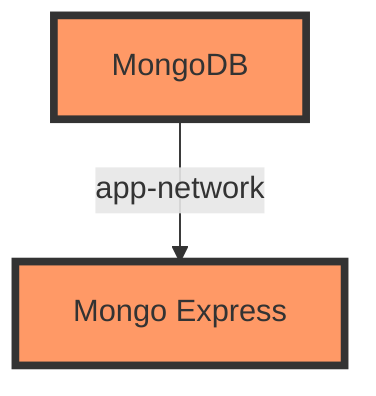
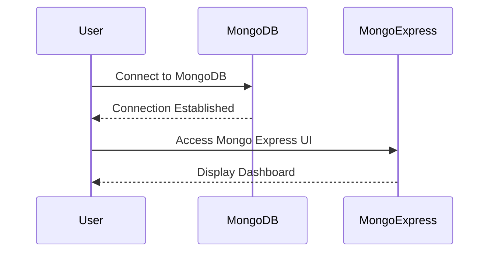

## Introduction to Docker Compose

Docker Compose is a tool designed to simplify the management of multi-container Docker applications. Instead of manually executing multiple `docker run` commands, Docker Compose allows you to define and manage your application’s services in a single file called `docker-compose.yml`. This file contains all the necessary configurations, such as environment variables, network settings, and volumes, which are then used to start and manage the containers.

### Why Use Docker Compose?

When working with multiple Docker containers, managing them individually via `docker run` commands can become cumbersome and error-prone. Docker Compose addresses this issue by providing a declarative approach to defining and running multi-container Docker applications. This makes it easier to:

1. **Automate Deployment**: Define your entire application stack in a single file, making it easy to deploy and manage.
2. **Consistency Across Environments**: Ensure that your development, testing, and production environments are consistent.
3. **Simplified Configuration**: Manage complex configurations such as networks, volumes, and environment variables in a centralized manner.
4. **Ease of Use**: Simplify the process of starting and stopping multiple containers with a single command.

### Background Theory

Before diving into Docker Compose, let's review some fundamental concepts related to Docker and containerization.

#### Containers and Images

A Docker container is an isolated, executable package that contains everything needed to run a piece of software, including the code, runtime, system tools, libraries, and settings. A Docker image is a read-only template that is used to create a container. An image consists of layers, each representing a specific aspect of the application, such as the base operating system, dependencies, and the application itself.

#### Networking in Docker

Containers can communicate with each other using Docker networks. By default, Docker creates a bridge network named `bridge`, but you can also create custom networks to control how containers interact. Custom networks allow you to specify IP ranges, subnet masks, and other network settings.

#### Volumes

Volumes are used to persist data outside of the container’s writable layer. This ensures that data remains available even if the container is removed. Volumes can be managed using the `docker volume` command or defined in a `docker-compose.yml` file.

### Example: MongoDB and Mongo Express

Let's consider the example provided in the lecture, where we have two Docker containers: MongoDB and Mongo Express. These containers need to communicate with each other, and we want to automate their deployment using Docker Compose.

#### Step-by-Step Mechanics

1. **Define the Network**: Create a custom network where the containers can communicate using their container names.
2. **Create the Docker Compose File**: Define the services, their configurations, and the network settings in a `docker-compose.yml` file.
3. **Start the Containers**: Use the `docker-compose up` command to start the containers based on the definitions in the `docker-compose.yml` file.

### Creating the Docker Compose File

Here is an example of a `docker-compose.yml` file for the MongoDB and Mongo Express setup:

```yaml
version: '3'
services:
  mongodb:
    image: mongo:latest
    container_name: mongodb
    ports:
      - "27017:27017"
    networks:
      - app-network
    volumes:
      - ./data:/data/db
  mongo-express:
    image: mongo-express:latest
    container_name: mongo-express
    ports:
      - "8081:8081"
    networks:
      - app-network
    environment:
      - ME_CONFIG_MONGODB_SERVER=mongodb
networks:
  app-network:
```

#### Explanation of the `docker-compose.yml` File

- **Version**: Specifies the version of the Docker Compose file format.
- **Services**: Defines the services (containers) that will be created.
  - **mongodb**: The MongoDB service.
    - **image**: The Docker image to use.
    - **container_name**: The name of the container.
    - **ports**: Maps the container's port to the host's port.
    - **networks**: Specifies the network(s) the container will join.
    - **volumes**: Mounts a local directory to the container.
  - **mongo-express**: The Mongo Express service.
    - **image**: The Docker image to use.
    - **container_name**: The name of the container.
    - **ports**: Maps the container's port to the host's port.
    - **networks**: Specifies the network(s) the container will join.
    - **environment**: Sets environment variables for the container.
- **Networks**: Defines the custom network(s) used by the services.

### Starting the Containers

To start the containers, navigate to the directory containing the `docker-compose.yml` file and run the following command:

```sh
docker-compose up
```

This command will start both the MongoDB and Mongo Express containers based on the definitions in the `docker-compose.yml` file.

### Full HTTP Request and Response Example

While Docker Compose primarily deals with container orchestration rather than HTTP requests, let's consider a scenario where we might interact with the MongoDB service via HTTP.

#### Example HTTP Request

```http
GET /_health HTTP/1.1
Host: localhost:27017
```

#### Example HTTP Response

```http
HTTP/1.1 200 OK
Content-Type: application/json

{
  "status": "healthy"
}
```

### Common Pitfalls and How to Avoid Them

#### Pitfall 1: Incorrect Network Configuration

If the containers cannot communicate due to incorrect network settings, ensure that both containers are joined to the same network and that the correct container names are used in the environment variables.

**Secure Code Fix**

Ensure that the `docker-compose.yml` file correctly defines the network and uses the correct container names:

```yaml
version: '3'
services:
  mongodb:
    image: mongo:latest
    container_name: mongodb
    ports:
      - "27017:27017"
    networks:
      - app-network
    volumes:
      - ./data:/data/db
  mongo-express:
    image: mongo-express:latest
    container_name: mongo-express
    ports:
      - "8081:8081"
    networks:
      - app-network
    environment:
      - ME_CONFIG_MONGODB_SERVER=mongodb
networks:
  app-network:
```

#### Pitfall  2: Data Loss Due to Incorrect Volume Configuration

If the data is not persisted correctly, ensure that the volumes are correctly mounted and that the data directory is specified correctly.

**Secure Code Fix**

Ensure that the `docker-compose.yml` file correctly mounts the volume:

```yaml
version: '3'
services:
  mongodb:
    image: mongo:latest
    container_name: mongodb
    ports:
      - "27017:27017"
    networks:
      - app-network
    volumes:
      - ./data:/data/db
  mongo-express:
    image: mongo-express:latest
    container_name: mongo-express
    ports:
      - "8081:8081"
    networks:
      - app-network
    environment:
      - ME_CONFIG_MONGODB_SERVER=mongodb
networks:
  app-network:
```

### Real-World Examples and Recent CVEs

#### Example: CVE-2021-22555

CVE-2021-22555 is a vulnerability in the MongoDB server that allows unauthenticated users to perform certain operations, leading to potential data exposure or unauthorized access. This vulnerability highlights the importance of securing your MongoDB instances, whether they are running in Docker containers or not.

**Detection and Prevention**

- **Detection**: Regularly scan your MongoDB instances for vulnerabilities using tools like `nmap` or `OpenVAS`.
- **Prevention**: Ensure that your MongoDB instances are configured securely, with authentication enabled and unnecessary services disabled. Use Docker Compose to enforce these configurations consistently across environments.

### Mermaid Diagrams

#### Network Topology



#### Sequence Diagram



### Hands-On Labs

For hands-on practice with Docker Compose, consider the following resources:

- **PortSwigger Web Security Academy**: Offers interactive labs to learn about web security and containerization.
- **OWASP Juice Shop**: A deliberately insecure web application to practice security testing.
- **DVWA (Damn Vulnerable Web Application)**: Another web application with intentional vulnerabilities for security training.

These resources provide practical experience in setting up and managing Docker containers using Docker Compose.

### Conclusion

Docker Compose simplifies the management of multi-container Docker applications by providing a declarative approach to defining and running services. By automating the deployment and configuration of containers, Docker Compose enhances consistency and ease of use across different environments. Understanding the underlying concepts and best practices ensures that you can effectively leverage Docker Compose to build and manage robust, scalable applications.

---
<!-- nav -->
[[01-Introduction to Docker Compose and Container Management|Introduction to Docker Compose and Container Management]] | [[DevOps/DevOps Bootcamp/05-Containerization (Docker)/11-Docker Compose Simplified Container Management/00-Overview|Overview]] | [[DevOps/DevOps Bootcamp/05-Containerization (Docker)/11-Docker Compose Simplified Container Management/03-Practice Questions & Answers|Practice Questions & Answers]]
