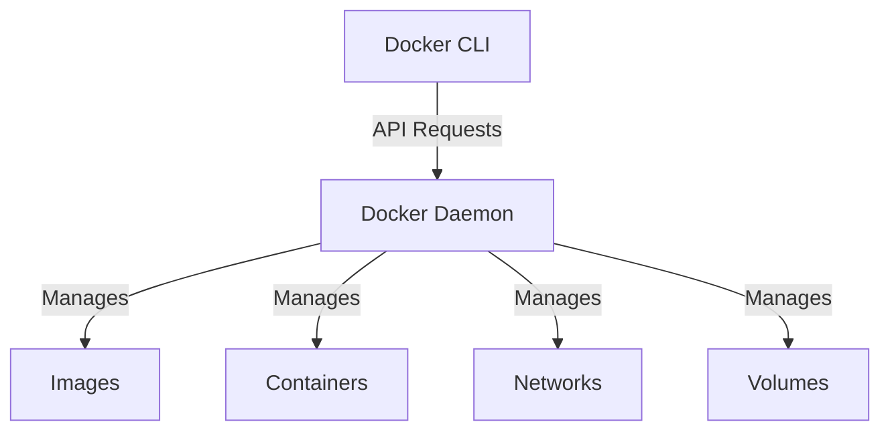
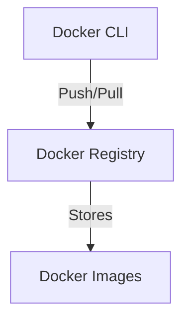

## Introduction to Docker Engine Components and Functionality

Docker is a powerful platform for building, packaging, and deploying applications as lightweight, portable, and self-sufficient containers. Containers encapsulate an application and its dependencies, ensuring consistent behavior across different environments. This section delves into the components and functionality of Docker, providing a comprehensive understanding of its architecture and usage.

### What is Docker?

Docker is an open-source platform that automates the deployment, scaling, and management of applications inside software containers. Containers are isolated environments that share the host operating system's kernel but have their own filesystem, process space, and network stack. This allows developers to package applications and their dependencies into a single unit, ensuring consistency and portability across development, testing, and production environments.

#### Why Use Docker?

1. **Consistency Across Environments**: Docker ensures that an application runs the same way in development, testing, and production environments.
2. **Isolation**: Each container runs in isolation, preventing conflicts between applications and their dependencies.
3. **Portability**: Docker containers can be easily moved between different hosts and cloud providers.
4. **Efficiency**: Containers are lightweight and start quickly, making them ideal for microservices architectures.

### Docker Engine Components

The Docker Engine consists of several key components:

1. **Docker Daemon**: The background service that manages Docker objects such as images, containers, networks, and volumes.
2. **Docker CLI (Command Line Interface)**: The command-line tool used to interact with the Docker daemon.
3. **Docker Registry**: A service that stores and distributes Docker images. The default registry is Docker Hub, but private registries can also be used.

#### Docker Daemon

The Docker daemon (`dockerd`) is the core component of the Docker Engine. It listens for Docker API requests and manages Docker objects. The daemon runs as a background service and can be accessed via the Docker CLI or other tools that communicate with the Docker API.



#### Docker CLI

The Docker CLI (`docker`) is the primary interface for interacting with the Docker daemon. It provides a wide range of commands for managing Docker objects, such as building images, running containers, and inspecting the state of the Docker environment.

```bash
# Example: List all running containers
docker ps

# Example: Run a new container
docker run -d --name my_container nginx
```

#### Docker Registry

A Docker registry is a service that stores and distributes Docker images. The default registry is Docker Hub, which is a public registry where users can store and share their images. Private registries can also be set up for internal use within organizations.



### Alternatives to Docker

While Docker is a popular choice for containerization, there are alternative tools that provide similar functionality. These alternatives can be useful in scenarios where only specific functionalities are required.

#### Container Runtime Tools

Container runtime tools are responsible for executing containerized applications. Some popular alternatives to Docker's container runtime include:

1. **ContainerD**: An industry-standard container runtime that can be used with various container orchestration systems.
2. **CRI-O**: A lightweight container runtime that implements the Kubernetes Container Runtime Interface (CRI).

##### ContainerD

ContainerD is a container runtime that can be used independently or integrated with container orchestration systems like Kubernetes. It focuses on running containers and managing their lifecycle.

```bash
# Example: Install ContainerD
sudo apt-get update
sudo apt-get install containerd

# Example: Start a container using ContainerD
ctr image pull docker.io/library/nginx
ctr run --rm docker.io/library/nginx my_nginx
```

##### CRI-O

CRI-O is a lightweight container runtime that implements the Kubernetes CRI. It is designed to work seamlessly with Kubernetes and provides a minimalistic approach to container execution.

```bash
# Example: Install CRI-O
sudo yum install -y cri-o

# Example: Start a container using CRI-O
podman run -d --name my_container nginx
```

#### Image Building Tools

Image building tools are responsible for creating Docker images. Some popular alternatives to Docker's image building capabilities include:

1. **Buildah**: A tool for building OCI-compliant container images.
2. **Podman**: A tool for managing pods, containers, and container images.

##### Buildah

Buildah is a tool for building OCI-compliant container images. It provides a flexible and powerful way to create images without requiring a Docker daemon.

```bash
# Example: Install Buildah
sudo yum install -y buildah

# Example: Create a new image using Buildah
buildah from alpine
buildah run alpine apk add --no-cache nginx
buildah commit alpine my_nginx_image
```

##### Podman

Podman is a tool for managing pods, containers, and container images. It provides a similar user experience to Docker but does not require a daemon.

```bash
# Example: Install Podman
sudo yum install -y podman

# Example: Run a container using Podman
podman run -d --name my_container nginx
```

### Installing Docker Locally

To use Docker, you need to install it on your local machine. Docker provides installation guides for different operating systems, including Mac, Linux, and Windows.

#### Linux

Linux supports Docker natively, and installation is straightforward. You can use package managers like `apt` or `yum` to install Docker.

```bash
# Example: Install Docker on Ubuntu
sudo apt-get update
sudo apt-get install -y docker-ce docker-ce-cli containerd.io

# Example: Verify Docker installation
sudo docker run hello-world
```

#### Windows

On Windows, you need to install Docker Desktop, which includes the Docker daemon, CLI, and other tools.

```bash
# Example: Download and install Docker Desktop
# Visit https://www.docker.com/products/docker-desktop and follow the installation instructions
```

#### Mac

On Mac, you also need to install Docker Desktop, which provides a complete Docker environment.

```bash
# Example: Download and install Docker Desktop
# Visit https://www.docker.com/products/docker-desktop and follow the installation instructions
```

### Conclusion

Docker is a powerful platform for building, packaging, and deploying applications as containers. Its components, including the Docker daemon, CLI, and registry, work together to provide a robust and efficient containerization solution. While Docker is widely used, there are alternative tools that can be used for specific functionalities, such as container runtime and image building. To get started with Docker, you need to install it on your local machine, following the appropriate installation guide for your operating system.

### How to Prevent / Defend

#### Secure Docker Installation

1. **Use Official Packages**: Always use official Docker packages from the Docker repository to ensure you are installing a trusted version.
2. **Keep Docker Updated**: Regularly update Docker to the latest version to benefit from security patches and improvements.

```bash
# Example: Update Docker on Ubuntu
sudo apt-get update
sudo apt-get upgrade docker-ce docker-ce-cli containerd.io
```

#### Secure Docker Configuration

1. **Restrict Docker Access**: Limit access to the Docker daemon to authorized users and processes.
2. **Use TLS for Docker Registry**: Enable TLS encryption for communication between the Docker client and registry to protect data in transit.

```bash
# Example: Configure TLS for Docker Registry
mkdir -p /etc/docker/certs.d/myregistry.example.com:5000
cp ca.pem /etc/docker/certs.d/myregistry.example.com:5000/ca.crt
```

#### Secure Docker Usage

1. **Use Minimal Base Images**: Use minimal base images to reduce the attack surface and improve performance.
2. **Scan Docker Images for Vulnerabilities**: Use tools like Trivy or Clair to scan Docker images for known vulnerabilities.

```bash
# Example: Scan Docker image using Trivy
trivy image my_nginx_image
```

### Real-World Examples

#### CVE-2019-14287: Docker API Authentication Bypass

In 2019, a critical vulnerability was discovered in Docker that allowed attackers to bypass authentication and gain unauthorized access to the Docker API. This vulnerability affected versions of Docker prior to 19.03.5.

**Impact**: Attackers could execute arbitrary commands on the host system, leading to potential data theft or system compromise.

**Mitigation**: Ensure Docker is updated to the latest version and restrict access to the Docker API.

```bash
# Example: Update Docker to the latest version
sudo apt-get update
sudo apt-get upgrade docker-ce docker-ce-cli containerd.io
```

#### CVE-2020-15252: Docker Compose Environment Variable Injection

In 2020, a vulnerability was discovered in Docker Compose that allowed attackers to inject malicious environment variables into containers. This vulnerability affected versions of Docker Compose prior to 1.26.2.

**Impact**: Attackers could inject malicious environment variables into containers, potentially leading to unauthorized access or code execution.

**Mitigation**: Ensure Docker Compose is updated to the latest version and validate environment variables before passing them to containers.

```bash
# Example: Update Docker Compose to the latest version
sudo curl -L "https://github.com/docker/compose/releases/download/1.26.2/docker-compose-$(uname -s)-$(uname -m)" -o /usr/local/bin/docker-compose
sudo chmod +x /usr/local/bin/docker-compose
```

### Practice Labs

For hands-on practice with Docker, consider the following labs:

- **PortSwigger Web Security Academy**: Offers a series of labs focused on web application security, including Docker-related challenges.
- **OWASP Juice Shop**: A deliberately insecure web application that includes Docker-based challenges.
- **Docker Documentation**: Provides official tutorials and examples for learning Docker.

By following these guidelines and practicing with real-world examples, you can gain a deep understanding of Docker and its components, ensuring secure and efficient containerization of your applications.

### Conclusion

This chapter provided a comprehensive overview of Docker Engine components and functionality, including detailed explanations of the Docker daemon, CLI, and registry. We explored alternative tools for container runtime and image building, and discussed the installation process for different operating systems. Additionally, we covered security best practices and real-world examples of Docker-related vulnerabilities. By mastering these concepts, you can effectively leverage Docker for building, packaging, and deploying applications as containers.

---
<!-- nav -->
[[DevOps/DevOps Bootcamp/05-Containerization (Docker)/12-Docker Engine Components and Functionality/00-Overview|Overview]] | [[02-Introduction to Docker and Containerization|Introduction to Docker and Containerization]]
