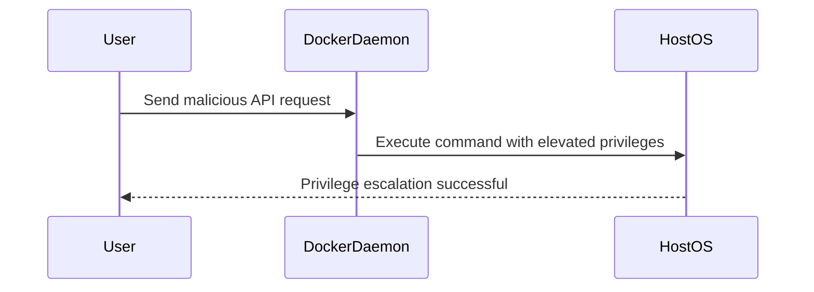
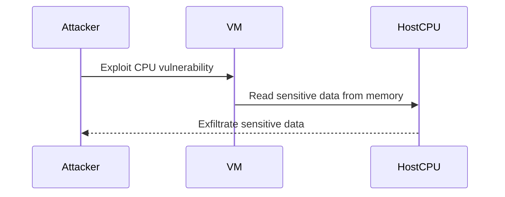
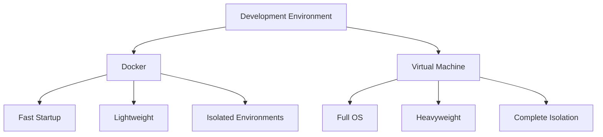
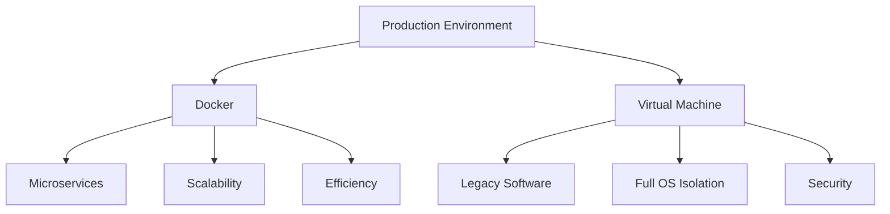
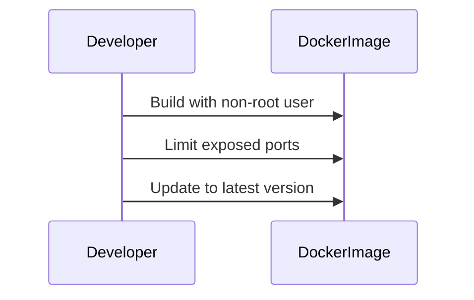
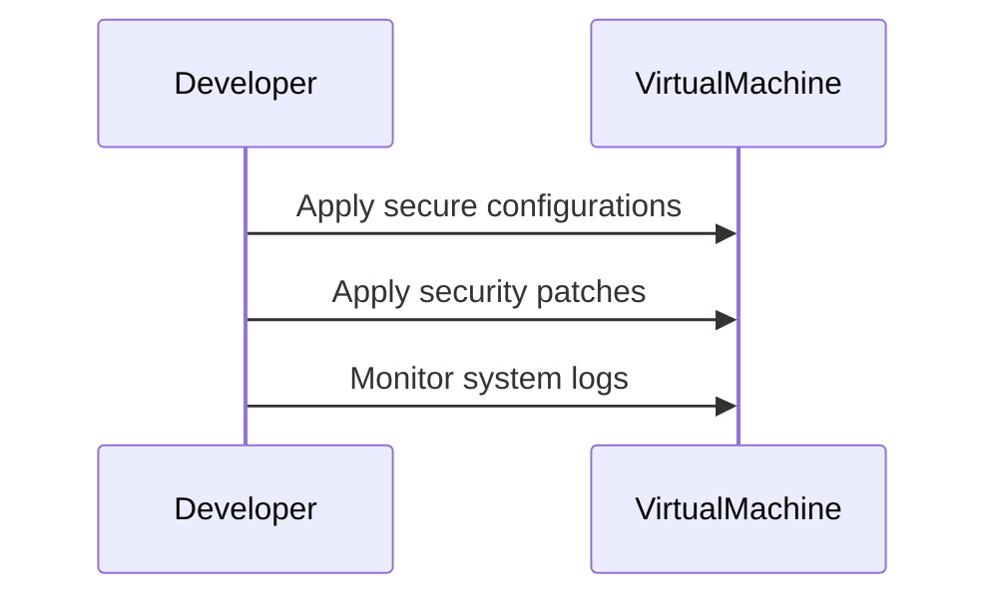
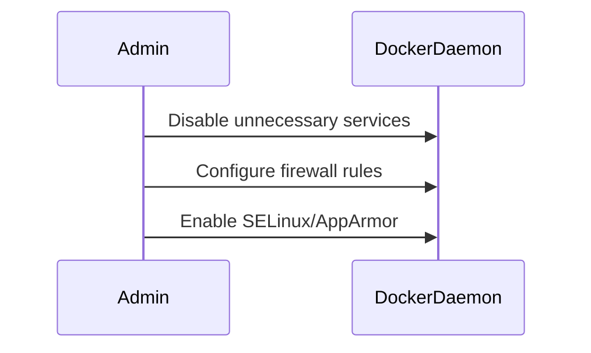
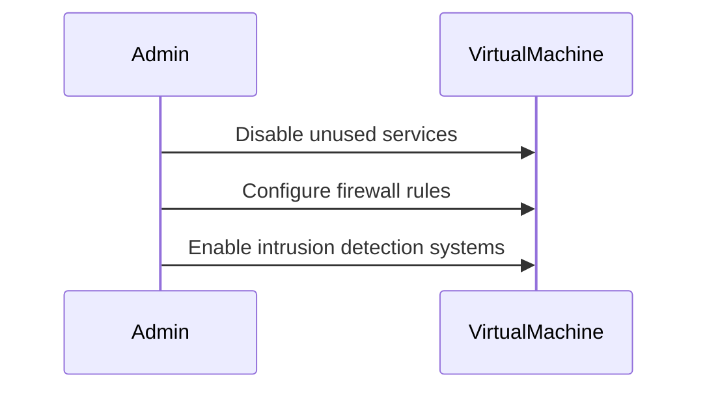

## Introduction to Docker and Virtual Machines

In the world of DevOps, two technologies stand out prominently for managing and deploying applications: Docker and Virtual Machines (VMs). Both serve the purpose of isolating applications from their underlying infrastructure, but they do so in fundamentally different ways. Understanding these differences is crucial for making informed decisions about application deployment and management.

### What is Docker?

Docker is a platform that allows developers to package their applications into lightweight, portable containers. These containers are isolated environments that contain all the necessary dependencies to run an application. Docker achieves this by leveraging the operating system's kernel and sharing it among multiple containers. This approach significantly reduces the overhead associated with traditional virtualization methods.

#### Key Concepts in Docker

- **Docker Image**: A Docker image is a lightweight, standalone, executable package that includes everything needed to run a piece of software, including the code, runtime, libraries, environment variables, and configuration files. Docker images are built using a `Dockerfile`, which is a text file containing instructions to build the image.

- **Docker Container**: A container is a runtime instance of a Docker image. Containers are created from images and can be started, stopped, moved, or deleted. Each container runs completely isolated from others, ensuring that applications do not interfere with each other.

- **Docker Daemon**: The Docker daemon (`dockerd`) is the background service that manages building, running, and distributing Docker containers. Users interact with the daemon through the Docker CLI or API.

### What is a Virtual Machine?

A virtual machine, on the other hand, is a simulated computer environment that behaves like a physical computer. VMs are created using virtualization software, such as VMware or VirtualBox, which abstracts the underlying hardware resources and provides a complete operating system environment.

#### Key Concepts in Virtual Machines

- **Hypervisor**: A hypervisor is a software layer that creates and manages virtual machines. There are two types of hypervisors:
  - Type 1 (Bare-metal): Runs directly on the host's hardware.
  - Type 2 (Hosted): Runs on top of a host operating system.

- **Virtual Machine Image**: A virtual machine image is a file that contains the entire state of a virtual machine, including the operating system, applications, and data. VM images are typically larger than Docker images because they include the entire operating system.

- **Guest OS**: The guest operating system is the operating system running inside the virtual machine. It is isolated from the host operating system and can be different from the host OS.

### Comparison Between Docker and Virtual Machines

The primary difference between Docker and virtual machines lies in how they handle the operating system and its components.

#### Operating System Virtualization

- **Docker**: Docker virtualizes the application layer and shares the host operating system's kernel. This means that Docker containers do not have their own kernels; instead, they rely on the kernel of the host operating system. This shared kernel approach results in significant performance benefits and reduced resource usage.

- **Virtual Machines**: Virtual machines virtualize the entire operating system, including the kernel. Each VM has its own complete operating system, which it boots independently of the host operating system. This isolation provides a high level of security and flexibility but comes at the cost of increased resource consumption.

#### Size and Performance

- **Size**: Docker images are typically much smaller than virtual machine images. A typical Docker image might be a few megabytes, whereas a VM image could be several gigabytes. This size difference is due to the fact that Docker images only include the application layer and necessary dependencies, while VM images include the entire operating system.

- **Performance**: Starting a Docker container is generally faster than starting a virtual machine. Since Docker containers share the host's kernel, they do not need to boot an entire operating system. In contrast, VMs require the full boot process of the guest operating system, which can take significantly longer.

#### Compatibility

- **Compatibility**: One of the key advantages of virtual machines is their ability to run any operating system on any host operating system. This makes VMs highly versatile and useful for testing and development across different environments. Docker, however, is more limited in terms of compatibility. Docker containers are designed to run on Linux-based systems, although there are ways to run Docker on Windows and macOS using tools like Docker Desktop.

### Real-World Examples and Recent Breaches

To understand the practical implications of these differences, let's look at some real-world examples and recent breaches involving both Docker and virtual machines.

#### Docker Example: CVE-2019-14287

CVE-2019-14287 was a critical vulnerability in Docker that allowed attackers to escalate privileges and gain root access to the host system. This vulnerability was due to a flaw in the Docker daemon's handling of certain API requests.



**Detection and Prevention**:

- **Detection**: Monitor Docker daemon logs for unusual activity, such as unexpected API calls or commands executed with elevated privileges.
- **Prevention**: Apply the latest security patches and updates to the Docker daemon. Use network segmentation to isolate Docker daemons from other critical systems.

#### Virtual Machine Example: Meltdown and Spectre

Meltdown and Spectre were a set of vulnerabilities affecting modern CPUs. These vulnerabilities allowed attackers to read sensitive information from the memory of other processes, including those running in virtual machines.



**Detection and Prevention**:

- **Detection**: Monitor system performance and memory access patterns for signs of unauthorized access.
- **Prevention**: Apply microcode updates provided by CPU manufacturers. Use hardware-based isolation techniques, such as Intel VT-x and AMD-V, to enhance security.

### Detailed Comparison and Use Cases

Let's delve deeper into the specific use cases and scenarios where Docker and virtual machines excel.

#### Use Case: Development and Testing

For development and testing environments, Docker is often preferred due to its lightweight nature and fast startup times. Developers can quickly spin up and tear down containers to test different configurations and dependencies.



**Example Dockerfile**:

```dockerfile
# Use an official Python runtime as a parent image
FROM python:3.8-slim

# Set the working directory in the container to /app
WORKDIR /app

# Copy the current directory contents into the container at /app
COPY . /app

# Install any needed packages specified in requirements.txt
RUN pip install --no-cache-dir -r requirements.txt

# Make port 80 available to the world outside this container
EXPOSE 80

# Define environment variable
ENV NAME World

# Run app.py when the container launches
CMD ["python", "app.py"]
```

**Example Virtual Machine Configuration**:

```xml
<domain type='kvm'>
  <name>test-vm</name>
  <memory unit='MiB'>1024</memory>
  <vcpu>2</vcpu>
  <os>
    <type arch='x86_64'>hvm</type>
    <boot dev='hd'/>
  </os>
  <devices>
    <disk type='file' device='disk'>
      <driver name='qemu' type='qcow2'/>
      <source file='/var/lib/libvirt/images/test-vm.qcow2'/>
      <target dev='vda' bus='virtio'/>
    </disk>
    <interface type='network'>
      <source network='default'/>
      <model type='virtio'/>
    </interface>
  </devices>
</domain>
```

#### Use Case: Production Deployment

In production environments, the choice between Docker and virtual machines depends on the specific requirements and constraints of the application. Docker is often used for microservices architectures due to its efficiency and scalability. Virtual machines may be preferred for applications that require full operating system isolation or legacy software that cannot run in a containerized environment.



### Pitfalls and Common Mistakes

When using Docker and virtual machines, there are several common pitfalls and mistakes that can lead to security vulnerabilities and operational issues.

#### Docker Pitfalls

- **Running as Root**: Running containers as the root user can expose the host system to security risks. Always run containers with non-root users whenever possible.

- **Insecure Images**: Using untrusted or outdated Docker images can introduce vulnerabilities. Always verify the source of Docker images and keep them up-to-date.

- **Exposed Ports**: Exposing unnecessary ports can increase the attack surface of the container. Only expose the minimum required ports.

#### Virtual Machine Pitfalls

- **Resource Overcommitment**: Overcommitting resources (CPU, memory, disk) can lead to performance degradation and stability issues. Ensure that resources are allocated appropriately based on workload demands.

- **Outdated Kernels**: Running outdated kernels in virtual machines can expose the system to known vulnerabilities. Regularly update the guest operating system and apply security patches.

- **Network Isolation**: Failing to properly isolate virtual machines on the network can allow lateral movement by attackers. Use network segmentation and firewalls to restrict communication between VMs.

### How to Prevent / Defend

#### Secure Coding Practices

- **Docker**: Implement secure coding practices by using non-root users, limiting exposed ports, and regularly updating Docker images.



- **Virtual Machine**: Implement secure coding practices by using secure configurations, applying security patches, and monitoring system logs.



#### Hardening Configurations

- **Docker**: Harden Docker configurations by disabling unnecessary services, configuring firewall rules, and enabling SELinux or AppArmor.



- **Virtual Machine**: Harden virtual machine configurations by disabling unused services, configuring firewall rules, and enabling intrusion detection systems.



### Conclusion

Understanding the differences between Docker and virtual machines is essential for effective DevOps practices. Docker offers lightweight, efficient containerization, while virtual machines provide full operating system isolation. By leveraging the strengths of each technology and implementing robust security measures, organizations can ensure the reliability and security of their applications.

### Hands-On Labs

For practical experience with Docker and virtual machines, consider the following labs:

- **PortSwigger Web Security Academy**: Offers hands-on labs for web application security, including Docker and containerization.
- **OWASP Juice Shop**: A deliberately insecure web application for practicing web security skills, including Docker deployment.
- **DVWA (Damn Vulnerable Web Application)**: A PHP/MySQL web application that is riddled with vulnerabilities, useful for learning Docker and container security.
- **CloudGoat**: A series of labs for practicing cloud security, including Docker and virtual machine configurations.
- **Kubernetes Goat**: A set of labs for practicing Kubernetes security, which often involves Docker and container management.

By engaging with these labs, you can gain practical experience and deepen your understanding of Docker and virtual machines in real-world scenarios.

---
<!-- nav -->
[[DevOps/DevOps Bootcamp/05-Containerization (Docker)/14-Docker Versus Virtual Machines Explained/00-Overview|Overview]] | [[02-Introduction to Virtualization Tools|Introduction to Virtualization Tools]]
