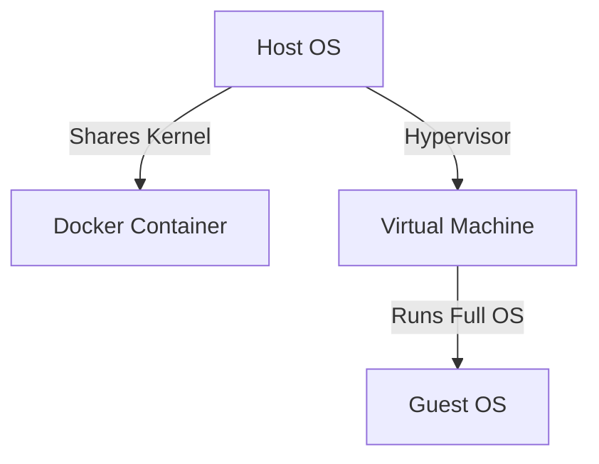

## Introduction to Virtualization Tools

Virtualization tools allow us to create isolated environments that can run different operating systems or configurations on the same physical hardware. Two popular types of virtualization tools are Docker and virtual machines (VMs).

### What is Docker?

Docker is a containerization platform that allows developers to package their applications and dependencies into lightweight, portable containers. Containers are isolated environments that share the host operating system's kernel but run their own processes and file systems.

### What is a Virtual Machine?

A virtual machine, on the other hand, is a complete emulation of a computer system, including its hardware and operating system. VMs are managed by a hypervisor, which is a software layer that runs on top of the host operating system and allocates resources to the VMs.

### Key Differences Between Docker and Virtual Machines

The key differences between Docker and virtual machines lie in their architecture and resource usage:

1. **Resource Usage**:
   - **Docker**: Containers share the host operating system's kernel, which means they use fewer resources than VMs. Each container only requires the memory and CPU needed to run its processes.
   - **Virtual Machines**: VMs require a full copy of the operating system, which can consume significant amounts of memory and CPU resources.

2. **Isolation**:
   - **Docker**: Containers are isolated from each other using namespaces and control groups (cgroups). Namespaces provide isolation for processes, network interfaces, and file systems, while cgroups limit and account for resource usage.
   - **Virtual Machines**: VMs provide stronger isolation because each VM runs its own operating system kernel and has its own set of resources.

3. **Speed**:
   - **Docker**: Containers can be created and destroyed quickly because they do not require the overhead of booting an entire operating system.
   - **Virtual Machines**: VMs take longer to start because they need to boot a full operating system.

### Diagram Comparing Docker and Virtual Machines

---
<!-- nav -->
[[01-Introduction to Docker and Virtual Machines|Introduction to Docker and Virtual Machines]] | [[DevOps/DevOps Bootcamp/05-Containerization (Docker)/14-Docker Versus Virtual Machines Explained/00-Overview|Overview]] | [[03-Comparison of Docker and Virtual Machines|Comparison of Docker and Virtual Machines]]
