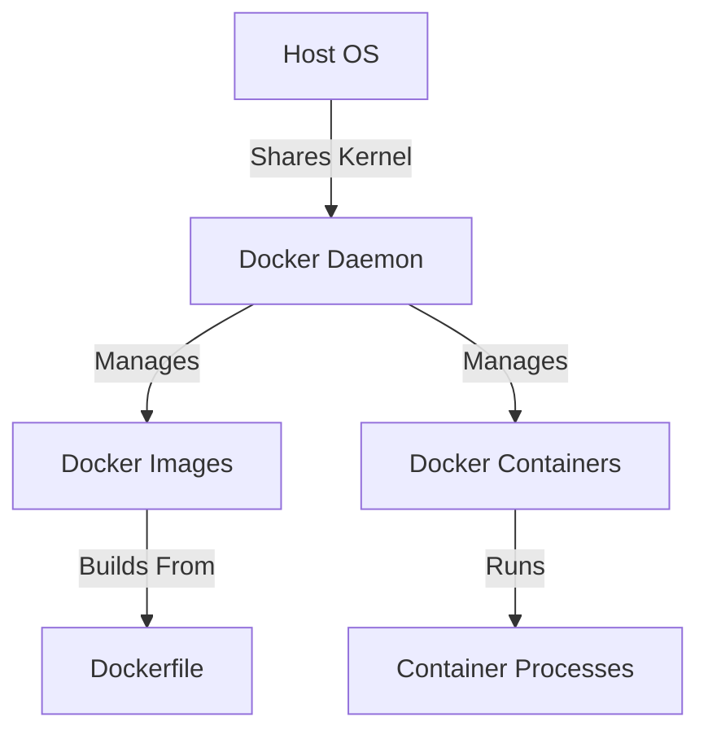

## How Docker Works on the Operating System Level

To understand how Docker works, let's break down its architecture and how it interacts with the host operating system.

### Docker Architecture

Docker consists of several components:

1. **Docker Daemon**: The Docker daemon (`dockerd`) is the server-side component that listens for API requests and manages Docker objects such as images, containers, networks, and volumes.
2. **Docker CLI**: The Docker command-line interface (CLI) is used to interact with the Docker daemon. It sends commands to the daemon via the Docker API.
3. **Docker Images**: Docker images are read-only templates that contain the necessary instructions to build a container. They are built from a series of layers, each representing a change to the image.
4. **Docker Containers**: Containers are running instances of Docker images. They are isolated environments that share the host operating system's kernel but run their own processes and file systems.
5. **Docker Registries**: Docker registries are repositories where Docker images are stored and distributed. The most popular registry is Docker Hub, but private registries can also be used.

### How Docker Uses the Host Kernel

Docker containers share the host operating system's kernel, which means they can run on any system that supports the Docker daemon. This shared kernel provides the following benefits:

- **Efficiency**: Containers use fewer resources than VMs because they do not require a full copy of the operating system.
- **Portability**: Containers can be easily moved between different systems as long as they have the same kernel version.

### Example of a Docker Image and Container

Let's consider a simple example where we create a Docker image and run a container from it.

#### Step 1: Create a Dockerfile

A Dockerfile is a text file that contains instructions for building a Docker image. Here is an example Dockerfile that creates a simple web server using Python:

```Dockerfile
# Use the official Python runtime as a parent image
FROM python:3.9-slim

# Set the working directory in the container
WORKDIR /app

# Copy the current directory contents into the container at /app
COPY . /app

# Install any needed packages specified in requirements.txt
RUN pip install --no-cache-dir -r requirements.txt

# Make port 80 available to the world outside this container
EXPOSE 80

# Define environment variable
ENV NAME World

# Run app.py when the container launches
CMD ["python", "app.py"]
```

#### Step 2: Build the Docker Image

To build the Docker image, we use the `docker build` command:

```bash
docker build -t my-web-server .
```

This command builds the image and tags it as `my-web-server`.

#### Step 3: Run the Docker Container

To run the container, we use the `docker run` command:

```bash
docker run -p 4000:80 my-web-server
```

This command maps port 80 of the container to port 4000 of the host, allowing us to access the web server.

### Diagram of Docker Architecture



---
<!-- nav -->
[[03-Comparison of Docker and Virtual Machines|Comparison of Docker and Virtual Machines]] | [[DevOps/DevOps Bootcamp/05-Containerization (Docker)/14-Docker Versus Virtual Machines Explained/00-Overview|Overview]] | [[05-How Virtual Machines Work on the Operating System Level|How Virtual Machines Work on the Operating System Level]]
