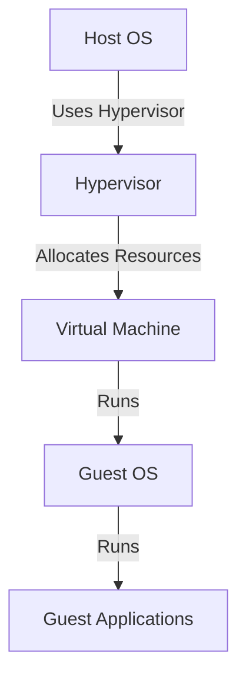

## How Virtual Machines Work on the Operating System Level

Now let's explore how virtual machines work and compare them to Docker.

### Virtual Machine Architecture

Virtual machines consist of the following components:

1. **Hypervisor**: The hypervisor is the software layer that manages the virtual machines. It allocates resources such as CPU, memory, and storage to the VMs.
2. **Guest Operating System**: Each virtual machine runs its own guest operating system, which is a complete copy of an operating system.
3. **Guest Applications**: The guest operating system runs its own set of applications, which are isolated from the host operating system and other VMs.

### How Virtual Machines Use the Host Hardware

Virtual machines use the host hardware through the hypervisor. The hypervisor allocates resources to the VMs and manages their interactions with the host hardware. This means that each VM runs its own operating system kernel and has its own set of resources.

### Example of a Virtual Machine

Let's consider an example where we create a virtual machine using VirtualBox.

#### Step 1: Install VirtualBox

First, we need to install VirtualBox on our host system. We can download it from the official website.

#### Step 2: Create a New Virtual Machine

Next, we create a new virtual machine in VirtualBox. We specify the amount of memory and storage to allocate to the VM.

#### Step 3: Install the Guest Operating System

We then install the guest operating system on the VM. This could be any operating system, such as Ubuntu, Windows, or macOS.

#### Step 4: Run the Virtual Machine

Finally, we run the virtual machine and use it as if it were a separate physical machine.

### Diagram of Virtual Machine Architecture

---
<!-- nav -->
[[04-How Docker Works on the Operating System Level|How Docker Works on the Operating System Level]] | [[DevOps/DevOps Bootcamp/05-Containerization (Docker)/14-Docker Versus Virtual Machines Explained/00-Overview|Overview]] | [[06-Understanding Operating Systems and Their Layers|Understanding Operating Systems and Their Layers]]
