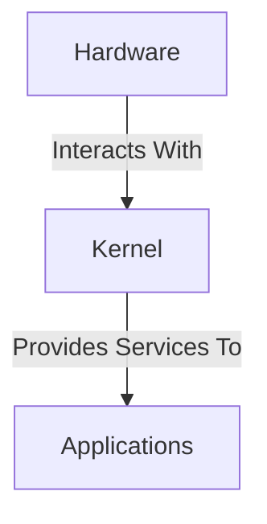

## Understanding Operating Systems and Their Layers

Before diving into the differences between Docker and virtual machines, it’s essential to understand the structure of an operating system. An operating system (OS) is composed of several layers, but for our purposes, we can focus on two primary layers:

1. **Operating System Kernel**: This is the core component of the OS that manages hardware resources such as the CPU, memory, and storage. The kernel acts as an intermediary between the hardware and the software, providing services like process management, memory management, and device drivers.
   
2. **Applications Layer**: This layer consists of all the software applications that run on top of the kernel. These applications interact with the kernel to perform tasks such as reading/writing files, accessing network resources, and managing processes.

### Diagram of Operating System Layers



### Examples of Operating Systems

Linux is one of the most popular operating systems, with numerous distributions available. Some well-known Linux distributions include:

- **Ubuntu**: Known for its user-friendly interface and wide range of software packages.
- **Debian**: Known for its stability and large repository of software.
- **Linux Mint**: Known for its ease of use and compatibility with Windows users.

Despite their differences in user interfaces and software packages, all these distributions share the same underlying Linux kernel. This means that they can run the same set of applications and provide similar functionality at the kernel level.

### How Applications Interact with the Kernel

Applications interact with the kernel through system calls. These are functions provided by the kernel that allow applications to request specific services, such as opening a file, creating a process, or allocating memory. For example, when an application wants to read data from a file, it makes a system call to the kernel, which then interacts with the file system to retrieve the data.

### Example of a System Call

Here is an example of a simple C program that uses a system call to print a message to the console:

```c
#include <stdio.h>

int main() {
    printf("Hello, World!\n");
    return 0;
}
```

In this example, the `printf` function makes a system call to the kernel to output the string "Hello, World!" to the console.

---
<!-- nav -->
[[05-How Virtual Machines Work on the Operating System Level|How Virtual Machines Work on the Operating System Level]] | [[DevOps/DevOps Bootcamp/05-Containerization (Docker)/14-Docker Versus Virtual Machines Explained/00-Overview|Overview]] | [[DevOps/DevOps Bootcamp/05-Containerization (Docker)/14-Docker Versus Virtual Machines Explained/07-Practice Questions & Answers|Practice Questions & Answers]]
