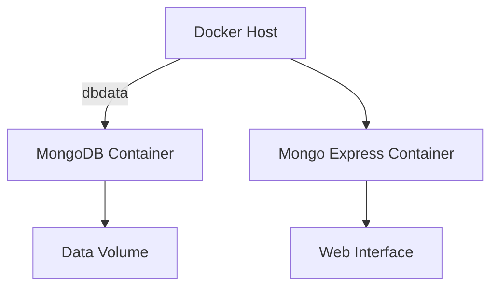
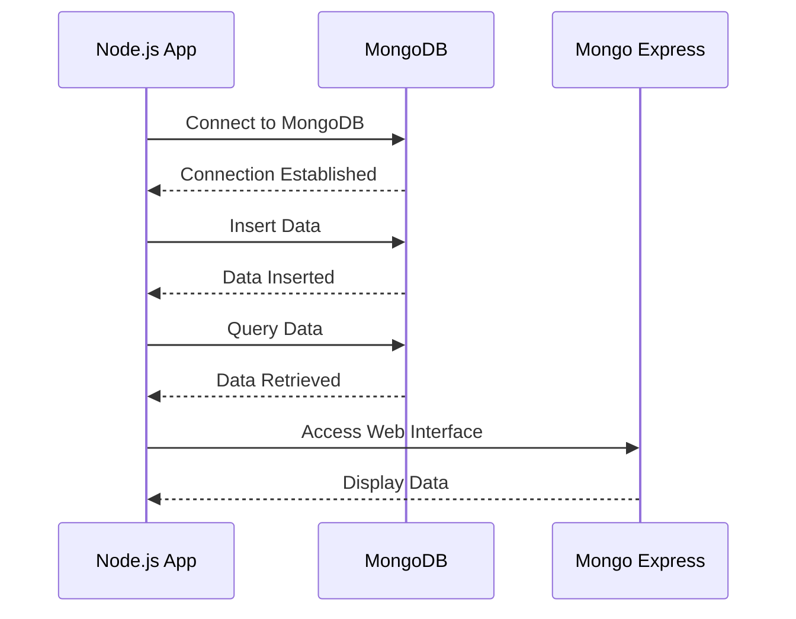

## Introduction to Docker Volumes

Docker volumes provide a way to persist data outside of the lifecycle of a container. In the context of a MongoDB database, using Docker volumes ensures that the data stored within the database remains intact even after the container is stopped and restarted. This is crucial for applications that rely on persistent storage, such as a Node.js application connecting to a MongoDB database.

### What is Docker?

Docker is an open-source platform that automates the deployment, scaling, and management of applications inside lightweight containers. Containers allow developers to package up their applications with all of their dependencies into a standardized unit for software development. Docker containers are isolated from one another and the host system, providing a consistent environment across different computing platforms.

### What is MongoDB?

MongoDB is a popular NoSQL document-oriented database system. Unlike traditional relational databases, MongoDB stores data in flexible, schema-less documents. This makes it highly scalable and suitable for applications that require high performance and flexibility.

### Why Use Docker Volumes?

Without Docker volumes, the data stored in a MongoDB container would be lost whenever the container is stopped and restarted. This is because Docker containers are ephemeral by nature, meaning they do not retain state between runs unless explicitly configured to do so. By using Docker volumes, you can ensure that the data persists independently of the container's lifecycle.

### How Docker Volumes Work

Docker volumes are managed by the Docker daemon and are stored in a specific directory on the host machine. When a container is created with a volume, Docker mounts the volume to a specified path within the container. This allows the container to read from and write to the volume, ensuring that the data remains available even after the container is removed.

### Example: Node.js Application with MongoDB

Let's consider a simple Node.js application that connects to a MongoDB database. The application requires persistent storage to maintain user data across restarts. To achieve this, we will use Docker volumes to store the MongoDB data.

#### Step-by-Step Setup

1. **Create the Docker Compose File**

   First, we need to define the services in a `docker-compose.yml` file. This file specifies the configuration for the MongoDB and Mongo Express containers.

   ```yaml
   version: '3'
   services:
     mongodb:
       image: mongo:latest
       volumes:
         - dbdata:/data/db
       ports:
         - "27017:27017"
     mongo-express:
       image: mongo-express:latest
       ports:
         - "8081:8081"
       environment:
         ME_CONFIG_MONGODB_SERVER: mongodb
   volumes:
     dbdata:
   ```

   Here, we define two services: `mongodb` and `mongo-express`. The `mongodb` service uses the `mongo:latest` image and maps the `/data/db` directory inside the container to a Docker volume named `dbdata`. The `mongo-express` service provides a web-based interface to interact with the MongoDB database.

2. **Start the Services**

   Run the following command to start the services defined in the `docker-compose.yml` file:

   ```bash
   docker-compose up
   ```

   This command starts both the MongoDB and Mongo Express containers. The MongoDB container will use the `dbdata` volume to store its data.

3. **Access Mongo Express**

   Once the services are running, you can access Mongo Express by navigating to `http://localhost:8081` in your web browser. This will allow you to interact with the MongoDB database through a user-friendly interface.

4. **Create a Database and Collection**

   Using Mongo Express, create a new database named `MyDB` and a collection named `Users`. You can then insert some sample data into the `Users` collection.

5. **Run the Node.js Application**

   Assuming you have a Node.js application that connects to the MongoDB database, you can run it alongside the MongoDB and Mongo Express containers. The application should be able to read from and write to the `Users` collection in the `MyDB` database.

### Persistent Storage with Docker Volumes

By using Docker volumes, the data stored in the MongoDB database is persisted even if the container is stopped and restarted. This is crucial for applications that require persistent storage.

#### Example: Losing Data Without Docker Volumes

If you were to run the MongoDB container without a volume, the data would be lost whenever the container is stopped and restarted. This can be demonstrated by stopping the MongoDB container and then starting it again without the volume.

```bash
# Stop the MongoDB container
docker-compose stop mongodb

# Remove the MongoDB container
docker-compose rm mongodb

# Start the MongoDB container without a volume
docker run --name mongodb -p 27017:27017 mongo:latest
```

In this scenario, the MongoDB container would start with an empty database, and all previously stored data would be lost.

### Real-World Examples

#### Recent CVEs and Breaches

One notable example of a breach involving MongoDB is the 2019 incident where thousands of MongoDB databases were compromised due to misconfigured security settings. In this case, the attackers exploited the lack of proper authentication and authorization mechanisms to gain unauthorized access to the databases.

To prevent such incidents, it is essential to configure MongoDB securely and use Docker volumes to ensure data persistence.

### How to Prevent / Defend

#### Secure Configuration

1. **Enable Authentication**

   Ensure that MongoDB is configured to require authentication. This can be done by setting the `auth` parameter to `true` in the MongoDB configuration file.

   ```yaml
   security:
     authorization: enabled
   ```

2. **Use Strong Passwords**

   Use strong, complex passwords for MongoDB users to prevent brute-force attacks.

3. **Limit Access**

   Restrict access to the MongoDB server by configuring firewall rules and limiting network exposure.

#### Secure Code Practices

1. **Validate User Input**

   Always validate user input to prevent SQL injection and other types of attacks.

2. **Use Prepared Statements**

   Use prepared statements to prevent SQL injection attacks.

3. **Implement Role-Based Access Control (RBAC)**

   Implement RBAC to ensure that users have only the necessary permissions to perform their tasks.

#### Hardening Measures

1. **Enable Encryption**

   Enable encryption for data at rest and in transit to protect sensitive information.

2. **Regularly Update Software**

   Regularly update MongoDB and other software components to ensure that known vulnerabilities are patched.

3. **Monitor Logs**

   Monitor MongoDB logs for suspicious activity and implement alerting mechanisms to detect potential security incidents.

### Conclusion

Using Docker volumes is essential for ensuring the persistence of data in MongoDB containers. By following best practices for secure configuration and coding, you can protect your MongoDB databases from potential security threats. Always validate user input, use prepared statements, and implement RBAC to ensure that your application is secure.

### Practice Labs

For hands-on experience with Docker volumes and MongoDB, consider the following labs:

- **PortSwigger Web Security Academy**: Offers a comprehensive set of labs covering various aspects of web security, including Docker and MongoDB.
- **OWASP Juice Shop**: A deliberately insecure web application that can be used to practice various security techniques, including Docker and MongoDB.
- **DVWA (Damn Vulnerable Web Application)**: Another intentionally vulnerable web application that can be used to practice security techniques.

These labs provide a practical way to apply the concepts learned in this chapter and gain hands-on experience with Docker volumes and MongoDB.

### Diagrams

#### Docker Compose Topology



This diagram illustrates the topology of the Docker Compose setup, showing the relationship between the Docker host, the MongoDB container, the Mongo Express container, and the data volume.

#### Request/Response Flow



This sequence diagram illustrates the flow of requests and responses between the Node.js application, MongoDB, and Mongo Express.

### Full Example

#### Docker Compose File

```yaml
version: '3'
services:
  mongodb:
    image: mongo:latest
    volumes:
      - dbdata:/data/db
    ports:
      - "27017:27017"
  mongo-express:
    image: mongo-express:latest
    ports:
      - "8081:8081"
    environment:
      ME_CONFIG_MONGODB_SERVER: mongodb
volumes:
  dbdata:
```

#### Node.js Application Code

```javascript
const MongoClient = require('mongodb').MongoClient;
const uri = 'mongodb://localhost:27017';
const client = new MongoClient(uri, { useNewUrlParser: true, useUnifiedTopology: true });

client.connect(err => {
  const collection = client.db('MyDB').collection('Users');
  // Perform operations on the collection
  client.close();
});
```

#### HTTP Requests and Responses

##### HTTP Request to MongoDB

```http
POST /insertData HTTP/1.1
Host: localhost:27017
Content-Type: application/json

{
  "username": "john_doe",
  "email": "john@example.com"
}
```

##### HTTP Response from MongoDB

```http
HTTP/1.1 200 OK
Content-Type: application/json

{
  "status": "success",
  "message": "Data inserted successfully"
}
```

##### HTTP Request to Mongo Express

```http
GET /displayData HTTP/1.1
Host: localhost:8081
```

##### HTTP Response from Mongo Express

```http
HTTP/1.1 200 OK
Content-Type: text/html

<!DOCTYPE html>
<html>
<head>
  <title>Mongo Express</title>
</head>
<body>
  <h1>Data Retrieved</h1>
  <ul>
    <li>Username: john_doe</li>
    <li>Email: john@example.com</li>
  </ul>
</body>
</html>
```

### Pitfalls and Common Mistakes

1. **Not Configuring Authentication**

   Failing to enable authentication can leave your MongoDB database vulnerable to unauthorized access.

2. **Using Weak Passwords**

   Using weak passwords can make it easier for attackers to gain unauthorized access to your MongoDB database.

3. **Not Limiting Access**

   Not restricting access to the MongoDB server can expose it to potential attacks from unauthorized sources.

### Summary

In conclusion, using Docker volumes is essential for ensuring the persistence of data in MongoDB containers. By following best practices for secure configuration and coding, you can protect your MongoDB databases from potential security threats. Always validate user input, use prepared statements, and implement RBAC to ensure that your application is secure.

---
<!-- nav -->
[[01-Introduction to Docker Volumes for Persistent MongoDB Data|Introduction to Docker Volumes for Persistent MongoDB Data]] | [[DevOps/DevOps Bootcamp/05-Containerization (Docker)/16-Docker Volumes for Persistent MongoDB Data/00-Overview|Overview]] | [[03-Docker Volumes for Persistent MongoDB Data|Docker Volumes for Persistent MongoDB Data]]
