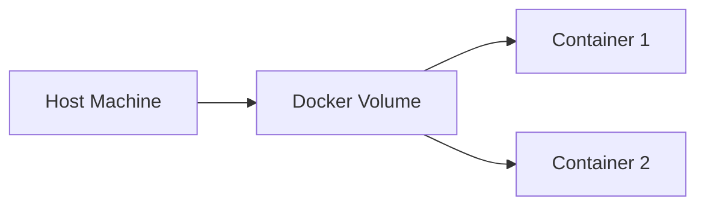

## Docker Volumes for Persistent MongoDB Data

In this section, we will delve into the use of Docker volumes to ensure persistent storage for MongoDB data. This is crucial because Docker containers are ephemeral by nature; once a container is stopped or removed, all data stored within it is lost unless it is persisted using volumes.

### Understanding Docker Volumes

Docker volumes provide a way to persist data outside of the container’s filesystem. This means that even if the container is deleted, the data remains intact and can be reused by new containers. Volumes are managed by Docker and can be shared between containers.

#### Why Use Docker Volumes?

Using Docker volumes ensures that your data is not tied to the lifecycle of a specific container. This is particularly important for databases like MongoDB, which rely on persistent storage to maintain their data integrity. Without volumes, any data written to the container would be lost when the container is stopped or removed.

#### How Docker Volumes Work

When you create a volume, Docker allocates space on the host machine to store the data. You can then mount this volume to one or more containers. The data stored in the volume persists independently of the container’s lifecycle.



### Using Docker Volumes with MongoDB

To illustrate the use of Docker volumes with MongoDB, let's walk through a complete example. We'll start by creating a Docker volume and then use it to store MongoDB data.

#### Step-by-Step Example

1. **Create a Docker Volume**

   First, we create a Docker volume named `mongodb-data`.

   ```bash
   docker volume create mongodb-data
   ```

2. **Run MongoDB Container with Volume**

   Next, we run a MongoDB container and mount the `mongodb-data` volume to `/data/db`, which is the default directory MongoDB uses to store its data.

   ```bash
   docker run --name mongodb-container -v mongodb-data:/data/db -d mongo
   ```

3. **Verify Data Persistence**

   To verify that the data is being stored in the volume, we can insert some data into the MongoDB instance and then stop and remove the container. Afterward, we will restart the container and check if the data is still present.

   ```bash
   # Insert data into MongoDB
   docker exec -it mongodb-container mongo
   > use mydb
   > db.mycol.insert({x:1})
   > exit

   # Stop and remove the container
   docker stop mongodb-container
   docker rm mongodb-container

   # Restart the container
   docker run --name mongodb-container -v mongodb-data:/data/db -d mongo

   # Check if the data is still present
   docker exec -it mongodb-container mongo
   > use mydb
   > db.mycol.find()
   ```

### Common Pitfalls and How to Prevent Them

One common pitfall is forgetting to mount the volume correctly, leading to data loss. Another issue is not properly securing the volume, which could expose sensitive data.

#### How to Prevent / Defend

1. **Ensure Correct Volume Mounting**

   Always double-check that the volume is mounted to the correct directory inside the container. In our example, we mounted `mongodb-data` to `/data/db`.

2. **Secure Volume Access**

   Ensure that the volume is only accessible to authorized containers. You can achieve this by setting appropriate permissions on the volume.

   ```bash
   # Set ownership and permissions
   docker run --rm -v mongodb-data:/data/db busybox chown -R 999:999 /data/db
   docker run --rm -v mongodb-data:/data/db busybox chmod -R 700 /data/db
   ```

3. **Monitor Volume Usage**

   Regularly monitor the usage of your Docker volumes to ensure they are not running out of space. You can use tools like `docker system df` to check disk usage.

   ```bash
   docker system df
   ```

### Real-World Examples and Recent CVEs

A notable real-world example is the MongoDB misconfiguration incident in 2016, where thousands of MongoDB instances were left exposed to the internet without proper authentication. This led to massive data theft and ransom demands. Ensuring that your MongoDB data is properly secured and backed up can help mitigate such risks.

### Practice Labs

For hands-on practice, consider the following labs:

- **PortSwigger Web Security Academy**: Offers a module on Docker and container security.
- **OWASP Juice Shop**: Provides a vulnerable application that can be deployed using Docker, including MongoDB.

These labs will help you gain practical experience with Docker volumes and MongoDB.

### Conclusion

Using Docker volumes for persistent MongoDB data is essential for maintaining data integrity and availability. By following the steps outlined above and adhering to best practices, you can ensure that your MongoDB data is safely stored and accessible across container lifecycles.

---
<!-- nav -->
[[02-Introduction to Docker Volumes|Introduction to Docker Volumes]] | [[DevOps/DevOps Bootcamp/05-Containerization (Docker)/16-Docker Volumes for Persistent MongoDB Data/00-Overview|Overview]] | [[04-Understanding Docker Volumes for Persistent MongoDB Data|Understanding Docker Volumes for Persistent MongoDB Data]]
