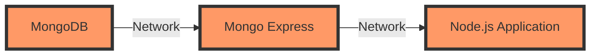

## Introduction to Docker Networking

Docker networking is a fundamental aspect of containerization that enables communication between different containers and with external systems. This section will delve into the concepts, mechanics, and practical applications of Docker networking, specifically focusing on setting up a development environment for a Node.js application backed by a MongoDB database and a MongoDB Express interface.

### What is Docker Networking?

Docker networking allows containers to communicate with each other and with the host system. By default, Docker provides several types of networks:

1. **Bridge Network**: The default network type, allowing containers to communicate with each other and with the host.
2. **Host Network**: Containers share the host’s network stack.
3. **None Network**: No networking is set up for the container.
4. **Custom Networks**: User-defined networks that can be customized for specific requirements.

In this context, we will focus on custom networks, particularly the bridge network, as it is the most flexible and commonly used for development environments.

### Why Use Docker Networks?

Using Docker networks ensures that containers can communicate securely and efficiently. By isolating containers within their own network, you can control access and reduce the attack surface. Additionally, Docker networks simplify the configuration of services by allowing containers to discover each other using their names rather than IP addresses.

### How Docker Networks Work

When you create a custom Docker network, Docker sets up a virtual network interface on the host machine. Containers connected to this network are assigned an IP address within the network's subnet. Communication between containers is managed through this virtual network, ensuring isolation and security.

#### Example: Creating a Custom Docker Network

To create a custom Docker network, you can use the `docker network create` command:

```sh
docker network create my_custom_network
```

This command creates a new network named `my_custom_network`.

### Running MongoDB and Mongo Express Containers

To run MongoDB and Mongo Express containers, you first need to pull the respective Docker images. Assuming you have already pulled the images, you can proceed to run the containers.

#### Pulling Docker Images

If you haven't already pulled the images, you can do so using the following commands:

```sh
docker pull mongo
docker pull mongo-express
```

#### Running MongoDB Container

To run the MongoDB container, use the following command:

```sh
docker run --name mongodb -d --network my_custom_network mongo
```

This command starts a MongoDB container named `mongodb`, attaches it to the `my_custom_network`, and runs it in detached mode (`-d`).

#### Running Mongo Express Container

Similarly, to run the Mongo Express container, use the following command:

```sh
docker run --name mongo-express -d --network my_custom_network -e ME_CONFIG_MONGODB_SERVER=mongodb mongo-express
```

This command starts a Mongo Express container named `mongo-express`, attaches it to the `my_custom_network`, and sets the environment variable `ME_CONFIG_MONGODB_SERVER` to `mongodb`, which tells Mongo Express to connect to the MongoDB container.

### Connecting Containers Using Docker Network

By attaching both containers to the same custom network (`my_custom_network`), they can communicate with each other using their container names. This simplifies the configuration and ensures that the containers can discover each other automatically.

#### Mermaid Diagram: Docker Network Topology



### Connecting External Applications to Docker Containers

Applications running outside of Docker, such as a Node.js application, can connect to the Docker containers using the host's IP address and the exposed ports. For example, if MongoDB is exposed on port 27017, the Node.js application can connect to `localhost:27017`.

#### Example: Connecting Node.js to MongoDB

Assuming your Node.js application is configured to connect to MongoDB, you can use the following code snippet:

```javascript
const MongoClient = require('mongodb').MongoClient;
const uri = 'mongodb://localhost:27017/mydatabase';
const client = new MongoClient(uri, { useNewUrlParser: true, useUnifiedTopology: true });

client.connect(err => {
  const collection = client.db("test").collection("devices");
  // perform actions on the collection object
  client.close();
});
```

### Packaging the Application into a Docker Image

Once your application is developed and tested, you can package it into a Docker image. This involves creating a `Dockerfile` that specifies the build instructions for the image.

#### Example: Dockerfile for Node.js Application

```Dockerfile
# Use an official Node.js runtime as a parent image
FROM node:14

# Set the working directory in the container
WORKDIR /usr/src/app

# Copy the current directory contents into the container at /usr/src/app
COPY . .

# Install any needed packages specified in package.json
RUN npm install

# Make port 3000 available to the world outside this container
EXPOSE 3000

# Define environment variable
ENV NODE_ENV=production

# Run app.py when the container launches
CMD ["npm", "start"]
```

#### Building and Running the Docker Image

To build the Docker image, use the following command:

```sh
docker build -t my_node_app .
```

To run the Docker image, use the following command:

```sh
docker run --name my_node_app -d --network my_custom_network -p 3000:3000 my_node_app
```

This command starts a container named `my_node_app`, attaches it to the `my_custom_network`, and maps port 3000 of the container to port 3000 of the host.

### Pitfalls and Best Practices

#### Common Pitfalls

1. **Incorrect Network Configuration**: Ensure that all containers are attached to the correct network.
2. **Port Conflicts**: Avoid conflicts by ensuring that the ports used by the containers are unique and not already in use.
3. **Security Risks**: Exposing sensitive services to the host can introduce security risks. Use secure configurations and limit access.

#### Best Practices

1. **Use Secure Configurations**: Always use secure configurations for services like MongoDB.
2. **Limit Access**: Restrict access to the Docker network to only necessary services.
3. **Regular Updates**: Keep Docker and the images up to date to ensure security patches are applied.

### Real-World Examples and CVEs

#### CVE-2021-22800: MongoDB Unauthorized Access

CVE-2021-22800 is a critical vulnerability in MongoDB that allows unauthorized access to the database. This vulnerability highlights the importance of securing MongoDB instances, especially when running in a Docker environment.

#### Secure Configuration Example

To mitigate this vulnerability, ensure that MongoDB is configured with authentication enabled and that access is restricted to the Docker network.

#### Vulnerable Configuration

```yaml
# Vulnerable MongoDB configuration
security:
  authorization: disabled
```

#### Secure Configuration

```yaml
# Secure MongoDB configuration
security:
  authorization: enabled
```

### How to Prevent / Defend

#### Detection

Monitor Docker logs and network traffic for unauthorized access attempts. Use tools like Docker Security Scanning to identify vulnerabilities in your images.

#### Prevention

1. **Enable Authentication**: Ensure that MongoDB is configured with authentication enabled.
2. **Restrict Access**: Limit access to the Docker network and use secure configurations.
3. **Regular Audits**: Perform regular audits of your Docker setup to identify and mitigate potential security issues.

#### Secure-Coding Fixes

Compare the vulnerable and secure configurations side by side:

**Vulnerable Configuration**

```yaml
# Vulnerable MongoDB configuration
security:
  authorization: disabled
```

**Secure Configuration**

```yaml
# Secure MongoDB configuration
security:
  authorization: enabled
```

### Conclusion

Docker networking is a powerful tool for managing communication between containers and with external systems. By understanding and properly configuring Docker networks, you can ensure that your development environment is secure and efficient. This chapter has covered the fundamentals of Docker networking, provided practical examples, and highlighted best practices and security considerations.

### Hands-On Labs

For hands-on practice, consider the following labs:

- **PortSwigger Web Security Academy**: Offers a variety of labs related to web application security, including Docker-related exercises.
- **OWASP Juice Shop**: A deliberately insecure web application for practicing web security skills.
- **DVWA (Damn Vulnerable Web Application)**: Another popular web application for learning web security.

These labs provide practical experience in setting up and securing Dockerized applications, reinforcing the concepts covered in this chapter.

---
<!-- nav -->
[[DevOps/DevOps Bootcamp/05-Containerization (Docker)/17-Dockerizing Node.js and MongoDB Development Environment/00-Overview|Overview]] | [[02-Introduction to Dockerizing Node.js and MongoDB Development Environment|Introduction to Dockerizing Node.js and MongoDB Development Environment]]
