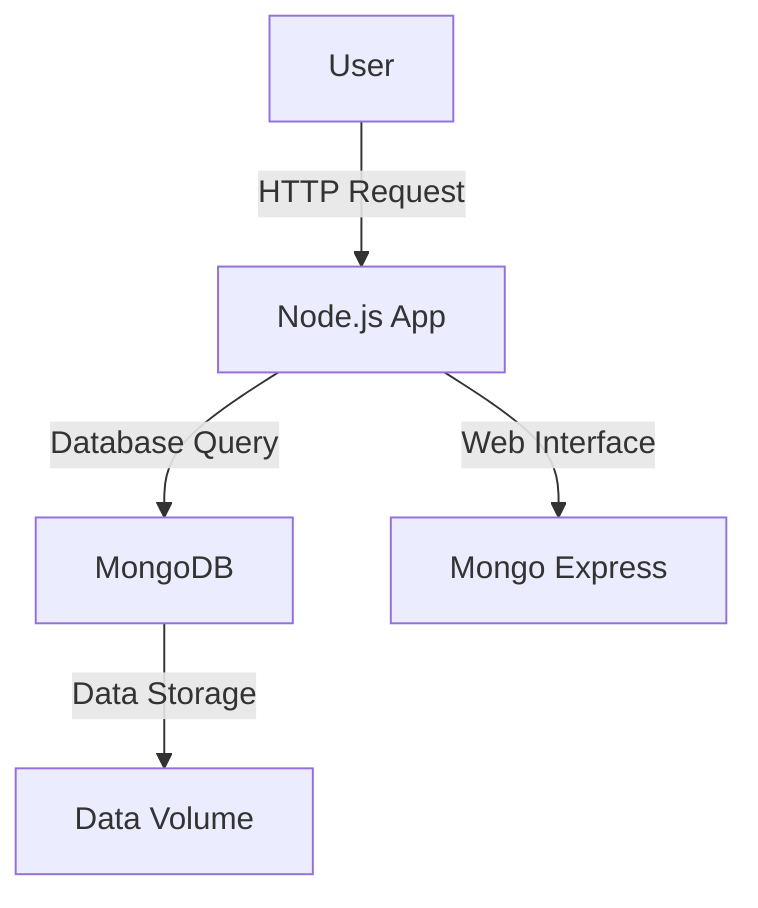

## Introduction to Dockerizing a Node.js and MongoDB Application

In this section, we will delve into the process of dockerizing a Node.js application that interacts with a MongoDB database. This approach allows us to create a consistent and portable development environment, ensuring that the application behaves the same way across different machines and environments. We will cover the theoretical foundations, practical steps, and security considerations involved in setting up such an environment.

### Background Theory

#### What is Docker?

Docker is a platform that uses OS-level virtualization to deliver software in packages called containers. Containers are lightweight and contain everything needed to run an application, including the code, runtime, system tools, libraries, and settings. This ensures that the application runs consistently regardless of the underlying infrastructure.

#### Why Use Docker?

1. **Consistency**: Docker ensures that the application runs the same way in development, testing, and production environments.
2. **Portability**: Docker containers can be easily moved between different systems.
3. **Isolation**: Each container runs in isolation, reducing conflicts between applications.
4. **Efficiency**: Containers share the host operating system kernel, making them more efficient than traditional VMs.

### Node.js and MongoDB Overview

#### Node.js

Node.js is an open-source, cross-platform JavaScript runtime environment that executes JavaScript code outside of a web browser. It is commonly used for building scalable network applications and is particularly popular for developing back-end services.

#### MongoDB

MongoDB is a NoSQL document-oriented database. Unlike traditional relational databases, MongoDB stores data in flexible, schema-less documents, making it highly scalable and suitable for modern web applications.

### Setting Up the Development Environment

To set up a development environment for a Node.js application that interacts with a MongoDB database, we will use Docker to containerize both the application and the database.

#### Step-by-Step Guide

1. **Create a Dockerfile for the Node.js Application**

   A `Dockerfile` is a script that contains instructions to build a Docker image. Below is an example `Dockerfile` for a Node.js application:

   ```dockerfile
   # Use the official Node.js runtime as a parent image
   FROM node:14

   # Set the working directory in the container
   WORKDIR /usr/src/app

   # Copy package.json and package-lock.json to the working directory
   COPY package*.json ./

   # Install dependencies
   RUN npm install

   # Copy the rest of the application code to the working directory
   COPY . .

   # Expose port 3000 to the outside world
   EXPOSE 3000

   # Command to run the application
   CMD ["npm", "start"]
   ```

2. **Create a `docker-compose.yml` File**

   `docker-compose` is a tool for defining and running multi-container Docker applications. Below is an example `docker-compose.yml` file that sets up both the Node.js application and the MongoDB database:

   ```yaml
   version: '3'
   services:
     app:
       build: .
       ports:
         - "3000:3000"
       depends_on:
         - db
     db:
       image: mongo:latest
       volumes:
         - ./data:/data/db
       ports:
         - "27017:27017"
     mongo-express:
       image: mongo-express
       restart: always
       ports:
         - "8081:8081"
       environment:
         ME_CONFIG_MONGODB_SERVER: db
   ```

3. **Build and Run the Docker Containers**

   To build and run the containers, navigate to the directory containing the `Dockerfile` and `docker-compose.yml` files and execute the following commands:

   ```bash
   docker-compose build
   docker-compose up
   ```

### Connecting the Application to the Database

The Node.js application needs to connect to the MongoDB database. Below is an example of how to establish a connection using the `mongoose` library:

```javascript
const mongoose = require('mongoose');

// Connect to MongoDB
mongoose.connect('mongodb://db:27017/mydatabase', { useNewUrlParser: true, useUnifiedTopology: true })
  .then(() => console.log('Connected to MongoDB'))
  .catch(err => console.error('Failed to connect to MongoDB:', err));
```

### Managing the Database with Mongo Express

Mongo Express is a web-based administration tool for MongoDB. It provides a user-friendly interface to manage the database. In our `docker-compose.yml` file, we have already configured Mongo Express to connect to the MongoDB service.

### Security Considerations

#### Vulnerabilities and Risks

1. **Unsecured MongoDB Instances**
   - **CVE Example**: CVE-2019-10130 - MongoDB versions before 4.0.11, 4.2.0, and 4.2.1 allow unauthenticated users to perform certain operations, leading to unauthorized access.
   - **Risk**: Unsecured MongoDB instances can be exploited to gain unauthorized access to sensitive data.

2. **Weak Authentication Mechanisms**
   - **Risk**: Weak or default authentication mechanisms can be easily bypassed, allowing attackers to gain unauthorized access.

#### How to Prevent / Defend

1. **Secure MongoDB Configuration**
   - **Detection**: Use tools like `nmap` to scan for open MongoDB ports and check for default configurations.
   - **Prevention**:
     - Enable authentication by setting `security.authorization` to `enabled`.
     - Use strong passwords and enable SSL/TLS encryption.
     - Restrict network access to MongoDB using firewall rules.

   ```yaml
   # Example of securing MongoDB in docker-compose.yml
   services:
     db:
       image: mongo:latest
       command: mongod --auth
       volumes:
         - ./data:/data/db
       ports:
         - "27017:27017"
       environment:
         MONGO_INITDB_ROOT_USERNAME: admin
         MONGO_INITDB_ROOT_PASSWORD: password123
   ```

2. **Use Strong Authentication Mechanisms**
   - **Detection**: Regularly audit authentication mechanisms and check for default credentials.
   - **Prevention**:
     - Use strong, unique passwords.
     - Implement multi-factor authentication (MFA).

   ```javascript
   // Example of using strong authentication in Node.js
   const mongoose = require('mongoose');

   const options = {
     useNewUrlParser: true,
     useUnifiedTopology: true,
     auth: {
       authSource: 'admin',
       user: 'admin',
       password: 'password123'
     }
   };

   mongoose.connect('mongodb://db:27017/mydatabase', options)
     .then(() => console.log('Connected to MongoDB'))
     .catch(err => console.error('Failed to connect to MongoDB:', err));
   ```

### Real-World Examples

#### Recent Breaches

1. **MongoDB Breach in 2019**
   - **Description**: Multiple MongoDB instances were left exposed due to misconfigurations, leading to unauthorized access and data theft.
   - **Impact**: Sensitive data was compromised, leading to reputational damage and financial loss.

#### Secure Coding Practices

1. **Validate User Input**
   - **Example**: Always validate and sanitize user input to prevent SQL injection attacks.

   ```javascript
   // Example of validating user input in Node.js
   const express = require('express');
   const app = express();

   app.use(express.json());

   app.post('/updateProfile', (req, res) => {
     const { name, email } = req.body;

     if (!name || !email) {
       return res.status(400).send('Invalid input');
     }

     // Update profile logic here
   });
   ```

2. **Use Prepared Statements**
   - **Example**: Use prepared statements to prevent SQL injection attacks.

   ```javascript
   // Example of using prepared statements in Node.js
   const { MongoClient } = require('mongodb');

   const uri = 'mongodb://db:27017/mydatabase';
   const client = new MongoClient(uri, { useNewUrlParser: true, useUnifiedTopology: true });

   async function updateProfile(name, email) {
     await client.connect();
     const collection = client.db('mydatabase').collection('users');

     const filter = { name };
     const update = { $set: { email } };

     const result = await collection.updateOne(filter, update);
     console.log(`Updated ${result.modifiedCount} document(s)`);
   }
   ```

### Diagrams

#### Docker Compose Topology



### Conclusion

By following the steps outlined in this chapter, you can successfully dockerize a Node.js application that interacts with a MongoDB database. This setup ensures consistency, portability, and security. Remember to follow best practices for securing your database and application to prevent potential vulnerabilities.

### Practice Labs

For hands-on practice, consider the following labs:

- **PortSwigger Web Security Academy**: Offers comprehensive labs on web application security.
- **OWASP Juice Shop**: A deliberately insecure web application for practicing web security skills.
- **DVWA (Damn Vulnerable Web Application)**: A PHP/MySQL web application that is riddled with vulnerabilities for educational purposes.
- **Kubernetes Goat**: A series of Kubernetes security challenges designed to test and improve your Kubernetes security skills.

These labs provide practical experience in setting up and securing Dockerized applications and databases.

---
<!-- nav -->
[[02-Introduction to Dockerizing Node.js and MongoDB Development Environment|Introduction to Dockerizing Node.js and MongoDB Development Environment]] | [[DevOps/DevOps Bootcamp/05-Containerization (Docker)/17-Dockerizing Node.js and MongoDB Development Environment/00-Overview|Overview]] | [[04-Introduction to Dockerizing a Node.js and MongoDB Development Environment|Introduction to Dockerizing a Node.js and MongoDB Development Environment]]
