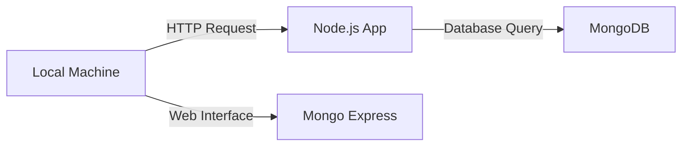
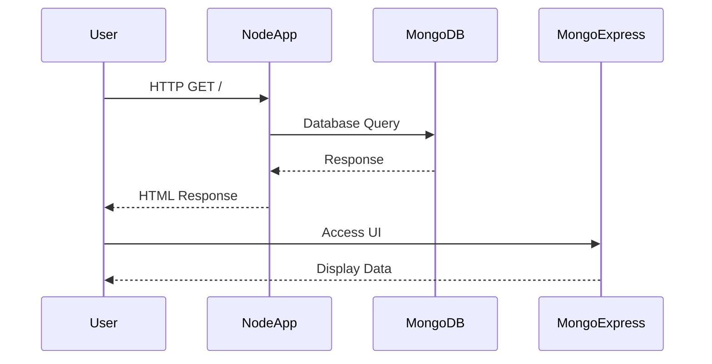

## Introduction to Dockerizing a Node.js and MongoDB Development Environment

In this section, we will delve into the practical aspects of using Docker to set up a local development environment for a Node.js application connected to a MongoDB database. This setup will provide a robust and reproducible development environment, ensuring consistency across different machines and developers. We will cover the entire process, from setting up the Node.js application to integrating it with Dockerized MongoDB and a MongoDB UI tool called Mongo Express.

### Background Theory

#### What is Docker?

Docker is a platform that allows developers to package their applications and dependencies into lightweight, portable containers. These containers can run consistently across different environments, whether it's a developer's local machine, a testing server, or a production environment. Docker achieves this by abstracting away the underlying operating system and providing a consistent runtime environment.

#### Why Use Docker?

Using Docker offers several advantages:

1. **Consistency**: Ensures that the application runs the same way in all environments.
2. **Portability**: Containers can be easily moved between different systems.
3. **Isolation**: Each container runs in isolation, reducing conflicts between different applications.
4. **Reproducibility**: Dockerfiles provide a clear and repeatable way to build and run the application.

### Setting Up the Node.js Application

Before diving into Docker, let's create a simple Node.js application that serves an HTML page and interacts with a MongoDB database.

#### Creating the Node.js Application

1. **Initialize the Project**:
    - Create a new directory for your project.
    - Initialize a new Node.js project using `npm init`.

    ```bash
    mkdir node-mongo-docker
    cd node-mongo-docker
    npm init -y
    ```

2. **Install Dependencies**:
    - Install `express` for creating the server.
    - Install `mongodb` for interacting with the MongoDB database.

    ```bash
    npm install express mongodb
    ```

3. **Create the Server**:
    - Create an `index.js` file to define the server logic.

    ```javascript
    // index.js
    const express = require('express');
    const MongoClient = require('mongodb').MongoClient;
    const app = express();
    const port = 3000;

    const url = 'mongodb://localhost:27017';
    const dbName = 'testdb';

    app.get('/', (req, res) => {
        res.sendFile(__dirname + '/index.html');
    });

    app.listen(port, () => {
        console.log(`Server running on http://localhost:${port}`);
    });

    MongoClient.connect(url, { useNewUrlParser: true, useUnifiedTopology: true }, (err, client) => {
        if (err) throw err;
        console.log('Connected to MongoDB');
        const db = client.db(dbName);
        // Example: Insert a document
        db.collection('documents').insertOne({ name: 'John Doe' }, (err, result) => {
            if (err) throw err;
            console.log('Document inserted:', result.ops[0]);
        });
    });
    ```

4. **Create the HTML File**:
    - Create an `index.html` file to serve as the frontend.

    ```html
    <!-- index.html -->
    <!DOCTYPE html>
    <html lang="en">
    <head>
        <meta charset="UTF-8">
        <meta name="viewport" content="width=device-width, initial-scale=1.0">
        <title>Node.js and MongoDB</title>
    </head>
    <body>
        <h1>Welcome to the Node.js and MongoDB Demo</h1>
        <p>This is a simple HTML page served by a Node.js server.</p>
    </body>
    </html>
    ```

### Dockerizing the Node.js Application

Now that we have our Node.js application set up, let's containerize it using Docker.

#### Creating the Dockerfile

1. **Create the Dockerfile**:
    - In the root of your project, create a `Dockerfile`.

    ```dockerfile
    # Dockerfile
    FROM node:14

    WORKDIR /app

    COPY package*.json ./
    RUN npm install

    COPY . .

    EXPOSE 3000
    CMD ["node", "index.js"]
    ```

2. **Build the Docker Image**:
    - Build the Docker image using the `Dockerfile`.

    ```bash
    docker build -t node-mongo-app .
    ```

3. **Run the Docker Container**:
    - Run the Docker container.

    ```bash
    docker run -p 3000:3000 node-mongo-app
    ```

### Dockerizing MongoDB

Next, we'll set up a Docker container for MongoDB.

#### Creating the MongoDB Docker Container

1. **Run the MongoDB Container**:
    - Use the official MongoDB Docker image.

    ```bash
    docker run --name mongo-db -p 27017:27017 -d mongo
    ```

2. **Verify MongoDB Connection**:
    - Ensure that MongoDB is running and accessible.

    ```bash
    docker exec -it mongo-db mongo
    ```

### Integrating Mongo Express

To simplify interaction with MongoDB, we'll use Mongo Express, a web-based UI for MongoDB.

#### Running Mongo Express

1. **Run the Mongo Express Container**:
    - Use the official Mongo Express Docker image.

    ```bash
    docker run --name mongo-express -p 8081:8081 --link mongo-db:mongo -d mongo-express
    ```

2. **Access Mongo Express**:
    - Open a browser and navigate to `http://localhost:8081`.

### Complete Docker Compose Setup

For a more streamlined setup, we can use Docker Compose to manage multiple containers.

#### Creating the `docker-compose.yml` File

1. **Create the `docker-compose.yml` File**:
    - Define services for the Node.js application, MongoDB, and Mongo Express.

    ```yaml
    # docker-compose.yml
    version: '3'
    services:
      node-app:
        build: .
        ports:
          - "3000:3000"
        depends_on:
          - mongo-db
      mongo-db:
        image: mongo
        ports:
          - "27017:27017"
      mongo-express:
        image: mongo-express
        ports:
          - "8081:8081"
        environment:
          ME_CONFIG_MONGODB_SERVER: mongo-db
        depends_on:
          - mongo-db
    ```

2. **Start the Services**:
    - Use Docker Compose to start all services.

    ```bash
    docker-compose up
    ```

### Mermaid Diagrams

#### Network Topology



#### Sequence Diagram



### Pitfalls and Best Practices

#### Common Mistakes

1. **Incorrect Port Mapping**:
    - Ensure that the correct ports are mapped in the Dockerfile and `docker-compose.yml`.
2. **Dependency Issues**:
    - Make sure all necessary dependencies are installed in the Dockerfile.
3. **Security Vulnerabilities**:
    - Regularly update Docker images and dependencies to avoid known vulnerabilities.

#### How to Prevent / Defend

1. **Secure Docker Images**:
    - Use trusted official images and regularly update them.
    - Scan images for vulnerabilities using tools like `Clair` or `Trivy`.

2. **Network Isolation**:
    - Use Docker networks to isolate services and limit exposure.
    - Configure firewall rules to restrict access to sensitive services.

3. **Environment Variable Management**:
    - Use environment variables for sensitive data and avoid hardcoding secrets.
    - Utilize Docker secrets for managing sensitive information securely.

### Real-World Examples

#### Recent CVEs and Breaches

1. **CVE-2021-21315**:
    - A vulnerability in MongoDB versions 4.4.0 to 4.4.3 allowed unauthorized access to the database.
    - **Impact**: Unauthorized access to sensitive data.
    - **Mitigation**: Update to the latest version of MongoDB and ensure proper authentication mechanisms are in place.

2. **MongoDB Exposed to the Internet**:
    - Several instances of MongoDB databases being exposed to the internet due to misconfiguration.
    - **Impact**: Data theft and unauthorized access.
    - **Mitigation**: Restrict access to MongoDB instances using firewalls and network policies.

### Conclusion

By following this guide, you should now have a comprehensive understanding of how to set up a Dockerized development environment for a Node.js application connected to a MongoDB database. This setup ensures consistency, portability, and isolation, making it ideal for both development and production environments. Additionally, by adhering to best practices and security measures, you can protect your application from common vulnerabilities and breaches.

### Practice Labs

For hands-on practice, consider the following labs:

- **PortSwigger Web Security Academy**: Offers a variety of labs related to web application security, including Docker-related challenges.
- **OWASP Juice Shop**: A deliberately insecure web application for practicing web security skills.
- **DVWA (Damn Vulnerable Web Application)**: Another popular web application for learning web security.

These labs will help reinforce the concepts covered in this chapter and provide practical experience with Docker and web application security.

---
<!-- nav -->
[[03-Introduction to Dockerizing a Node.js and MongoDB Application|Introduction to Dockerizing a Node.js and MongoDB Application]] | [[DevOps/DevOps Bootcamp/05-Containerization (Docker)/17-Dockerizing Node.js and MongoDB Development Environment/00-Overview|Overview]] | [[05-Connecting Node.js with MongoDB Using Docker|Connecting Node.js with MongoDB Using Docker]]
