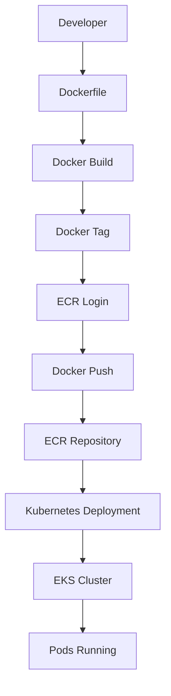

## Introduction to AWS ECR and EKS Integration

In the context of modern DevOps practices, containerization and orchestration play crucial roles in streamlining the deployment and management of applications. Docker Hub, a popular container registry, has traditionally been used to store and manage Docker images. However, as organizations move towards more robust and scalable solutions, integrating Amazon Elastic Container Registry (ECR) with Amazon Elastic Kubernetes Service (EKS) becomes a compelling alternative. This integration offers several advantages, including enhanced security, scalability, and seamless integration with other AWS services.

### Background Theory

#### What is AWS ECR?

Amazon Elastic Container Registry (ECR) is a fully managed Docker container registry service provided by AWS. It allows users to store, manage, and deploy Docker container images. ECR supports private repositories, which means that only authorized users can access the images stored within them. This feature enhances security by ensuring that sensitive application components are not exposed to unauthorized parties.

#### What is EKS?

Amazon Elastic Kubernetes Service (EKS) is a managed Kubernetes service that makes it easy to run Kubernetes on AWS without needing to install and operate your own Kubernetes control plane. EKS simplifies the process of deploying, managing, and scaling containerized applications using Kubernetes. By leveraging EKS, organizations can focus on developing their applications rather than managing the underlying infrastructure.

### Why Replace Docker Hub with AWS ECR?

There are several reasons why replacing Docker Hub with AWS ECR might be beneficial:

1. **Security**: ECR provides enhanced security features such as private repositories, encryption at rest, and integration with AWS Identity and Access Management (IAM) for fine-grained access control.
   
2. **Scalability**: ECR is designed to scale with your application's needs, ensuring that you can store and manage large numbers of Docker images efficiently.
   
3. **Integration with AWS Services**: ECR integrates seamlessly with other AWS services, such as EKS, AWS Lambda, and AWS CodePipeline, making it easier to build and deploy applications in a consistent environment.

### How to Replace Docker Hub with AWS ECR

To replace Docker Hub with AWS ECR, you need to follow these steps:

1. **Create an ECR Repository**:
   - Log in to the AWS Management Console.
   - Navigate to the ECR service.
   - Create a new repository and note down the repository URI.

2. **Push Docker Images to ECR**:
   - Tag your Docker image with the ECR repository URI.
   - Authenticate with ECR using `aws ecr get-login-password`.
   - Push the image to the ECR repository.

3. **Update Kubernetes Deployment to Use ECR Image**:
   - Modify the Kubernetes deployment YAML file to reference the ECR image URI.
   - Apply the updated deployment configuration to your EKS cluster.

### Detailed Example

Let's walk through a detailed example of replacing Docker Hub with AWS ECR in a Kubernetes deployment.

#### Step 1: Create an ECR Repository

First, create an ECR repository using the AWS Management Console or the AWS CLI.

```bash
# Using AWS CLI
aws ecr create-repository --repository-name my-app
```

This command creates a new repository named `my-app`. Note down the repository URI, which will be in the format `aws_account_id.dkr.ecr.region.amazonaws.com/my-app`.

#### Step 2: Push Docker Images to ECR

Next, push your Docker image to the newly created ECR repository.

```bash
# Tag the Docker image with the ECR repository URI
docker tag my-app:latest aws_account_id.dkr.ecr.region.amazonaws.com/my-app:latest

# Authenticate with ECR
aws ecr get-login-password --region region | docker login --username AWS --password-stdin aws_account_id.dkr.ecr.region.amazonaws.com

# Push the image to ECR
docker push aws_account_id.dkr.ecr.region.amazonaws.com/my-app:latest
```

#### Step 3: Update Kubernetes Deployment to Use ECR Image

Modify the Kubernetes deployment YAML file to reference the ECR image URI.

```yaml
apiVersion: apps/v1
kind: Deployment
metadata:
  name: my-app-deployment
spec:
  replicas: 3
  selector:
    matchLabels:
      app: my-app
  template:
    metadata:
      labels:
        app: my-app
    spec:
      containers:
      - name: my-app
        image: aws_account_id.dkr.ecr.region.amazonaws.com/my-app:latest
        ports:
        - containerPort: 80
```

Apply the updated deployment configuration to your EKS cluster.

```bash
kubectl apply -f deployment.yaml
```

### Monitoring and Verification

After updating the deployment, verify that the new pods are running with the correct image.

```bash
kubectl get pods
```

Check the details of a specific pod to confirm the image URL.

```bash
kubectl describe pod my-app-deployment-xxxxx
```

Scroll up to the `Containers` section to find the image URL, which should now point to the ECR repository.

### Real-World Examples and Recent Breaches

#### Example: CVE-2021-44228 (Log4Shell)

The Log4Shell vulnerability (CVE-2021-44228) affected many Java applications, including those deployed in containerized environments. By using ECR with EKS, organizations can ensure that their Docker images are regularly scanned for vulnerabilities and that only secure images are deployed.

#### Example: Docker Hub Breach

In 2021, Docker Hub experienced a breach that compromised user credentials. By using ECR, organizations can leverage AWS's robust security measures to protect their container images and reduce the risk of similar breaches.

### Common Pitfalls and Best Practices

#### Pitfall: Insecure Image Storage

Storing Docker images in public repositories can expose sensitive information. Always use private repositories and enforce strict access controls.

#### Best Practice: Regular Scanning

Regularly scan Docker images for vulnerabilities using tools like Trivy or Clair. Integrate these scans into your CI/CD pipeline to ensure that only secure images are deployed.

### How to Prevent / Defend

#### Detection

Use AWS CloudTrail to monitor API calls made to ECR. Set up alerts for suspicious activities, such as unauthorized access attempts.

#### Prevention

- **Use Private Repositories**: Ensure that all Docker images are stored in private ECR repositories.
- **Enforce IAM Policies**: Use IAM policies to restrict access to ECR repositories based on least privilege principles.
- **Enable Encryption**: Enable encryption at rest for ECR repositories to protect data confidentiality.

#### Secure-Coding Fixes

Compare the vulnerable and secure versions of the Kubernetes deployment YAML file.

**Vulnerable Version:**

```yaml
apiVersion: apps/v1
kind: Deployment
metadata:
  name: my-app-deployment
spec:
  replicas: 3
  selector:
    matchLabels:
      app: my-app
  template:
    metadata:
      labels:
        app: my-app
    spec:
      containers:
      - name: my-app
        image: docker.io/my-app:latest
        ports:
        - containerPort: 80
```

**Secure Version:**

```yaml
apiVersion: apps/v1
kind: Deployment
metadata:
  name: my-app-deployment
spec:
  replicas: 3
  selector:
    matchLabels:
      app: my-app
  template:
    metadata:
      labels:
        app: my-app
    spec:
      containers:
      - name: my-app
        image: aws_account_id.dkr.ecr.region.amazonaws.com/my-app:latest
        ports:
        - containerPort: 
```

### Mermaid Diagrams

#### ECR and EKS Integration Diagram



### Hands-On Labs

For hands-on practice, consider the following labs:

- **PortSwigger Web Security Academy**: Focuses on web application security but can provide insights into securing containerized applications.
- **OWASP Juice Shop**: A deliberately insecure web application for practicing web security skills.
- **CloudGoat**: Provides a series of labs to learn about securing AWS services, including ECR and EKS.

By following these steps and best practices, you can effectively replace Docker Hub with AWS ECR and ensure that your containerized applications are securely deployed and managed in an EKS cluster.

---
<!-- nav -->
[[DevOps/DevOps Bootcamp/05-Containerization (Docker)/18-Replacing Docker Hub with AWS ECR/00-Overview|Overview]] | [[02-Introduction to AWS ECR and Its Benefits Over Docker Hub|Introduction to AWS ECR and Its Benefits Over Docker Hub]]
