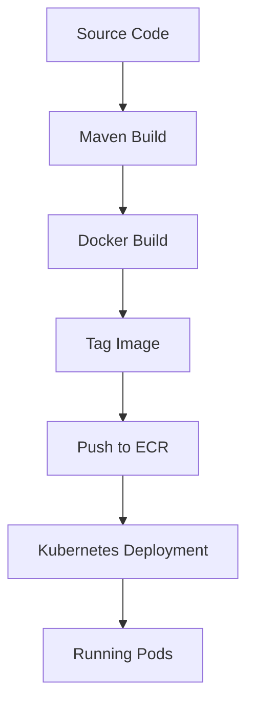

## Introduction to AWS ECR and Its Integration with Kubernetes

In the realm of modern DevOps practices, containerization plays a pivotal role in streamlining the development, deployment, and management of applications. Docker, being one of the most popular containerization platforms, relies heavily on Docker Hub for storing and distributing Docker images. However, for organizations that require more control, security, and integration with their existing infrastructure, Amazon Elastic Container Registry (ECR) emerges as a robust alternative. This chapter delves into the process of replacing Docker Hub with AWS ECR and integrating it with an Amazon EKS (Elastic Kubernetes Service) cluster.

### What is AWS ECR?

AWS ECR is a fully managed Docker container registry service provided by Amazon Web Services (AWS). It allows users to store, manage, and deploy Docker container images. Unlike Docker Hub, which is a public registry, AWS ECR offers a private registry that integrates seamlessly with other AWS services, providing enhanced security and scalability.

#### Why Use AWS ECR?

1. **Security**: AWS ECR supports image scanning using AWS Security Hub, which helps identify vulnerabilities in your images.
2. **Integration**: ECR integrates seamlessly with other AWS services such as EKS, ECS (Elastic Container Service), and CodePipeline.
3. **Scalability**: ECR scales automatically to meet the demands of your applications, ensuring high availability and performance.
4. **Cost-Effective**: With ECR, you pay only for the storage and data transfer associated with your images, making it cost-effective for large-scale deployments.

### Setting Up an ECR Repository

To begin, we need to create an ECR repository where our Docker images will be stored. Let's walk through the steps to create a private repository in AWS ECR.

#### Step-by-Step Guide to Create an ECR Repository

1. **Access AWS Management Console**:
   - Log in to the AWS Management Console using your credentials.
   - Navigate to the ECR service.

2. **Create a New Repository**:
   - Click on the "Repositories" tab.
   - Click on the "Create repository" button.
   - Provide a name for your repository. For example, `JavaMavenApp`.

3. **Configure Repository Settings**:
   - Leave the default settings as they are unless you have specific requirements.
   - Click on the "Create repository" button to finalize the creation.

#### Understanding the Repository Name

The repository name in ECR follows a specific format: `<aws_account_id>.dkr.ecr.<region>.amazonaws.com/<repository_name>`. For instance, if your AWS account ID is `123456789012` and you created a repository named `JavaMavenApp` in the `us-east-1` region, the full repository name would be:

```plaintext
123456789012.dkr.ecr.us-east-1.amazonaws.com/JavaMavenApp
```

This naming convention ensures that the repository is uniquely identifiable within your AWS account.

### Integrating ECR with Kubernetes

Once the ECR repository is set up, the next step is to integrate it with a Kubernetes cluster, specifically an Amazon EKS cluster. This involves creating a secret in Kubernetes that contains the necessary credentials to access the ECR repository.

#### Creating a Secret for ECR

Kubernetes uses secrets to securely store sensitive information such as passwords, tokens, and certificates. To allow Kubernetes to pull images from ECR, we need to create a secret containing the AWS access key and secret key.

##### Step-by-Step Guide to Create a Secret

1. **Generate AWS Access Key and Secret Key**:
   - Go to the IAM (Identity and Access Management) console in AWS.
   - Create a new IAM user with programmatic access.
   - Generate an access key and secret key for this user.

2. **Create the Secret in Kubernetes**:
   - Use the `kubectl` command to create a secret. Here’s an example command:

   ```sh
   kubectl create secret docker-registry ecr-secret \
     --docker-server=https://<aws_account_id>.dkr.ecr.<region>.amazonaws.com \
     --docker-username=AWS \
     --docker-password=<aws_secret_key> \
     --docker-email=<your_email>
   ```

   Replace `<aws_account_id>`, `<region>`, `<aws_secret_key>`, and `<your_email>` with the appropriate values.

#### Example of Creating a Secret

Let’s assume your AWS account ID is `123456789012`, the region is `us-east-1`, and your secret key is `wJalrXUtnFEMI/K7MDENG/bPxRfiCYEXAMPLEKEY`. The command would look like this:

```sh
kubectl create secret docker-registry ecr-secret \
  --docker-server=https://123456789012.dkr.ecr.us-east-1.amazonaws.com \
  --docker-username=AWS \
  --docker-password=wJalrXUtnFEMI/K7MDENG/bPxRfiCYEXAMPLEKEY \
  --docker-email=user@example.com
```

### Configuring Kubernetes to Use the ECR Secret

Now that the secret is created, we need to configure our Kubernetes deployment or pod to use this secret for pulling images from ECR.

#### Example Deployment Configuration

Here’s an example of a Kubernetes deployment configuration that uses the ECR secret:

```yaml
apiVersion: apps/v1
kind: Deployment
metadata:
  name: java-maven-app-deployment
spec:
  replicas: 3
  selector:
    matchLabels:
      app: java-maven-app
  template:
    metadata:
      labels:
        app: java-maven-app
    spec:
      containers:
      - name: java-maven-app-container
        image: 123456789012.dkr.ecr.us-east-1.amazonaws.com/java-maven-app:latest
        ports:
        - containerPort: 8080
      imagePullSecrets:
      - name: ecr-secret
```

### Pushing Images to ECR

Before deploying the application, we need to push the Docker image to the ECR repository. This involves logging in to ECR and then pushing the image.

#### Step-by-Step Guide to Push an Image

1. **Login to ECR**:
   - Use the `aws ecr get-login-password` command to authenticate with ECR.

   ```sh
   $(aws ecr get-login-password --region <region>) | docker login --username AWS --password-stdin <aws_account_id>.dkr.ecr.<region>.amazonaws.com
   ```

2. **Tag the Docker Image**:
   - Tag the local Docker image with the ECR repository URL.

   ```sh
   docker tag my-java-maven-app:latest 123456789012.dkr.ecr.us-east-1.amazonaws.com/java-maven-app:latest
   ```

3. **Push the Image to ECR**:
   - Push the tagged image to the ECR repository.

   ```sh
   docker push 123456789012.dkr.ecr.us-east-1.amazonaws.com/java-maven-app:latest
   ```

### Integrating with Jenkins

Finally, we need to update our Jenkins pipeline to use the ECR repository instead of Docker Hub. This involves modifying the Jenkinsfile to include the necessary steps for building, tagging, and pushing the Docker image to ECR.

#### Example Jenkinsfile

Here’s an example of a Jenkinsfile that builds and pushes a Docker image to ECR:

```groovy
pipeline {
    agent any

    environment {
        AWS_ACCOUNT_ID = '123456789012'
        AWS_REGION = 'us-east-1'
        IMAGE_NAME = 'java-maven-app'
        IMAGE_TAG = 'latest'
    }

    stages {
        stage('Build') {
            steps {
                sh 'mvn clean package'
            }
        }
        stage('Build Docker Image') {
            steps {
                script {
                    docker.build("${env.AWS_ACCOUNT_ID}.dkr.ecr.${env.AWS_REGION}.amazonaws.com/${env.IMAGE_NAME}:${env.IMAGE_TAG}")
                }
            }
        }
        stage('Push to ECR') {
            steps {
                script {
                    sh '''
                        $(aws ecr get-login-password --region ${AWS_REGION}) | docker login --username AWS --password-stdin ${AWS_ACCOUNT_ID}.dkr.ecr.${AWS_REGION}.amazonaws.com
                        docker push ${AWS_ACCOUNT_ID}.dkr.ecr.${AWS_REGION}.amazonaws.com/${IMAGE_NAME}:${IMAGE_TAG}
                    '''
                }
            }
        }
    }
}
```

### Diagramming the Process

To better visualize the process, let’s use a mermaid diagram to illustrate the flow from building the Docker image to deploying it on the EKS cluster.



### Common Pitfalls and How to Avoid Them

1. **Incorrect Region or Account ID**: Ensure that the AWS region and account ID are correctly specified in all commands and configurations.
2. **Insufficient Permissions**: Make sure the IAM user has the necessary permissions to access ECR and perform actions such as pushing images.
3. **Network Issues**: Ensure that the Kubernetes nodes have network access to the ECR repository.

### How to Prevent / Defend

#### Detection

- **Image Scanning**: Use AWS Security Hub to scan images for vulnerabilities.
- **Logging and Monitoring**: Enable CloudTrail and VPC Flow Logs to monitor access to ECR.

#### Prevention

- **IAM Policies**: Restrict access to ECR using fine-grained IAM policies.
- **Encryption**: Enable encryption at rest for ECR repositories.

#### Secure Coding Fixes

Compare the insecure and secure versions of the Jenkinsfile:

**Insecure Version**:
```groovy
pipeline {
    agent any

    stages {
        stage('Build') {
            steps {
                sh 'mvn clean package'
            }
        }
        stage('Build Docker Image') {
            steps {
                script {
                    docker.build("my-java-maven-app:latest")
                }
            }
        }
        stage('Push to Docker Hub') {
            steps {
                script {
                    sh 'docker push my-java-maven-app:latest'
                }
            }
        }
    }
}
```

**Secure Version**:
```groovy
pipeline {
    agent any

    environment {
        AWS_ACCOUNT_ID = '123456789012'
        AWS_REGION = 'us-east-1'
        IMAGE_NAME = 'java-maven-app'
        IMAGE_TAG = 'latest'
    }

    stages {
        stage('Build') {
            steps {
                sh 'mvn clean package'
            }
        }
        stage('Build Docker Image') {
            steps {
                script {
                    docker.build("${env.AWS_ACCOUNT_ID}.dkr.ecr.${env.AWS_REGION}.amazonaws.com/${env.IMAGE_NAME}:${env.IMAGE_TAG}")
                }
            }
        }
        stage('Push to ECR') {
            steps {
                script {
                    sh '''
                        $(aws ecr get-login-password --region ${AWS_REGION}) | docker login --username AWS --password-stdin ${AWS_ACCOUNT_ID}.dkr.ecr.${AWS_REGION}.amazonaws.com
                        docker push ${AWS_ACCOUNT_ID}.dkr.ecr.${AWS_REGION}.amazonaws.com/${IMAGE_NAME}:${IMAGE_TAG}
                    '''
                }
            }
        }
    }
}
```

### Real-World Examples

#### Recent Breaches and CVEs

- **CVE-2021-21277**: This vulnerability in Docker allowed unauthorized access to the Docker daemon, leading to potential compromise of container images. Using ECR and proper IAM policies can mitigate such risks.
- **Breaches Involving Public Registries**: Several high-profile breaches have occurred due to the use of public registries like Docker Hub. By moving to a private registry like ECR, organizations can reduce the risk of exposure.

### Hands-On Labs

For practical experience, consider the following labs:

- **PortSwigger Web Security Academy**: Focuses on web application security but can provide foundational knowledge on container security.
- **OWASP Juice Shop**: While primarily a web application, it can be used to understand container security principles.
- **CloudGoat**: Provides scenarios for learning about AWS security, including ECR and EKS.

By following these detailed steps and understanding the underlying concepts, you can effectively replace Docker Hub with AWS ECR and integrate it seamlessly with your Kubernetes cluster.

---
<!-- nav -->
[[02-Introduction to AWS ECR and Its Benefits Over Docker Hub|Introduction to AWS ECR and Its Benefits Over Docker Hub]] | [[DevOps/DevOps Bootcamp/05-Containerization (Docker)/18-Replacing Docker Hub with AWS ECR/00-Overview|Overview]] | [[04-Introduction to AWS Elastic Container Registry (ECR)|Introduction to AWS Elastic Container Registry (ECR)]]
