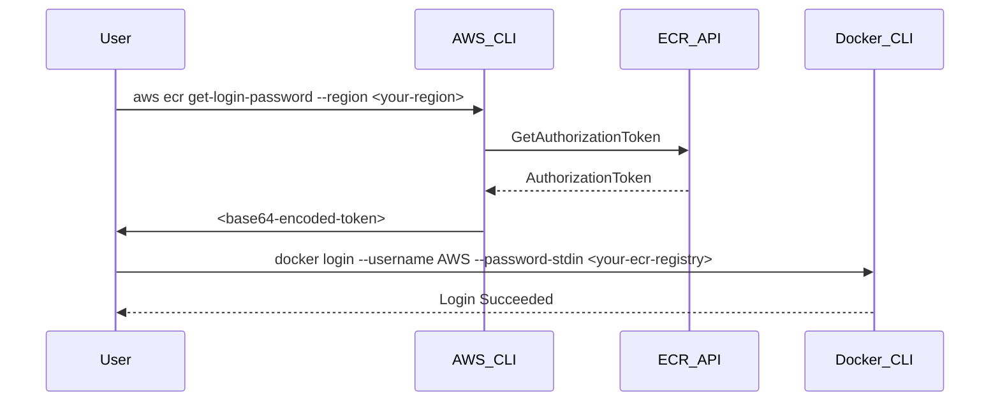

## Introduction to AWS Elastic Container Registry (ECR)

AWS Elastic Container Registry (ECR) is a managed Docker container registry that makes it easy for developers to store, manage, and deploy Docker container images. ECR is integrated with Amazon Elastic Container Service (ECS) and supports private Docker repositories with data encryption, authentication, and authorization. This chapter will delve into the process of replacing Docker Hub with AWS ECR, focusing on creating credentials for the ECR repository in Jenkins.

### Background Theory

Before diving into the practical steps, it's essential to understand the theoretical underpinnings of container registries and their integration with CI/CD pipelines.

#### What is a Container Registry?

A container registry is a storage service that hosts container images. These images can be pulled and run on any system that supports Docker. Container registries are crucial for managing and distributing containerized applications across development, testing, and production environments.

#### Why Use AWS ECR Over Docker Hub?

While Docker Hub is a popular choice for hosting container images, AWS ECR offers several advantages:

1. **Integration with AWS Services**: ECR integrates seamlessly with other AWS services such as ECS, EKS, and Lambda, making it easier to manage and deploy containerized applications within the AWS ecosystem.
2. **Security Features**: ECR provides enhanced security features such as data encryption, authentication, and authorization, which are critical for enterprise-level deployments.
3. **Performance**: ECR is designed to deliver high performance and reliability, ensuring that your container images are available when needed.

### Setting Up AWS ECR

To replace Docker Hub with AWS ECR, you need to set up an ECR repository and configure Jenkins to use it. This section will cover the steps involved in creating an ECR repository and generating credentials for Jenkins.

#### Creating an ECR Repository

1. **Log in to the AWS Management Console**:
   - Navigate to the ECR service.
   - Click on "Repositories" and then "Create repository".
   - Provide a name for your repository (e.g., `JavaMavenApp`).

2. **Configure Repository Settings**:
   - Set the repository type (Docker image).
   - Configure encryption settings (optional but recommended).
   - Set up lifecycle policies to manage image retention (optional).

#### Generating Credentials for Jenkins

Once the ECR repository is created, you need to generate credentials that Jenkins can use to authenticate with the repository. This involves using the AWS CLI to retrieve a login password for the ECR repository.

##### Using AWS CLI to Retrieve Login Password

The AWS CLI provides a command to retrieve a temporary login password for the ECR repository. This password is valid for 12 hours and can be used to log in to the ECR repository using the Docker CLI.

```bash
aws ecr get-login-password --region <your-region>
```

Replace `<your-region>` with the appropriate AWS region (e.g., `us-west-2`). This command returns a temporary password that can be used to log in to the ECR repository.

### Configuring Jenkins to Use ECR

Now that you have the necessary credentials, you need to configure Jenkins to use the ECR repository. This involves creating a username and password credential in Jenkins and configuring the Jenkins pipeline to use these credentials.

#### Creating a Username and Password Credential in Jenkins

1. **Navigate to Jenkins Credentials Management**:
   - Go to `Manage Jenkins` > `Manage Credentials`.
   - Select the appropriate domain (e.g., `Global`).

2. **Add New Credentials**:
   - Click on `Add Credentials`.
   - Choose `Username with password` as the credential type.
   - Enter the username as `AWS` and the password as the output of the `aws ecr get-login-password` command.

#### Configuring the Jenkins Pipeline

To use the ECR repository in your Jenkins pipeline, you need to modify the pipeline script to include the necessary steps for logging in to the ECR repository and pushing/pulling images.

```groovy
pipeline {
    agent any
    environment {
        AWS_REGION = 'us-west-2'
        ECR_REGISTRY = '<your-ecr-registry>'
        DOCKER_IMAGE_NAME = 'JavaMavenApp'
    }
    stages {
        stage('Login to ECR') {
            steps {
                script {
                    sh """
                        aws ecr get-login-password --region ${AWS_REGION} | docker login --username AWS --password-stdin ${ECR_REGISTRY}
                    """
                }
            }
        }
        stage('Build and Push Docker Image') {
            steps {
                script {
                    sh """
                        docker build -t ${DOCKER_IMAGE_NAME}:latest .
                        docker tag ${DOCKER_IMAGE_NAME}:latest ${ECR_REGISTRY}/${DOCKER_IMAGE_NAME}:latest
                        docker push ${ECR_REGISTRY}/${DOCKER_IMAGE_NAME}:latest
                    """
                }
            }
        }
    }
}
```

### Full Example of HTTP Request and Response

When you execute the `aws ecr get-login-password` command, it sends a request to the AWS API to retrieve the login password. Here is a detailed breakdown of the HTTP request and response:

#### HTTP Request

```http
POST / HTTP/1.1
Host: ecr.<your-region>.amazonaws.com
Content-Type: application/x-amz-json-1.1
Authorization: AWS4-HMAC-SHA256 Credential=<access-key-id>/<date>/<region>/sts/aws4_request, SignedHeaders=content-type;host;x-amz-date, Signature=<signature>
X-Amz-Date: <current-date>
Content-Length: <content-length>

{
    "Action": "GetAuthorizationToken",
    "Version": "2015-09-21"
}
```

#### HTTP Response

```http
HTTP/1.1 200 OK
Content-Type: application/json
Content-Length: <content-length>
Date: <current-date>

{
    "authorizationData": [
        {
            "authorizationToken": "<base64-encoded-token>",
            "expiresAt": "<expiration-time>",
            "proxyEndpoint": "https://<your-ecr-registry>.dkr.ecr.<your-region>.amazonaws.com"
        }
    ]
}
```

### Mermaid Diagrams

#### Sequence Diagram for ECR Login Process



### Common Pitfalls and How to Avoid Them

#### Incorrect Region Configuration

One common pitfall is using the wrong region when executing the `aws ecr get-login-password` command. Ensure that the region specified matches the region where your ECR repository is located.

#### Expiration of Login Token

The login token retrieved using the `aws ecr get-login-password` command is valid for only 12 hours. If you attempt to use the token after it expires, you will receive an error. Always ensure that you retrieve a fresh token before attempting to log in to the ECR repository.

### How to Prevent / Defend

#### Securely Storing Credentials

To prevent unauthorized access to your ECR repository, ensure that you securely store the credentials used to authenticate with the repository. Use Jenkins credentials management to store the username and password securely.

#### Monitoring and Logging

Enable monitoring and logging for your ECR repository to detect any unauthorized access attempts. Use AWS CloudTrail to log API calls made to the ECR service and monitor for suspicious activity.

#### Secure Coding Practices

Follow secure coding practices when building and deploying containerized applications. Use tools like Trivy to scan your Docker images for vulnerabilities and ensure that your images are free from known security issues.

### Real-World Examples

#### Recent Breaches Involving Container Registries

In 2021, a major breach involving Docker Hub was reported, where unauthorized users gained access to private repositories and pushed malicious images. This highlights the importance of using a secure container registry like AWS ECR and following best practices for securing your container images.

### Practice Labs

For hands-on practice with integrating Jenkins with AWS ECR, consider the following labs:

- **PortSwigger Web Security Academy**: Offers a series of labs focused on web application security, including container security.
- **OWASP Juice Shop**: A deliberately insecure web application for security training purposes, which can be deployed using Docker and ECR.
- **CloudGoat**: A set of labs focused on AWS security, including ECR and other container-related services.

By following these steps and best practices, you can effectively replace Docker Hub with AWS ECR and ensure that your containerized applications are securely managed and deployed.

---
<!-- nav -->
[[03-Introduction to AWS ECR and Its Integration with Kubernetes|Introduction to AWS ECR and Its Integration with Kubernetes]] | [[DevOps/DevOps Bootcamp/05-Containerization (Docker)/18-Replacing Docker Hub with AWS ECR/00-Overview|Overview]] | [[05-Introduction to Docker Hub and AWS ECR|Introduction to Docker Hub and AWS ECR]]
