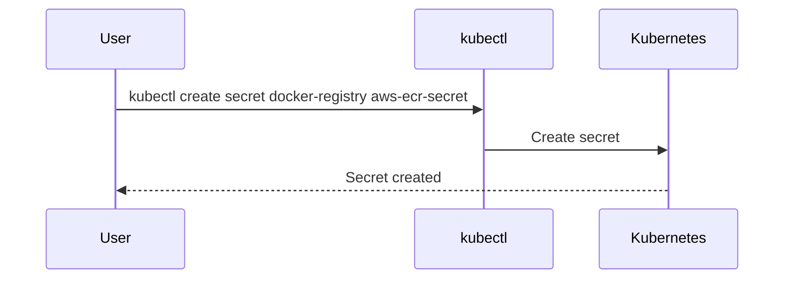
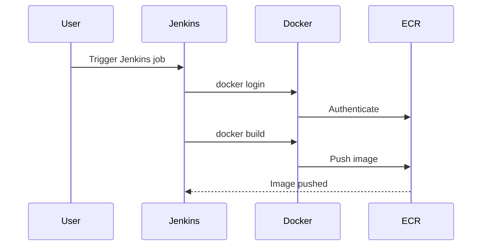

## Introduction to Docker Hub and AWS ECR

In the world of containerization, Docker Hub and Amazon Elastic Container Registry (ECR) are two widely-used services for storing and managing Docker images. Docker Hub is a public registry where developers can store and share their Docker images. On the other hand, AWS ECR is a managed service provided by Amazon Web Services (AWS) that allows users to store, manage, and deploy Docker container images.

### Why Replace Docker Hub with AWS ECR?

There are several reasons why one might want to replace Docker Hub with AWS ECR:

1. **Security**: AWS ECR provides enhanced security features such as encryption at rest and in transit, IAM role-based access control, and integration with AWS CloudTrail for auditing.
2. **Performance**: ECR is integrated with AWS infrastructure, providing faster and more reliable image pulls and pushes compared to Docker Hub.
3. **Cost Management**: While Docker Hub offers free plans, AWS ECR integrates seamlessly with AWS billing, allowing for better cost management and budgeting.
4. **Integration**: ECR integrates well with other AWS services like ECS (Elastic Container Service) and EKS (Elastic Kubernetes Service), making it easier to manage containerized applications within the AWS ecosystem.

### Background Theory

#### Docker Hub

Docker Hub is a cloud-based registry service provided by Docker Inc. It allows users to store and distribute Docker images. Docker Hub supports both public and private repositories. Public repositories are accessible to anyone, while private repositories require authentication.

#### AWS ECR

Amazon Elastic Container Registry (ECR) is a fully-managed Docker container registry service provided by AWS. ECR enables users to store, manage, and deploy Docker container images. Unlike Docker Hub, ECR is tightly integrated with other AWS services, providing additional security and performance benefits.

### Setting Up Docker Credentials

Before we proceed with replacing Docker Hub with AWS ECR, we need to set up Docker credentials. This involves creating a secret in Kubernetes to store the Docker credentials securely.

#### Creating a Secret in Kubernetes

To create a secret in Kubernetes, we use the `kubectl` command-line tool. The secret will store the Docker username and password.

```bash
kubectl create secret docker-registry aws-ecr-secret \
    --docker-server=aws_account_id.dkr.ecr.region.amazonaws.com \
    --docker-username=AWS \
    --docker-password=$(aws ecr get-login-password --region region) \
    --docker-email=your_email@example.com
```

Here’s a breakdown of the command:

- `--docker-server`: The URL of the Docker registry. For ECR, it is in the format `aws_account_id.dkr.ecr.region.amazonaws.com`.
- `--docker-username`: The username to authenticate with the Docker registry. For ECR, it is always `AWS`.
- `--docker-password`: The password to authenticate with the Docker registry. For ECR, you can use the `aws ecr get-login-password` command to retrieve the password.
- `--docker-email`: An email address associated with the Docker account.

### Configuring Deployment YAML

Once the secret is created, we need to reference it in the deployment configuration file (`deployment.yaml`). This ensures that the Kubernetes cluster can pull the Docker image from the ECR repository.

```yaml
apiVersion: apps/v1
kind: Deployment
metadata:
  name: my-deployment
spec:
  replicas: 3
  selector:
    matchLabels:
      app: my-app
  template:
    metadata:
      labels:
        app: my-app
    spec:
      containers:
      - name: my-container
        image: aws_account_id.dkr.ecr.region.amazonaws.com/my-repo:latest
        imagePullPolicy: Always
      imagePullSecrets:
      - name: aws-ecr-secret
```

Here’s a breakdown of the configuration:

- `image`: The URL of the Docker image in the ECR repository.
- `imagePullPolicy`: Specifies when the image should be pulled. `Always` ensures that the latest image is pulled every time the pod is started.
- `imagePullSecrets`: References the secret created earlier to authenticate with the ECR repository.

### Modifying Jenkinsfile

Next, we need to modify the Jenkinsfile to ensure that the Docker image is pushed to the ECR repository instead of Docker Hub.

```groovy
pipeline {
    agent any
    stages {
        stage('Build') {
            steps {
                script {
                    def ecrCredentials = credentials('ecr-credentials-id')
                    def ecrUsername = ecrCredentials.username
                    def ecrPassword = ecrCredentials.password
                    
                    sh """
                        docker login -u ${ecrUsername} -p ${ecrPassword} ${AWS_ACCOUNT_ID}.dkr.ecr.${REGION}.amazonaws.com
                        docker build -t ${AWS_ACCOUNT_ID}.dkr.ecr.${REGION}.amazonaws.com/my-repo:latest .
                        docker push ${AWS_ACCOUNT_ID}.dkr.ecr.${REGION}.amazonaws.com/my-repo:latest
                    """
                }
            }
        }
    }
}
```

Here’s a breakdown of the Jenkinsfile:

- `credentials('ecr-credentials-id')`: Retrieves the ECR credentials from Jenkins.
- `docker login`: Authenticates with the ECR repository using the retrieved credentials.
- `docker build`: Builds the Docker image with the specified tag.
- `docker push`: Pushes the built image to the ECR repository.

### Extracting Repository URL

The repository URL is a crucial piece of information that needs to be extracted and stored in a variable. This ensures that the URL is consistent across different parts of the pipeline.

```groovy
pipeline {
    agent any
    environment {
        ECR_REPOSITORY_URL = "${AWS_ACCOUNT_ID}.dkr.ecr.${REGION}.amazonaws.com/my-repo"
    }
    stages {
        stage('Build') {
            steps {
                script {
                    def ecrCredentials = credentials('ecr-credentials-id')
                    def ecrUsername = ecrCredentials.username
                    def ecrPassword = ecrCredentials.password
                    
                    sh """
                        docker login -u ${ecrUsername} -p ${ecrPassword} ${ECR_REPOSITORY_URL}
                        docker build -t ${ECR_REPOSITORY_URL}:latest .
                        docker push ${ECR_REPOSITORY_URL}:latest
                    """
                }
            }
        }
    }
}
```

Here’s a breakdown of the environment variable:

- `ECR_REPOSITORY_URL`: Stores the repository URL as an environment variable.

### Real-World Examples and Pitfalls

#### Real-World Example: CVE-2021-21277

CVE-2021-21277 is a critical vulnerability in Docker Hub that allowed unauthorized access to private repositories. This vulnerability highlights the importance of using a secure registry like AWS ECR.

#### Pitfall: Hard-Coded Credentials

One common pitfall is hard-coding credentials directly in the Jenkinsfile or deployment configuration. This can lead to security vulnerabilities if the files are committed to version control systems.

### How to Prevent / Defend

#### Detection

To detect unauthorized access to Docker images, you can use tools like AWS CloudTrail and AWS Config. These tools provide detailed logs and configurations that can help identify suspicious activities.

#### Prevention

1. **Use IAM Roles**: Ensure that IAM roles are used to grant permissions to access the ECR repository. This provides fine-grained control over who can access the repository.
2. **Enable Encryption**: Enable encryption at rest and in transit for the ECR repository to protect sensitive data.
3. **Secure Jenkins Credentials**: Store Jenkins credentials securely using the Jenkins Credential Manager. Avoid hard-coding credentials in the Jenkinsfile.

#### Secure Code Fix

Here’s an example of a vulnerable Jenkinsfile and its secure counterpart:

**Vulnerable Jenkinsfile**

```groovy
pipeline {
    agent any
    stages {
        stage('Build') {
            steps {
                sh """
                    docker login -u my_username -p my_password my_repository_url
                    docker build -t my_repository_url:latest .
                    docker push my_repository_url:latest
                """
            }
        }
    }
}
```

**Secure Jenkinsfile**

```groovy
pipeline {
    agent any
    environment {
        ECR_REPOSITORY_URL = "${AWS_ACCOUNT_ID}.dkr.ecr.${REGION}.amazonaws.com/my-repo"
    }
    stages {
        stage('Build') {
            steps {
                script {
                    def ecrCredentials = credentials('ecr-credentials-id')
                    def ecrUsername = e
                    crCredentials.username
                    def ecrPassword = ecrCredentials.password
                    
                    sh """
                        docker login -u ${ecrUsername} -p ${ecrPassword} ${ECR_REPOSITORY_URL}
                        docker build -t ${ECR_REPOSITORY_URL}:latest .
                        docker push ${ECR_REPOSITORY_URL}:latest
                    """
                }
            }
        }
    }
}
```

### Conclusion

Replacing Docker Hub with AWS ECR provides numerous benefits, including enhanced security, performance, and seamless integration with other AWS services. By following the steps outlined in this chapter, you can successfully transition your containerized applications from Docker Hub to AWS ECR.

### Practice Labs

For hands-on practice, consider the following labs:

- **PortSwigger Web Security Academy**: Focuses on web application security but can be adapted to understand container security.
- **OWASP Juice Shop**: A deliberately insecure web application for learning about web security.
- **DVWA (Damn Vulnerable Web Application)**: Another web application for practicing web security.

These labs provide a solid foundation for understanding and implementing container security practices.

### Diagrams

#### Kubernetes Secret Creation



#### Jenkins Pipeline Flow



By following these detailed steps and understanding the underlying concepts, you can effectively transition from Docker Hub to AWS ECR, ensuring a secure and efficient container management process.

---
<!-- nav -->
[[04-Introduction to AWS Elastic Container Registry (ECR)|Introduction to AWS Elastic Container Registry (ECR)]] | [[DevOps/DevOps Bootcamp/05-Containerization (Docker)/18-Replacing Docker Hub with AWS ECR/00-Overview|Overview]] | [[06-Introduction to Docker Registries and AWS ECR|Introduction to Docker Registries and AWS ECR]]
