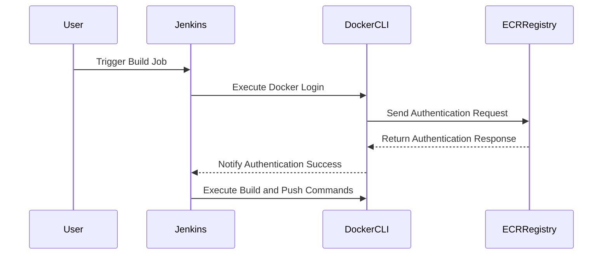

## Introduction to Docker Registries and AWS ECR

### Background Theory

Docker registries are central repositories for storing and distributing Docker images. They allow developers to store, manage, and distribute their container images efficiently. Docker Hub is the default public registry provided by Docker, but organizations often prefer private registries like Amazon Elastic Container Registry (ECR) for enhanced security and control.

Amazon Elastic Container Registry (ECR) is a fully managed Docker registry service provided by AWS. It allows users to store, manage, and deploy Docker images. ECR integrates seamlessly with other AWS services, making it a popular choice for organizations using AWS infrastructure.

### Key Concepts

#### Docker Registries

A Docker registry is a storage and distribution system for Docker images. It can be either public (like Docker Hub) or private (like AWS ECR). Registries are essential for managing and deploying Docker images across different environments.

#### Docker Hub

Docker Hub is the default public registry provided by Docker. It is used to store and share Docker images. Docker Hub is widely used, but it may not meet the security and compliance requirements of some organizations.

#### AWS ECR

AWS ECR is a fully managed Docker registry service provided by AWS. It offers features such as image scanning, encryption, and integration with other AWS services. ECR is ideal for organizations that require enhanced security and control over their Docker images.

### Transition from Docker Hub to AWS ECR

Transitioning from Docker Hub to AWS ECR involves several steps, including setting up the ECR registry, configuring authentication, and updating deployment pipelines.

### Setting Up AWS ECR

To set up AWS ECR, follow these steps:

1. **Create an ECR Repository**:
    - Log in to the AWS Management Console.
    - Navigate to the ECR service.
    - Create a new repository.

2. **Get Login Credentials**:
    - To authenticate with ECR, you need to get the login credentials.
    - Run the following command to get the login credentials:
      ```sh
      aws ecr get-login-password --region <your-region>
      ```
    - This command returns the password needed to log in to the ECR registry.

3. **Login to ECR**:
    - Use the `docker login` command to authenticate with ECR:
      ```sh
      docker login -u AWS -p $(aws ecr get-login-password --region <your-region>) https://<your-account-id>.dkr.ecr.<your-region>.amazonaws.com
      ```

### Understanding the Commands

The commands mentioned in the lecture involve authenticating with the ECR registry and logging in to the Docker client.

#### Command Breakdown

1. **Get Password**:
    - The first command retrieves the password for the ECR registry:
      ```sh
      aws ecr get-login-password --region <your-region>
      ```
    - This command returns the password needed to log in to the ECR registry.

2. **Docker Login**:
    - The second command logs in to the Docker client using the retrieved password:
      ```sh
      docker login -u AWS -p $(aws ecr get-login-password --region <your-region>) https://<your-account-id>.dkr.ecr.<your-region>.amazonaws.com
      ```
    - Here, `-u AWS` specifies the username, and `-p` specifies the password.
    - The password is taken from standard input, which is the output of the `aws e[cr get-login-password` command.

3. **Third Parameter**:
    - The third parameter is the Docker registry URL. For ECR, this is the URL of the ECR registry without the application name.
    - Example:
      ```sh
      https://<your-account-id>.dkr.ecr.<your-region>.amazonaws.com
      ```

### Jenkins Integration

In Jenkins, you need to configure the Docker login step to include the ECR registry URL.

#### Jenkinsfile Example

Here is an example of how to configure the Docker login step in a Jenkinsfile:

```groovy
pipeline {
    agent any
    stages {
        stage('Build and Push Docker Image') {
            steps {
                script {
                    def ecrPassword = sh(script: 'aws ecr get-login-password --region <your-region>', returnStdout: true).trim()
                    sh """
                        docker login -u AWS -p ${ecrPassword} https://<your-account-id>.dkr.ecr.<your-region>.amazonaws.com
                        docker build -t <your-image-name> .
                        docker tag <your-image-name>:latest <your-account-id>.dkr.ecr.<your-region>.amazonaws.com/<your-image-name>:latest
                        docker push <your-account-id>.dkr.ecr.<your-region>.amazonaws.com/<your-image-name>:latest
                    """
                }
            }
        }
    }
}
```

### Full HTTP Request and Response

When you run the `docker login` command, it sends an HTTP request to the Docker registry to authenticate. Here is an example of the HTTP request and response:

#### HTTP Request

```http
POST /v2/ HTTP/1.1
Host: <your-account-id>.dkr.ecr.<your-region>.amazonaws.com
Authorization: Basic QVdTOnBhc3N3b3Jk
Content-Type: application/json
User-Agent: docker/20.10.7 go/go1.13.15 git-commit/b0fc4d6 kernel/5.4.0-105-generic os/linux arch/amd64 UpstreamClient(Docker-Client/20.10.7 \\x5c(linux))
Accept-Encoding: gzip
```

#### HTTP Response

```http
HTTP/1.1 200 OK
Date: Tue, 01 Aug 2023 12:00:00 GMT
Server: Amazon ECS (unknown-version)
Content-Length: 0
Connection: keep-alive
```

### Mermaid Diagrams

#### Sequence Diagram for Docker Login



### Pitfalls and Common Mistakes

1. **Incorrect Region**: Ensure that the region specified in the `aws ecr get-login-password` command matches the region of your ECR registry.
2. **Missing Permissions**: Ensure that the IAM role or user has the necessary permissions to access the ECR registry.
3. **Incorrect URL**: Ensure that the Docker registry URL is correct and does not include the application name.

### How to Prevent / Defend

#### Detection

1. **Logging and Monitoring**: Enable logging and monitoring for Docker login attempts and ECR operations.
2. **Audit Logs**: Use AWS CloudTrail to audit ECR operations and detect unauthorized access.

#### Prevention

1. **IAM Policies**: Restrict access to the ECR registry using IAM policies.
2. **Secure Credentials**: Store and manage Docker login credentials securely using AWS Secrets Manager or similar tools.

#### Secure Coding Fixes

##### Vulnerable Code

```groovy
pipeline {
    agent any
    stages {
        stage('Build and Push Docker Image') {
            steps {
                script {
                    def ecrPassword = sh(script: 'aws ecr get-login-password --region <your-region>', returnStdout: true).trim()
                    sh """
                        docker login -u AWS -p ${ecrPassword} https://<your-account-id>.dkr.ecr.<your-region>.amazonaws.com
                        docker build -t <your-image-name> .
                        docker tag <your-image-name>:latest <your-account-id>.dkr.ecr.<your-region>.amazonaws.com/<your-image-name>:latest
                        docker push <your-account-id>.dkr.ecr.<your-region>.amazonaws.com/<your-image-name>:latest
                    """
                }
            }
        }
    }
}
```

##### Secure Code

```groovy
pipeline {
    agent any
    stages {
        stage('Build and Push Docker Image') {
            steps {
                script {
                    withCredentials([usernamePassword(credentialsId: 'ecr-credentials', usernameVariable: 'AWS_ACCESS_KEY_ID', passwordVariable: 'AWS_SECRET_ACCESS_KEY')]) {
                        def ecrPassword = sh(script: 'aws ecr get-login-password --region <your-region>', returnStdout: true).trim()
                        sh """
                            docker login -u AWS -p ${ecrPassword} https://<your-account-id>.dkr.ecr.<your-region>.amazonaws.com
                            docker build -t <your-image-name> .
                            docker tag <your-image-name>:latest <your-account-id>.dkr.ecr.<your-region>.amazonaws.com/<your-image-name>:latest
                            docker push <your-account-id>.dkr.ecr.<your-region>.amazonaws.com/<your-image-name>:latest
                        """
                    }
                }
            }
        }
    }
}
```

### Real-World Examples

#### Recent Breaches

- **CVE-2021-21287**: A vulnerability in Docker Hub allowed unauthorized access to private repositories. This highlights the importance of using private registries like ECR for sensitive applications.
- **AWS ECR Scanning**: AWS ECR provides built-in image scanning capabilities to detect vulnerabilities in Docker images. This helps organizations maintain secure and compliant Docker images.

### Hands-On Labs

For hands-on practice, consider the following labs:

- **PortSwigger Web Security Academy**: Offers a comprehensive course on web application security, including Docker and container security.
- **OWASP Juice Shop**: A deliberately insecure web application for practicing web security skills.
- **DVWA (Damn Vulnerable Web Application)**: Another popular web application for learning web security.
- **WebGoat**: An interactive web application security training tool.

These labs provide practical experience in securing Docker images and managing Docker registries.

### Conclusion

Transitioning from Docker Hub to AWS ECR involves setting up the ECR registry, configuring authentication, and updating deployment pipelines. By following the steps outlined in this chapter, you can ensure a smooth transition and enhance the security of your Docker images.

---
<!-- nav -->
[[05-Introduction to Docker Hub and AWS ECR|Introduction to Docker Hub and AWS ECR]] | [[DevOps/DevOps Bootcamp/05-Containerization (Docker)/18-Replacing Docker Hub with AWS ECR/00-Overview|Overview]] | [[07-Introduction to Environment Variables and Configuration Management in CICD Pipelines|Introduction to Environment Variables and Configuration Management in CICD Pipelines]]
