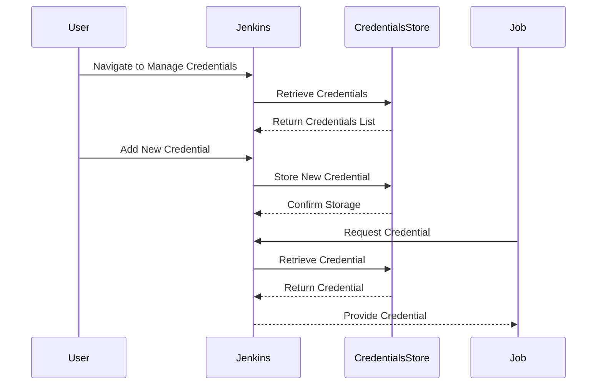

## Introduction to Jenkins Credentials Management Plugin

### Background Theory

Jenkins is a widely-used open-source automation server that provides continuous integration and continuous delivery (CI/CD) services. One of the key challenges in managing Jenkins environments is securely handling sensitive information such as passwords, API keys, and SSH keys. The Jenkins Credentials Management Plugin addresses this challenge by providing a centralized and secure way to store and manage these credentials.

### What is the Credentials Management Plugin?

The Credentials Management Plugin is an essential component of Jenkins that allows users to store and manage sensitive data securely. This plugin was added relatively recently to Jenkins, enhancing its capabilities for handling credentials in a more organized and secure manner. Prior to this plugin, credentials were often scattered across various plugins and configurations, leading to potential security risks and management difficulties.

### Why Use the Credentials Management Plugin?

1. **Centralized Management**: All credentials are stored in a central location, making it easier to manage and audit.
2. **Security**: Credentials are encrypted and stored securely, reducing the risk of exposure.
3. **Ease of Use**: Credentials can be easily referenced in Jenkins jobs and pipelines, simplifying their usage.
4. **Flexibility**: Supports various types of credentials, including usernames/passwords, SSH keys, and API tokens.

### How Does the Credentials Management Plugin Work?

The plugin operates by creating a centralized store for credentials. This store is divided into domains, which can be either global or specific to a particular project or job. Each credential is associated with a specific domain, ensuring that it is only accessible within the appropriate context.

#### Credential Store and Domains

- **Credential Store**: A repository where all credentials are stored.
- **Global Domain**: A default domain that applies to the entire Jenkins instance.
- **Project-Specific Domains**: Domains that are specific to individual projects or jobs.

### Creating and Managing Credentials

To create and manage credentials using the Credentials Management Plugin, follow these steps:

1. **Navigate to Credentials Management**:
    - Go to `Manage Jenkins` > `Manage Credentials`.
    - Here, you will see the global domain and any project-specific domains.

2. **Create New Credentials**:
    - Click on `Global` or the specific project domain.
    - Click on `Add Credentials`.
    - Select the type of credential (e.g., Username with password, SSH Username with private key).

3. **Fill in the Details**:
    - Enter the required details for the credential type.
    - Save the credential.

### Types of Credentials

The Credentials Management Plugin supports several types of credentials:

- **Username with Password**: Commonly used for basic authentication.
- **SSH Username with Private Key**: Used for SSH connections.
- **API Token**: Used for API-based authentication.
- **Certificate**: Used for SSL/TLS certificates.

### Scopes of Credentials

Credentials can have different scopes, which determine where they can be used:

- **System Scope**: Available only to the Jenkins server itself.
- **Global Scope**: Available to all jobs and pipelines within the Jenkins instance.
- **Job Scope**: Available only to specific jobs or pipelines.

### System Credentials

System credentials are specifically designed for Jenkins administrators who need to configure Jenkins to communicate with other services. These credentials are only available to the Jenkins server and cannot be accessed by individual jobs or pipelines.

### Example: Creating a System Credential

Let's walk through an example of creating a system credential for Jenkins administration.

1. **Navigate to Credentials Management**:
    - Go to `Manage Jenkins` > `Manage Credentials`.
    - Click on `Global`.

2. **Add a New Credential**:
    - Click on `Add Credentials`.
    - Select `Username with password` as the credential type.

3. **Enter the Details**:
    - **Username**: Enter the username.
    - **Password**: Enter the password.
    - **ID**: Enter a unique ID for the credential.
    - **Description**: Provide a description for the credential.

4. **Save the Credential**:
    - Click `OK` to save the credential.

### Raw HTTP Request and Response

When interacting with Jenkins via HTTP, you might need to authenticate using credentials. Here is an example of an HTTP request and response for authenticating with Jenkins using a username and password:

```http
POST /j_acegi_security_check HTTP/1.1
Host: jenkins.example.com
Content-Type: application/x-www-form-urlencoded

j_username=admin&j_password=secret
```

```http
HTTP/1.1 200 OK
Date: Mon, 20 Mar 2023 12:00:00 GMT
Server: Jenkins
Set-Cookie: JSESSIONID=abc123; Path=/; HttpOnly
Content-Length: 0
```

### Mermaid Diagram: Credential Management Flow

Here is a mermaid diagram illustrating the flow of credential management in Jenkins:



### Pitfalls and Common Mistakes

1. **Incorrect Scope**: Using a system credential in a job or pipeline can lead to unauthorized access.
2. **Exposure**: Storing credentials in plain text or insecure locations can lead to exposure.
3. **Insufficient Permissions**: Not granting sufficient permissions to the Jenkins server can result in failed operations.

### Real-World Examples

Recent breaches and vulnerabilities related to Jenkins credentials management include:

- **CVE-2021-21154**: A vulnerability in Jenkins that allowed unauthorized access to credentials.
- **CVE-2021-21155**: Another vulnerability that could allow attackers to bypass authentication mechanisms.

### How to Prevent / Defend

#### Detection

- **Audit Logs**: Regularly review audit logs to detect unauthorized access attempts.
- **Monitoring Tools**: Use monitoring tools like Splunk or ELK Stack to monitor Jenkins activities.

#### Prevention

- **Secure Storage**: Ensure that credentials are stored securely using encryption.
- **Access Control**: Implement strict access control policies to limit who can access credentials.
- **Regular Audits**: Conduct regular audits to ensure compliance with security policies.

#### Secure Coding Fixes

Here is an example of a vulnerable Jenkinsfile and its secure counterpart:

**Vulnerable Jenkinsfile**

```groovy
pipeline {
    agent any
    stages {
        stage('Build') {
            steps {
                script {
                    def credentials = credentials('my-credentials')
                    sh "echo ${credentials.username}:${credentials.password}"
                }
            }
        }
    }
}
```

**Secure Jenkinsfile**

```groovy
pipeline {
    agent any
    stages {
        stage('Build') {
            steps {
                script {
                    withCredentials([usernamePassword(credentialsId: 'my-credentials', usernameVariable: 'USERNAME', passwordVariable: 'PASSWORD')]) {
                        sh "echo \$USERNAME:\$PASSWORD"
                    }
                }
            }
        }
    }
}
```

### Configuration Hardening

- **Disable Unnecessary Plugins**: Remove any plugins that are not necessary to reduce the attack surface.
- **Enable Security Features**: Enable features like CSRF protection and Jenkins security realm.
- **Use Strong Authentication Methods**: Use strong authentication methods like LDAP or OAuth.

### Conclusion

The Jenkins Credentials Management Plugin is a powerful tool for securely managing credentials in Jenkins environments. By understanding how to create, manage, and secure credentials, you can significantly enhance the security of your Jenkins setup. Always ensure that you follow best practices for secure coding and configuration hardening to protect against potential threats.

### Practice Labs

For hands-on practice with Jenkins Credentials Management, consider the following labs:

- **PortSwigger Web Security Academy**: Offers exercises on securing Jenkins environments.
- **OWASP Juice Shop**: Provides a vulnerable Jenkins environment for penetration testing.
- **DVWA**: Contains scenarios for practicing Jenkins security.
- **WebGoat**: Includes modules on securing Jenkins credentials.

These labs will help you gain practical experience in managing credentials securely in Jenkins.

---
<!-- nav -->
[[DevOps/DevOps Bootcamp/06-CI CD & Build Tools/03-Jenkins Credentials Management Plugin Overview/00-Overview|Overview]] | [[02-Introduction to Jenkins Credentials Management|Introduction to Jenkins Credentials Management]]
