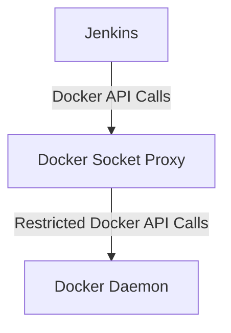
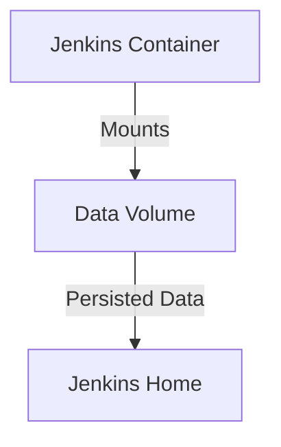

## Introduction to Docker Volumes and Jenkins Integration

In the context of DevOps, integrating Docker with Jenkins is a common practice to streamline the continuous integration and continuous deployment (CI/CD) process. One key aspect of this integration is the ability to execute Docker commands within the Jenkins environment. This requires making Docker available inside the Jenkins container, which can be achieved by mounting Docker directories from the host machine into the Jenkins container as volumes.

### Why Attach Docker Volumes to Jenkins?

When building applications, especially in a CI/CD pipeline, it is often necessary to create Docker images of the application. To accomplish this, Jenkins needs access to Docker commands. By attaching Docker volumes to the Jenkins container, you ensure that Docker is available within the container, allowing Jenkins to perform tasks such as building, pushing, and managing Docker images.

### Background Theory: Docker Volumes

Docker volumes are a way to persist data outside of the lifecycle of a container. While a container itself is ephemeral and can be destroyed and recreated, the data stored in a volume persists even after the container is removed. This makes volumes ideal for storing important data like Jenkins configurations, job definitions, and credentials.

#### How Docker Volumes Work

Docker volumes are managed by the Docker daemon and are stored in a specific location on the host machine. When a volume is mounted into a container, the container can read from and write to the volume as if it were a local directory. This allows for data persistence across container lifecycles.

### Mounting Docker Directories into Jenkins

To make Docker available inside the Jenkins container, you need to mount the Docker runtime directory from the host machine into the container. This involves stopping the current Jenkins container, creating a new container with the required volumes, and ensuring that the existing Jenkins data is preserved.

#### Steps to Mount Docker Volumes

1. **Stop the Current Jenkins Container**:
   Before making changes, you need to stop the currently running Jenkins container. This ensures that the new container can be started with the updated configuration.

   ```sh
   docker stop jenkins
   ```

2. **Create a New Jenkins Container with Docker Volumes**:
   You need to start a new Jenkins container and mount the Docker runtime directory from the host machine into the container. Additionally, you should mount the existing Jenkins data volume to preserve the configuration and data.

   ```sh
   docker run -d --name jenkins -v /var/run/docker.sock:/var/run/docker.sock -v jenkins_home:/var/jenkins_home jenkins/jenkins:lts
   ```

   In this command:
   - `-v /var/run/docker.sock:/var/run/docker.sock` mounts the Docker socket from the host machine into the container.
   - `-v jenkins_home:/var/jenkins_home` mounts the existing Jenkins data volume into the container.

### Preserving Jenkins Data

When creating a new Jenkins container, it is crucial to preserve the existing Jenkins data. This includes configurations, jobs, credentials, and other important information. By mounting the existing Jenkins data volume into the new container, you ensure that all the previous work is retained.

#### Checking Existing Volumes

Before starting the new container, you can check the existing volumes to ensure that the Jenkins data volume is still available.

```sh
docker volume ls
```

This command lists all the Docker volumes on the host machine. You should see the `jenkins_home` volume listed.

### Real-World Example: Recent Breaches

In recent years, there have been several high-profile breaches involving Docker and Jenkins. One notable example is the breach of the Travis CI service in 2019, where attackers exploited vulnerabilities in the Docker and Jenkins setup to gain unauthorized access to build environments.

#### Security Implications

Attaching Docker volumes to Jenkins can introduce security risks if not properly configured. For instance, exposing the Docker socket (`/var/run/docker.sock`) to the Jenkins container can allow Jenkins to execute arbitrary Docker commands, potentially leading to unauthorized actions such as container creation, deletion, or image manipulation.

### How to Prevent / Defend

To mitigate these risks, it is essential to follow best practices for securing Docker and Jenkins integrations.

#### Secure Configuration

1. **Limit Docker Access**:
   Instead of exposing the entire Docker socket, consider using a more restrictive approach. For example, you can use a tool like `docker-socket-proxy` to limit the Docker API calls that Jenkins can make.

   ```sh
   docker run -d --name docker-socket-proxy -v /var/run/docker.sock:/var/run/docker.sock -p 2375:2375 alpine/socat TCP-LISTEN:2375,fork UNIX-CONNECT:/var/run/docker.sock
   ```

   Then, configure Jenkins to use the proxy instead of the direct Docker socket.

2. **Use Namespaces**:
   Utilize Docker namespaces to isolate Jenkins from the rest of the system. This can help prevent Jenkins from accessing sensitive parts of the host filesystem.

3. **Audit and Monitor**:
   Regularly audit Docker and Jenkins logs to detect any suspicious activity. Implement monitoring tools to alert on unusual behavior.

#### Secure Code Fix

Here is an example of how to securely configure Jenkins to use Docker:

**Vulnerable Configuration**:
```yaml
# Vulnerable Jenkinsfile
pipeline {
    agent any
    stages {
        stage('Build') {
            steps {
                script {
                    sh 'docker build -t myapp .'
                }
            }
        }
    }
}
```

**Secure Configuration**:
```yaml
# Secure Jenkinsfile
pipeline {
    agent any
    environment {
        DOCKER_HOST = 'tcp://localhost:2375'
    }
    stages {
        stage('Build') {
            steps {
                script {
                    sh 'docker build -t myapp .'
                }
            }
        }
    }
}
```

In the secure configuration, Jenkins uses the Docker socket proxy instead of the direct Docker socket, reducing the risk of unauthorized access.

### Complete Example: Full HTTP Request and Response

When configuring Jenkins to use Docker, you might need to interact with the Jenkins API to manage plugins or configurations. Here is an example of a full HTTP request and response for installing a Docker plugin:

**HTTP Request**:
```http
POST /pluginManager/installNecessaryPlugins HTTP/1.1
Host: localhost:8080
Content-Type: application/json
Authorization: Basic YWRtaW46YWRtaW4=

{
  "pluginIds": ["docker-plugin"]
}
```

**HTTP Response**:
```http
HTTP/1.1 200 OK
Date: Mon, 01 Jan 2024 00:00:00 GMT
Content-Type: application/json;charset=UTF-8
Transfer-Encoding: chunked

{
  "status": "OK",
  "message": "Plugin installation initiated successfully"
}
```

### Mermaid Diagrams

#### Docker Socket Proxy Architecture



#### Jenkins Data Volume Persistence



### Practice Labs

For hands-on experience with Docker and Jenkins integration, consider the following labs:

- **PortSwigger Web Security Academy**: Offers a module on Docker and Jenkins integration.
- **OWASP Juice Shop**: Provides a scenario where you can integrate Docker and Jenkins for CI/CD.
- **CloudGoat**: Focuses on cloud security but includes scenarios where Docker and Jenkins are used together.

By following these detailed steps and best practices, you can effectively integrate Docker with Jenkins while maintaining a secure and robust CI/CD pipeline.

---
<!-- nav -->
[[DevOps/DevOps Bootcamp/06-CI CD & Build Tools/05-Attaching Docker Volumes To Jenkins Container/00-Overview|Overview]] | [[02-Introduction to Docker and Jenkins Integration|Introduction to Docker and Jenkins Integration]]
