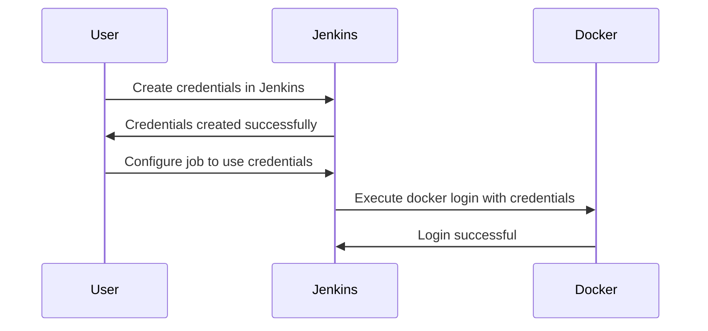

## Attaching Docker Volumes to Jenkins Container

In this section, we will delve into the process of attaching Docker volumes to a Jenkins container, focusing on the management and utilization of credentials within Jenkins. This involves understanding how to configure Jenkins to use credentials stored in a secure manner, and then leveraging these credentials in Docker commands.

### Background Theory

Jenkins is a widely-used open-source automation server that provides continuous integration and continuous delivery (CI/CD) services. One of the key features of Jenkins is its ability to securely store and manage credentials, which are essential for various tasks such as logging into Docker registries, accessing remote servers, and more.

Docker volumes provide a way to persist data outside of the container's lifecycle. This is particularly useful for Jenkins, which often needs to store build artifacts, logs, and other important data that should not be lost when the container is stopped or restarted.

### Configuring Credentials in Jenkins

To securely manage credentials in Jenkins, you can use the **Credentials Plugin**. This plugin allows you to store sensitive information like usernames, passwords, SSH keys, and other secrets in a secure manner. These credentials can then be referenced in your Jenkins jobs and pipelines.

#### Creating Credentials

1. **Navigate to Credentials Management:**
   - Go to `Manage Jenkins` > `Manage Credentials`.
   - Click on `Global credentials (unrestricted)`.

2. **Add New Credentials:**
   - Click on `Add Credentials`.
   - Select the type of credential you want to create (e.g., Username with password).

3. **Fill in the Details:**
   - Enter the username and password.
   - Provide an ID and description for the credential.
   - Click `OK`.

### Using Credentials in Jenkins Jobs

Once you have created the credentials, you can use them in your Jenkins jobs. This involves configuring the job to reference the credentials and using them in commands like `docker login`.

#### Configuring Job to Use Credentials

1. **Open Your Jenkins Job:**
   - Go to the job configuration page.

2. **Add Credential Binding:**
   - Scroll down to the `Build Environment` section.
   - Check `Use secret text(s) or file(s)`.

3. **Configure Bindings:**
   - Click on `Add` to add a new binding.
   - Choose the type of binding (e.g., `Username and password`).
   - Select the credential you created.
   - Define the environment variable names for the username and password.



### Example: Docker Login Command

Let’s walk through an example of how to use the credentials in a `docker login` command.

#### Step-by-Step Configuration

1. **Create Credentials:**
   - Go to `Manage Jenkins` > `Manage Credentials`.
   - Add a new `Username with password` credential.
   - Fill in the username and password for Docker Hub.

2. **Configure Job:**
   - Open your Jenkins job configuration.
   - Under `Build Environment`, check `Use secret text(s) or file(s)`.
   - Add a new binding for `Username and password`.
   - Select the Docker Hub credentials.
   - Set the environment variable names (e.g., `DOCKER_USERNAME` and `DOCKER_PASSWORD`).

3. **Execute Docker Login:**
   - In the build steps, add a shell script step.
   - Use the following command:

```bash
docker login -u $DOCKER_USERNAME -p $DOCKER_PASSWORD
```

### Full Example with Raw HTTP Messages

When executing the `docker login` command, Jenkins sends a request to the Docker registry. Here is a detailed breakdown of the HTTP messages involved:

#### HTTP Request

```http
POST /v2/users/login HTTP/1.1
Host: index.docker.io
Content-Type: application/json
Authorization: Basic <base64_encoded_username_password>

{
  "username": "<DOCKER_USERNAME>",
  "password": "<DOCKER_PASSWORD>"
}
```

#### HTTP Response

```http
HTTP/1.1 200 OK
Content-Type: application/json

{
  "token": "<JWT_token>",
  "access_token": "<access_token>",
  "expires_in": 3600,
  "issued_at": "2023-10-01T12:00:00Z"
}
```

### Pitfalls and Common Mistakes

1. **Incorrect Credential References:**
   - Ensure that the environment variable names match exactly with those defined in the job configuration.

2. **Security Risks:**
   - Avoid hardcoding credentials directly in scripts or configurations. Always use Jenkins’ built-in credential management.

3. **Permissions Issues:**
   - Ensure that the Jenkins user has the necessary permissions to read the credentials from the Jenkins master.

### How to Prevent / Defend

#### Detection

- **Audit Logs:** Regularly review Jenkins audit logs to detect unauthorized access attempts.
- **Credential Scanning:** Use tools like TruffleHog to scan repositories for hardcoded credentials.

#### Prevention

- **Secure Storage:** Store credentials securely using Jenkins’ built-in credential management.
- **Least Privilege Principle:** Grant minimal necessary permissions to Jenkins users and jobs.

#### Secure Coding Fixes

**Vulnerable Code:**

```bash
docker login -u myuser -p mypass
```

**Fixed Code:**

```bash
docker login -u $DOCKER_USERNAME -p $DOCKER_PASSWORD
```

### Real-World Examples

#### Recent Breaches

- **CVE-2021-25282:** A vulnerability in Jenkins allowed attackers to execute arbitrary code by manipulating the Jenkinsfile. Ensure that Jenkins is updated to the latest version and that plugins are kept up-to-date.

#### Real-World Usage

- **PortSwigger Web Security Academy:** Offers hands-on labs to practice securing Jenkins and Docker environments.
- **OWASP Juice Shop:** Provides a vulnerable web application that includes Jenkins and Docker usage scenarios.

### Conclusion

Attaching Docker volumes to a Jenkins container and managing credentials securely is crucial for maintaining the integrity and security of your CI/CD pipeline. By following the steps outlined above and adhering to best practices, you can ensure that your Jenkins environment remains robust and secure.

### Practice Labs

- **PortSwigger Web Security Academy:** Offers hands-on labs to practice securing Jenkins and Docker environments.
- **OWASP Juice Shop:** Provides a vulnerable web application that includes Jenkins and Docker usage scenarios.

By thoroughly understanding and implementing these concepts, you will be well-equipped to handle complex DevOps scenarios involving Jenkins and Docker.

---
<!-- nav -->
[[03-Introduction to Jenkins and Docker Integration|Introduction to Jenkins and Docker Integration]] | [[DevOps/DevOps Bootcamp/06-CI CD & Build Tools/05-Attaching Docker Volumes To Jenkins Container/00-Overview|Overview]] | [[05-Configuring Jenkins to Push Docker Images to a Private Registry|Configuring Jenkins to Push Docker Images to a Private Registry]]
