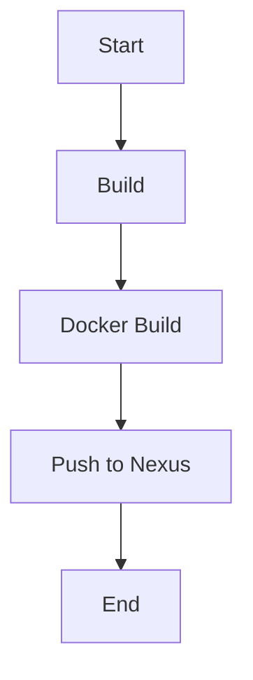

## Configuring Jenkins to Push Docker Images to a Private Registry

### Background Theory

In modern DevOps practices, continuous integration and deployment (CI/CD) pipelines often involve building and pushing Docker images to a private registry such as Nexus. This allows teams to maintain control over their artifacts and ensures that only authorized builds are deployed. In this section, we will cover the steps required to configure Jenkins to push Docker images to a Nexus repository, including setting up necessary permissions and credentials.

### Reconfiguring Docker to Allow Access to Nexus

Before configuring Jenkins, we need to ensure that Docker is properly configured to access the Nexus repository. This involves marking the Nexus repository as an insecure registry and adjusting Docker's permissions.

#### Marking Nexus as an Insecure Registry

By default, Docker requires secure connections (HTTPS) to registries. However, in many development environments, the Nexus repository might not have a valid SSL certificate. Therefore, we need to mark the Nexus repository as an insecure registry.

1. **Edit Docker Configuration**:
    - Open the Docker daemon configuration file (`/etc/docker/daemon.json`).
    - Add the following entry to specify the Nexus repository as an insecure registry:

    ```json
    {
      "insecure-registries" : ["<Nexus_IP>:<Port>"]
    }
    ```

    Replace `<Nexus_IP>` and `<Port>` with the actual IP address and port of your Nexus repository.

2. **Restart Docker Service**:
    - After updating the configuration, restart the Docker service to apply the changes:

    ```bash
    sudo systemctl restart docker
    ```

#### Adjusting Docker Socket Permissions

To allow Jenkins to interact with Docker, we need to adjust the permissions of the Docker socket file (`/var/run/docker.sock`). This allows Jenkins to execute Docker commands.

1. **Change Ownership**:
    - Change the ownership of the Docker socket file to the Jenkins user:

    ```bash
    sudo chown jenkins:jenkins /var/run/docker.sock
    ```

2. **Set Appropriate Permissions**:
    - Set the appropriate permissions to allow read/write access:

    ```bash
    sudo chmod 660 /var/run/docker.sock
    ```

### Configuring Jenkins to Push to Nexus Repository

Now that Docker is configured to access the Nexus repository, we can proceed to configure Jenkins to push Docker images to this repository.

#### Creating Credentials for Nexus

Jenkins needs credentials to authenticate with the Nexus repository. These credentials are used during the build process to push Docker images.

1. **Manage Jenkins Credentials**:
    - Navigate to `Manage Jenkins` > `Manage Credentials`.
    - Click on `Global credentials (unrestricted)`.

2. **Add New Credentials**:
    - Click on `Add Credentials`.
    - Select `Username with password` as the credential type.
    - Enter the username and password for the Nexus repository.
    - Provide a meaningful ID and description, such as `nexus-docker-repo`.

#### Configuring the Jenkins Job

Next, we need to modify the Jenkins job to use the newly created credentials and push the Docker images to the Nexus repository.

1. **Edit Jenkins Job**:
    - Navigate to the Jenkins job that builds and pushes Docker images.
    - Click on `Configure`.

2. **Modify Build Steps**:
    - Locate the build step that tags and pushes the Docker image.
    - Update the repository name to use the Nexus repository URL.

    ```bash
    docker tag <image_name> <Nexus_IP>:<Port>/<image_name>
    docker push <Nexus_IP>:<Port>/<image_name>
    ```

3. **Use Nexus Credentials**:
    - Ensure that the build step uses the credentials created for the Nexus repository.

### Example Jenkinsfile

Here is an example of a Jenkinsfile that demonstrates the configuration:

```groovy
pipeline {
    agent any

    environment {
        DOCKER_IMAGE_NAME = 'my-java-app'
        NEXUS_URL = '<Nexus_IP>:<Port>'
    }

    stages {
        stage('Build') {
            steps {
                sh 'mvn clean package'
            }
        }

        stage('Docker Build') {
            steps {
                script {
                    def dockerImage = docker.build("${env.NEXUS_URL}/${env.DOCKER_IMAGE_NAME}")
                }
            }
        }

        stage('Push to Nexus') {
            steps {
                withCredentials([usernamePassword(credentialsId: 'nexus-docker-repo', usernameVariable: 'USERNAME', passwordVariable: 'PASSWORD')]) {
                    sh """
                        echo $PASSWORD | docker login -u $USERNAME --password-stdin ${env.NEXUS_URL}
                        docker tag ${env.DOCKER_IMAGE_NAME} ${env.NEXUS_URL}/${env.DOCKER_IMAGE_NAME}
                        docker push ${env.NNEXUS_URL}/${env.DOCKER_IMAGE_NAME}
                    """
                }
            }
        }
    }
}
```

### Diagram: Jenkins Pipeline Flow



### Common Pitfalls and How to Prevent Them

#### Incorrect Docker Configuration

**Issue**: If Docker is not correctly configured to access the Nexus repository, Jenkins may fail to push the Docker images.

**Prevention**:
- Ensure the Nexus repository is marked as an insecure registry in the Docker daemon configuration.
- Restart the Docker service after making changes to the configuration.

#### Insufficient Permissions

**Issue**: Jenkins may lack the necessary permissions to interact with the Docker socket.

**Prevention**:
- Change the ownership of `/var/run/docker.sock` to the Jenkins user.
- Set appropriate permissions to allow read/write access.

#### Incorrect Credentials

**Issue**: Jenkins may fail to authenticate with the Nexus repository due to incorrect credentials.

**Prevention**:
- Verify that the credentials provided in Jenkins match those used to access the Nexus repository.
- Ensure the credentials are correctly stored and referenced in the Jenkins job configuration.

### Real-World Examples

#### Recent Breaches and CVEs

- **CVE-2021-21319**: This vulnerability in Docker allowed unauthorized access to the Docker daemon through the Docker API. Ensuring proper authentication and authorization mechanisms are in place helps mitigate such risks.
- **CVE-2020-15250**: This vulnerability in Nexus Repository Manager allowed unauthorized access to repositories. Using secure credentials and limiting access to only necessary users helps prevent such issues.

### How to Prevent / Defend

#### Detection

- **Logging and Monitoring**: Enable logging for both Docker and Jenkins to monitor access attempts and detect unauthorized activity.
- **Security Tools**: Use security tools like Docker Security Scanning and Jenkins Security Plugin to identify and mitigate vulnerabilities.

#### Prevention

- **Secure Configuration**: Follow best practices for securing Docker and Jenkins configurations.
- **Least Privilege Principle**: Grant only the minimum necessary permissions to users and services.
- **Regular Audits**: Conduct regular security audits to identify and address potential vulnerabilities.

#### Secure Coding Fixes

**Vulnerable Code**:
```groovy
pipeline {
    agent any

    environment {
        DOCKER_IMAGE_NAME = 'my-java-app'
        NEXUS_URL = '<Nexus_IP>:<Port>'
    }

    stages {
        stage('Build') {
            steps {
                sh 'mvn clean package'
            }
        }

        stage('Docker Build') {
            steps {
                script {
                    def dockerImage = docker.build("${env.NEXUS_URL}/${env.DOCKER_IMAGE_NAME}")
                }
            }
        }

        stage('Push to Nexus') {
            steps {
                sh """
                    docker tag ${env.DOCKER_IMAGE_NAME} ${env.NEXUS_URL}/${env.DOCKER_IMAGE_NAME}
                    docker push ${env.NEXUS_URL}/${env.DOCKER_IMAGE_NAME}
                """
            }
        }
    }
}
```

**Fixed Code**:
```groovy
pipeline {
    agent any

    environment {
        DOCKER_IMAGE_NAME = 'my-java-app'
        NEXUS_URL = '<Nexus_IP>:<Port>'
    }

    stages {
        stage('Build') {
            steps {
                sh 'mvn clean package'
            }
        }

        stage('Docker Build') {
            steps {
                script {
                    def dockerImage = docker.build("${env.NEXUS_URL}/${env.DOCKER_IMAGE_NAME}")
                }
            }
        }

        stage('Push to Nexus') {
            steps {
                withCredentials([usernamePassword(credentialsId: 'nexus-docker-repo', usernameVariable: 'USERNAME', passwordVariable: 'PASSWORD')]) {
                    sh """
                        echo $PASSWORD | docker login -u $USERNAME --password-stdin ${env.NEXUS_URL}
                        docker tag ${env.DOCKER_IMAGE_NAME} ${env.NEXUS_URL}/${env.DOCKER_IMAGE_NAME}
                        docker push ${env.NEXUS_URL}/${env.DOCKER_IMAGE_NAME}
                    """
                }
            }
        }
    }
}
```

### Practice Labs

For hands-on practice, consider the following labs:

- **PortSwigger Web Security Academy**: Offers a variety of labs related to Docker and Jenkins security.
- **OWASP Juice Shop**: Provides a vulnerable application that can be used to practice securing Docker and Jenkins setups.
- **DVWA (Damn Vulnerable Web Application)**: Useful for practicing various security concepts, including Docker and Jenkins configurations.

By following these detailed steps and best practices, you can ensure that your Jenkins jobs securely push Docker images to a private Nexus repository.

---
<!-- nav -->
[[04-Attaching Docker Volumes to Jenkins Container|Attaching Docker Volumes to Jenkins Container]] | [[DevOps/DevOps Bootcamp/06-CI CD & Build Tools/05-Attaching Docker Volumes To Jenkins Container/00-Overview|Overview]] | [[06-Understanding Docker Volumes and Jenkins Integration|Understanding Docker Volumes and Jenkins Integration]]
