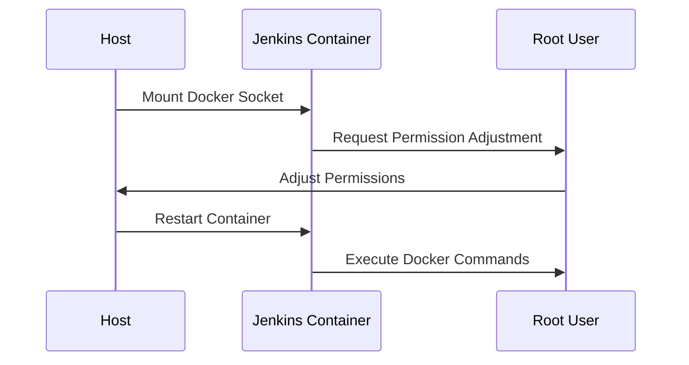

## Understanding Docker Volumes and Jenkins Integration

### Background Theory

Docker volumes provide a way to persist data outside of the lifecycle of a container. This means that even if the container is deleted, the data stored in the volume remains intact. In the context of Jenkins, which is a popular continuous integration and continuous delivery (CI/CD) tool, integrating Docker volumes can help maintain the state of builds and configurations across different runs.

### Jenkins and Docker Integration

Jenkins often needs to interact with Docker to manage and build Docker images. This interaction requires access to the Docker daemon, which is typically accessed via the Docker socket (`/var/run/docker.sock`). When Jenkins is running in a container, it needs to have access to this socket to perform Docker operations.

#### Permission Issues

When Jenkins is running inside a container, it may encounter permission issues when trying to access the Docker socket. This happens because the Jenkins user inside the container does not have the necessary permissions to access the socket mounted from the host.

### Detailed Explanation of the Problem

Let's break down the problem step-by-step:

1. **Running Jenkins in a Container**:
    - Jenkins is running inside a Docker container.
    - The Docker socket (`/var/run/docker.sock`) is mounted from the host into the container.

2. **Accessing the Docker Socket**:
    - When Jenkins tries to execute Docker commands, it needs to access the Docker socket.
    - The Jenkins user inside the container does not have the necessary permissions to access the socket.

3. **Permission Denied Error**:
    - When Jenkins attempts to execute a Docker command, it receives a `permission denied` error.
    - This error occurs because the Jenkins user does not have the required permissions on the Docker socket.

### Example Scenario

Consider the following scenario where Jenkins is running in a container and needs to access the Docker socket:

```bash
# List running containers
docker ps

# Enter the Jenkins container
docker exec -it <jenkins_container_id> /bin/bash

# Check if Docker is available
which docker

# Try to execute a Docker command
docker ps
```

If the Jenkins user does not have the necessary permissions, the output will be:

```
Got permission denied while trying to connect to the Docker daemon socket at unix:///var/run/docker.sock: Post http://%2Fvar%2Frun%2Fdocker.sock/v1.40/containers/json: dial unix /var/run/docker.sock: connect: permission denied
```

### Fixing the Permission Issue

To resolve the permission issue, you need to adjust the permissions on the Docker socket so that the Jenkins user can access it.

#### Step-by-Step Solution

1. **Identify the Jenkins User**:
    - Determine the user ID of the Jenkins user inside the container.
    - Typically, the Jenkins user is `jenkins`.

2. **Adjust Permissions on the Docker Socket**:
    - Exit the container and log in as the root user on the host.
    - Change the ownership and permissions of the Docker socket.

```bash
# Exit the container
exit

# Log in as root on the host
sudo su -

# Change ownership and permissions of the Docker socket
chown root:docker /var/run/docker.sock
chmod 660 /var/run/docker.sock
```

3. **Add Jenkins User to the Docker Group**:
    - Add the Jenkins user to the `docker` group on the host.
    - This allows the Jenkins user to access the Docker socket.

```bash
# Add Jenkins user to the docker group
usermod -aG docker jenkins
```

4. **Restart the Jenkins Container**:
    - Restart the Jenkins container to apply the changes.

```bash
# Restart the Jenkins container
docker restart <jenkins_container_id>
```

### Full Example with Code

Here is a complete example showing the steps to fix the permission issue:

```bash
# List running containers
docker ps

# Enter the Jenkins container
docker exec -it <jenkins_container_id> /bin/bash

# Check if Docker is available
which docker

# Try to execute a Docker command
docker ps

# Exit the container
exit

# Log in as root on the host
sudo su -

# Change ownership and permissions of the Docker socket
chown root:docker /var/run/docker.sock
chmod 660 /var/run/docker.sock

# Add Jenkins user to the docker group
usermod -aG docker jenkins

# Restart the Jenkins container
docker restart <jenkins_container_id>

# Re-enter the Jenkins container
docker exec -it <jenkins_container_id> /bin/bash

# Verify Docker command execution
docker ps
```

### Mermaid Diagrams

#### Docker Volume Mounting Diagram

```mermaid
graph LR
A[Host] --> B[Docker Socket (/var/run/docker.sock)]
B --> C[Jenkins Container]
C --> D[Docker Command Execution]
```

#### Permission Adjustment Flow



### Pitfalls and Common Mistakes

1. **Incorrect User Permissions**:
    - Not adding the Jenkins user to the `docker` group can result in permission issues.
    - Ensure the correct user is added to the group.

2. **Socket Path Mismatch**:
    - Incorrectly mounting the Docker socket can lead to errors.
    - Verify the path and mount point are correct.

3. **Container Restart Required**:
    - For changes to take effect, the Jenkins container must be restarted.
    - Failure to restart can result in unchanged behavior.

### How to Prevent / Defend

#### Detection

- Monitor Docker logs for permission denied errors.
- Use tools like `auditd` to track file access attempts.

#### Prevention

- Ensure the Jenkins user is added to the `docker` group on the host.
- Adjust permissions on the Docker socket to allow access.

#### Secure Coding Fixes

##### Vulnerable Code

```yaml
version: '3'
services:
  jenkins:
    image: jenkins/jenkins:lts
    volumes:
      - /var/run/docker.sock:/var/run/docker.sock
```

##### Fixed Code

```yaml
version: '3'
services:
  jenkins:
    image: jenkins/jenkins:lts
    volumes:
      - /var/run/docker.sock:/var/run/docker.sock
    user: jenkins
```

#### Configuration Hardening

- Use SELinux or AppArmor to restrict container access.
- Implement network policies to limit container communication.

### Real-World Examples

#### Recent CVEs and Breaches

- **CVE-2021-44228**: A critical vulnerability in Apache Log4j allowed remote code execution. Ensuring proper permissions and monitoring can help mitigate such risks.
- **SolarWinds Supply Chain Attack**: Demonstrates the importance of securing infrastructure components like Jenkins and Docker.

### Practice Labs

For hands-on practice, consider the following labs:

- **PortSwigger Web Security Academy**: Offers exercises related to Docker and Jenkins integration.
- **OWASP Juice Shop**: Provides scenarios involving CI/CD pipelines and Docker usage.
- **DVWA**: Contains challenges related to Docker and container management.

By thoroughly understanding and implementing these concepts, you can ensure that your Jenkins setup is secure and functional.

---
<!-- nav -->
[[05-Configuring Jenkins to Push Docker Images to a Private Registry|Configuring Jenkins to Push Docker Images to a Private Registry]] | [[DevOps/DevOps Bootcamp/06-CI CD & Build Tools/05-Attaching Docker Volumes To Jenkins Container/00-Overview|Overview]] | [[DevOps/DevOps Bootcamp/06-CI CD & Build Tools/05-Attaching Docker Volumes To Jenkins Container/07-Practice Questions & Answers|Practice Questions & Answers]]
