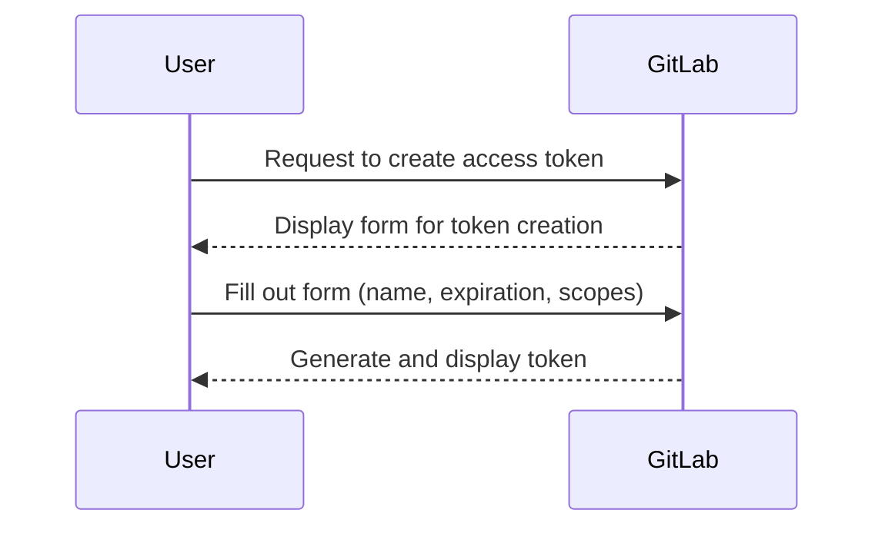
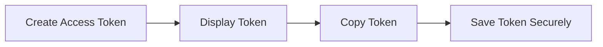

## Introduction to Access Tokens in GitLab

Access tokens are a fundamental component in modern DevOps practices, especially when integrating different services like Jenkins and GitLab. An access token is a string of characters used to authenticate a user or application to a service. In the context of GitLab, these tokens allow applications to interact with GitLab's API without needing to provide a username and password each time.

### Why Use Access Tokens?

Using access tokens instead of username and password offers several advantages:

1. **Security**: Access tokens can be scoped to specific permissions, reducing the risk of unauthorized access. They also do not expose sensitive credentials like passwords.
2. **Automation**: Access tokens are ideal for automated processes, such as continuous integration and deployment pipelines, where manual intervention is impractical.
3. **Revocation**: Access tokens can be easily revoked if compromised, unlike usernames and passwords which might require more extensive changes.

### Creating an Access Token in GitLab

To create an access token in GitLab, follow these steps:

1. **Log in to GitLab**: Ensure you are logged in to your GitLab account.
2. **Navigate to Settings**: Click on your profile picture in the upper-right corner and select `Settings`.
3. **Access Tokens Tab**: Under the `Account` section, click on `Access Tokens`.

#### Configuring the Access Token

When creating an access token, you need to specify several details:

- **Name**: A descriptive name for the token, e.g., `Jenkins`.
- **Expiration Date**: Set an expiration date for the token. This can be far in the future or a short duration depending on your use case.
- **Scopes**: Define the permissions the token will have. Scopes determine what actions the token can perform within GitLab.



### Saving the Access Token

Once the token is generated, it is displayed only once. Therefore, it is crucial to save the token immediately. Copy the token and store it securely, such as in a password manager or a secure file.



### Using the Access Token in Jenkins

To integrate Jenkins with GitLab using the access token, follow these steps:

1. **Configure Jenkins**: Navigate to the Jenkins dashboard and go to `Manage Jenkins > Configure System`.
2. **Add GitLab API Token**: Scroll down to the `Global Properties` section and add a new environment variable for the GitLab API token.
3. **Use the Token in Jenkins Jobs**: In your Jenkins jobs, reference the environment variable containing the GitLab API token.

#### Example Configuration in Jenkins

Here is an example of how to configure the GitLab API token in Jenkins:

1. **Environment Variable**:
   - Name: `GITLAB_API_TOKEN`
   - Value: `<your_access_token>`

2. **Jenkins Job Configuration**:
   - Use the environment variable in your job scripts or configurations.

```yaml
# Jenkinsfile example
pipeline {
    agent any
    environment {
        GITLAB_API_TOKEN = credentials('gitlab-api-token')
    }
    stages {
        stage('Build') {
            steps {
                script {
                    // Use the GITLAB_API_TOKEN in your build steps
                }
            }
        }
    }
}
```

### Real-World Examples and Security Implications

Recent breaches and vulnerabilities often involve misconfigured access tokens. For instance, a misconfigured access token in a public repository can lead to unauthorized access to sensitive data. Here are some real-world examples:

- **CVE-2021-22205**: This vulnerability involved a misconfigured access token in a public repository, leading to unauthorized access to sensitive data.
- **GitHub Data Breach (2020)**: Misconfigured access tokens were a significant factor in this breach, highlighting the importance of proper token management.

### How to Prevent / Defend Against Misuse of Access Tokens

#### Detection

- **Audit Logs**: Regularly review audit logs for unusual activity related to access tokens.
- **Monitoring Tools**: Use monitoring tools like GitLab's built-in monitoring features to track access token usage.

#### Prevention

- **Scoped Permissions**: Limit the scope of access tokens to the minimum necessary permissions.
- **Regular Revocation**: Regularly revoke and regenerate access tokens to minimize exposure.
- **Secure Storage**: Store access tokens securely, such as in a password manager or encrypted file.

#### Secure Coding Fixes

Here is an example of how to securely manage access tokens in a Jenkins pipeline:

```yaml
# Vulnerable Code
pipeline {
    agent any
    environment {
        GITLAB_API_TOKEN = 'your-access-token'
    }
    stages {
        stage('Build') {
            steps {
                script {
                    // Use the GITLAB_API_TOKEN in your build steps
                }
            }
        }
    }
}

# Secure Code
pipeline {
    agent any
    environment {
        GITLAB_API_TOKEN = credentials('gitlab-api-token')
    }
    stages {
        stage('Build') {
            steps {
                script {
                    // Use the GITLAB_API_TOKEN in your build steps
                }
            }
        }
    }
}
```

### Conclusion

Access tokens are a critical component in automating build triggers with Jenkins and GitLab. By understanding their creation, configuration, and usage, you can ensure secure and efficient integration between these services. Always prioritize security by limiting token scopes, regularly revoking tokens, and storing them securely.

---
<!-- nav -->
[[DevOps/DevOps Bootcamp/06-CI CD & Build Tools/06-Automating Build Triggers With Jenkins And GitLab/00-Overview|Overview]] | [[02-Introduction to Automated Build Triggers with Jenkins and GitLab|Introduction to Automated Build Triggers with Jenkins and GitLab]]
