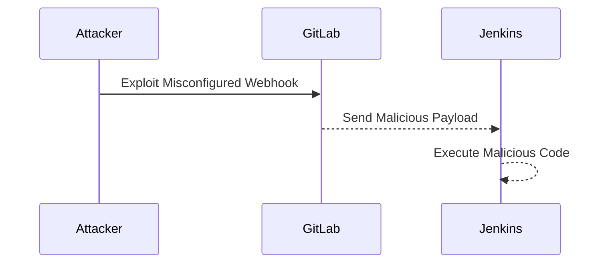

## Introduction to Automated Build Triggers with Jenkins and GitLab

In modern DevOps practices, automating the build process is crucial for maintaining efficiency and ensuring continuous integration and delivery. This chapter delves into the setup and configuration of automated build triggers using Jenkins and GitLab. We will cover the theoretical background, practical steps, potential pitfalls, and security considerations involved in setting up an automated build pipeline.

### Background Theory

#### Continuous Integration (CI)

Continuous Integration (CI) is a development practice where developers integrate their code into a shared repository several times a day. Each integration is verified by an automated build and test process. This helps catch integration issues early and reduces the time spent on debugging.

#### Continuous Delivery (CD)

Continuous Delivery (CD) extends CI by ensuring that the software can be released to production at any time. This involves automating the deployment process so that new changes can be deployed quickly and reliably.

#### Jenkins

Jenkins is an open-source automation server that provides hundreds of plugins to support building, deploying, and automating any project. It is widely used in CI/CD pipelines due to its flexibility and extensive plugin ecosystem.

#### GitLab

GitLab is a web-based DevOps lifecycle tool that provides a Git-repository manager providing wiki, issue-tracking, and CI/CD pipeline features. GitLab integrates seamlessly with Jenkins to automate the build process.

### Setting Up Automated Build Triggers

To set up automated build triggers, we need to configure both Jenkins and GitLab to communicate effectively. This involves setting up webhooks in GitLab and configuring Jenkins to listen for these webhooks.

#### Step-by-Step Configuration

1. **Create a Jenkins Job**

   First, create a Jenkins job that will perform the build and test tasks. This job can be configured to run shell scripts, execute Maven or Gradle commands, etc.

   ```mermaid
sequenceDiagram
     participant User
     participant Jenkins
     User->>Jenkins: Create New Job
     Jenkins-->>User: Job Created
```

2. **Configure GitLab Repository**

   Ensure that your GitLab repository is properly set up and contains the necessary files for the build process.

3. **Set Up Webhook in GitLab**

   A webhook is a method for augmenting or altering the behavior of an application through the use of callbacks. In GitLab, you can set up a webhook to notify Jenkins whenever a change is pushed to the repository.

   ```mermaid
sequenceDiagram
     participant User
     participant GitLab
     participant Jenkins
     User->>GitLab: Set Up Webhook
     GitLab-->>Jenkins: Notify on Push
```

   To set up a webhook in GitLab:

   - Go to your project in GitLab.
   - Navigate to `Settings` > `Webhooks`.
   - Enter the URL of your Jenkins instance (e.g., `http://jenkins.example.com/github-webhook/`).
   - Select the events you want to trigger the webhook (e.g., push events).
   - Click `Add Webhook`.

4. **Configure Jenkins to Listen for Webhooks**

   In Jenkins, you need to configure the job to listen for webhooks from GitLab.

   - Install the `GitHub Plugin` or `Generic Webhook Trigger Plugin` in Jenkins.
   - Configure the job to trigger on webhook events.

   ```mermaid
sequenceDiagram
     participant GitLab
     participant Jenkins
     GitLab-->>Jenkins: Send Webhook
     Jenkins-->>Jenkins: Trigger Build
```

### Example Configuration

Let's walk through a complete example of setting up an automated build trigger using Jenkins and GitLab.

#### GitLab Webhook Configuration

1. Go to your GitLab project.
2. Navigate to `Settings` > `Webhooks`.
3. Add a new webhook with the following details:
   - **URL**: `http://jenkins.example.com/github-webhook/`
   - **Secret Token**: (optional, but recommended for security)
   - **Events**: `Push events`

   ```mermaid
sequenceDiagram
     participant User
     participant GitLab
     User->>GitLab: Add Webhook
     GitLab-->>User: Webhook Added
```

#### Jenkins Job Configuration

1. Install the `GitHub Plugin` or `Generic Webhook Trigger Plugin` in Jenkins.
2. Create a new Jenkins job.
3. Configure the job to trigger on webhook events.

   ```yaml
   # Jenkinsfile
   pipeline {
       agent any
       triggers {
           genericTrigger(
               genericVariables: [
                   [key: 'ref', value: '$ref'],
                   [key: 'before', value: '$before'],
                   [key: 'after', value: '$after']
               ],
               genericFilterClass: 'jenkins.plugins.generic__subversion.GenericSubversionFilter',
               printContributedVariables: true,
               printPostContent: true,
               silentResponse: false
           )
       }
       stages {
           stage('Build') {
               steps {
                   sh 'mvn clean install'
               }
           }
       }
   }
   ```

### Real-World Examples and Recent Breaches

Automated build triggers are essential for maintaining a secure and efficient CI/CD pipeline. However, misconfigurations can lead to security vulnerabilities. For example, a recent breach involving a misconfigured webhook allowed attackers to inject malicious code into the build process.

#### CVE-2021-3156: Spring Framework RCE Vulnerability

The Spring Framework RCE vulnerability (CVE-2021-3156) demonstrated how a misconfigured webhook could be exploited to execute arbitrary code. This vulnerability affected applications using the Spring Framework and could be exploited if the webhook was not properly secured.



### How to Prevent / Defend

#### Secure Webhook Configuration

1. **Use Secret Tokens**: Always use secret tokens for webhooks to ensure that only authorized sources can trigger the build.
2. **Validate Webhook Payloads**: Validate the payload of incoming webhooks to ensure they come from trusted sources.
3. **Limit Webhook Events**: Only subscribe to the events that are necessary for your build process.

#### Secure Jenkins Configuration

1. **Enable CSRF Protection**: Enable Cross-Site Request Forgery (CSRF) protection in Jenkins to prevent unauthorized access.
2. **Use Strong Authentication**: Use strong authentication mechanisms such as OAuth or LDAP to secure Jenkins access.
3. **Regularly Update Plugins**: Keep Jenkins and its plugins up to date to mitigate known vulnerabilities.

### Complete Example

Let's put together a complete example of a secure automated build trigger setup.

#### GitLab Webhook Configuration

1. Go to your GitLab project.
2. Navigate to `Settings` > `Webhooks`.
3. Add a new webhook with the following details:
   - **URL**: `http://jenkins.example.com/github-webhook/`
   - **Secret Token**: `mysecrettoken`
   - **Events**: `Push events`

   ```mermaid
sequenceDiagram
     participant User
     participant GitLab
     User->>GitLab: Add Webhook
     GitLab-->>User: Webhook Added
```

#### Jenkins Job Configuration

1. Install the `GitHub Plugin` or `Generic Webhook Trigger Plugin` in Jenkins.
2. Create a new Jenkins job.
3. Configure the job to trigger on webhook events.

   ```yaml
   # Jenkinsfile
   pipeline {
       agent any
       triggers {
           genericTrigger(
               genericVariables: [
                   [key: 'ref', value: '$ref'],
                   [key: 'before', value: '$before'],
                   [key: 'after', value: '$after']
               ],
               genericFilterClass: 'jenkins.plugins.generic__subversion.GenericSubversionFilter',
               printContributedVariables: true,
               printPostContent: true,
               silentResponse: false
           )
       }
       stages {
           stage('Build') {
               steps {
                   sh 'mvn clean install'
               }
           }
       }
   }
   ```

### Common Pitfalls and Detection

#### Common Pitfalls

1. **Misconfigured Webhooks**: Ensure that webhooks are properly configured with secret tokens and limited event subscriptions.
2. **Unsecured Jenkins Access**: Ensure that Jenkins is secured with strong authentication mechanisms and CSRF protection.
3. **Outdated Plugins**: Regularly update Jenkins and its plugins to mitigate known vulnerabilities.

#### Detection

1. **Monitor Webhook Activity**: Monitor webhook activity to detect any unauthorized access attempts.
2. **Audit Jenkins Logs**: Regularly audit Jenkins logs to identify any suspicious activity.
3. **Use Security Tools**: Use security tools such as SonarQube or Fortify to scan Jenkins configurations and plugins for vulnerabilities.

### Hands-On Labs

For hands-on practice, consider the following labs:

- **PortSwigger Web Security Academy**: Offers a comprehensive set of labs covering various aspects of web security, including CI/CD pipelines.
- **OWASP Juice Shop**: A deliberately insecure web application for security training.
- **DVWA (Damn Vulnerable Web Application)**: A PHP/MySQL web application that is riddled with vulnerabilities for educational purposes.
- **WebGoat**: An interactive, gamified training application for learning about web application security.

These labs provide practical experience in setting up and securing automated build triggers using Jenkins and GitLab.

### Conclusion

Automating build triggers with Jenkins and GitLab is a critical aspect of modern DevOps practices. By following the steps outlined in this chapter, you can set up a secure and efficient CI/CD pipeline. Remember to regularly monitor and audit your configurations to ensure ongoing security and reliability.

---
<!-- nav -->
[[01-Introduction to Access Tokens in GitLab|Introduction to Access Tokens in GitLab]] | [[DevOps/DevOps Bootcamp/06-CI CD & Build Tools/06-Automating Build Triggers With Jenkins And GitLab/00-Overview|Overview]] | [[03-Introduction to Automating Build Triggers with Jenkins and GitLab|Introduction to Automating Build Triggers with Jenkins and GitLab]]
