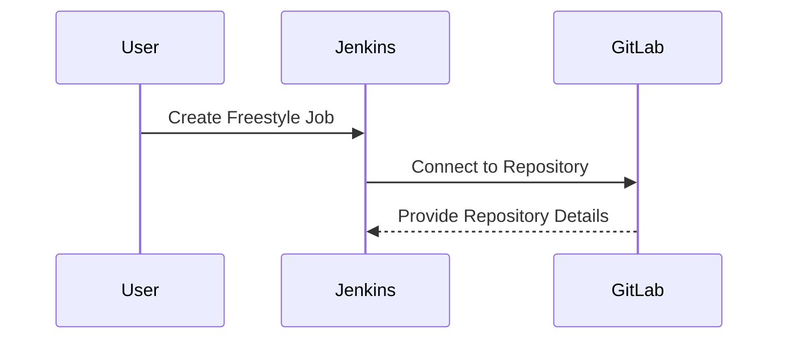
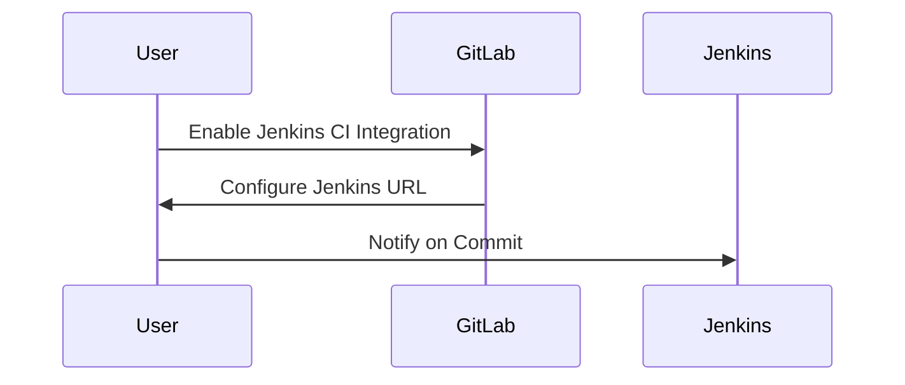
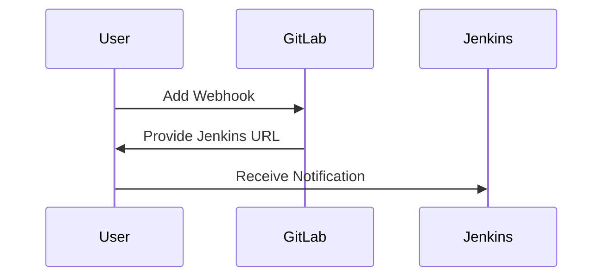

## Introduction to Automating Build Triggers with Jenkins and GitLab

Automating build triggers is a fundamental aspect of continuous integration (CI) and continuous delivery (CD) pipelines. This process ensures that code changes are tested and validated automatically, reducing the likelihood of human error and speeding up the development cycle. In this section, we will delve into how to set up automated build triggers using Jenkins and GitLab.

### Background Theory

Continuous Integration (CI) is a practice where developers integrate their work frequently, ideally several times a day, and each integration is verified by an automated build and test process. Continuous Delivery (CD) extends CI by ensuring that the software can be released to production at any time. Automated build triggers play a crucial role in both CI and CD by automating the process of building and testing code whenever changes are pushed to the repository.

### Jenkins and GitLab Integration

Jenkins is a popular open-source automation server used for continuous integration and continuous delivery. GitLab, on the other hand, is a web-based Git-repository manager that provides a wide range of features for project management, issue tracking, and CI/CD pipelines.

#### Setting Up Jenkins

To set up Jenkins, you need to install it on your server. Jenkins can be installed via package managers like `apt` for Debian-based systems or `yum` for Red Hat-based systems. Here’s a basic installation process:

```bash
# Update package lists
sudo apt update

# Install Jenkins
wget -q -O - https://pkg.jenkins.io/debian/jenkins.io.key | sudo apt-key add -
sudo sh -c 'echo deb http://pkg.jenkins.io/debian-stable binary/ > /etc/apt/sources.list.d/jenkins.list'
sudo apt update
sudo apt install jenkins
```

Once installed, Jenkins runs as a service. You can start it using:

```bash
sudo systemctl start jenkins
```

And ensure it starts on boot:

```bash
sudo systemctl enable jenkins
```

#### Setting Up GitLab

GitLab can be installed on-premises or hosted on a cloud provider. For simplicity, let's assume you have a GitLab instance running. You can create a new project and set up the necessary configurations.

### Configuring Jenkins Pipeline

In Jenkins, you can create a pipeline job to automate the build process. A pipeline job allows you to define a series of steps that are executed sequentially or in parallel.

#### Creating a Freestyle Job

First, let's create a freestyle job in Jenkins to understand the basics. Navigate to Jenkins dashboard and click on "New Item". Choose "Freestyle project" and provide a name for the job.

Next, configure the source code management section to connect to your GitLab repository. You need to set up a GitLab connection in Jenkins using the GitLab Plugin.



#### Configuring GitLab Integration

To configure GitLab to notify Jenkins about commits, you need to set up an integration in GitLab. Navigate to your project settings and find the "Integrations" section. Enable the "Jenkins CI" integration and configure it to send notifications to Jenkins.

Here’s how you can configure the integration:

1. **Enable the Integration**: Click on the "Jenkins CI" integration and enable it.
2. **Configure the Connection**: Provide the Jenkins URL, including the port. This URL should point to your Jenkins instance.



### Configuring GitLab to Send Notifications

In GitLab, you can configure the integration to send notifications to Jenkins whenever a commit is pushed. This is done through the "Webhooks" feature in GitLab.

#### Setting Up Webhooks

Navigate to your project settings and find the "Webhooks" section. Add a new webhook and provide the Jenkins URL where you want GitLab to send the notifications.



### Example Configuration

Here’s a complete example of setting up the integration between GitLab and Jenkins:

#### Jenkins Configuration

1. **Install GitLab Plugin**: Ensure the GitLab Plugin is installed in Jenkins.
2. **Create a Pipeline Job**: Create a new pipeline job and configure the source code management section to connect to your GitLab repository.
3. **Configure Build Triggers**: Set up build triggers to automatically trigger builds when changes are pushed to the repository.

```yaml
pipeline {
    agent any
    stages {
        stage('Build') {
            steps {
                git url: 'https://gitlab.com/your/repo.git', credentialsId: 'your-credentials-id'
                sh 'make build'
            }
        }
        stage('Test') {
            steps {
                sh 'make test'
            }
        }
    }
}
```

#### GitLab Configuration

1. **Enable Jenkins CI Integration**: Navigate to your project settings and enable the Jenkins CI integration.
2. **Configure Webhook**: Add a new webhook and provide the Jenkins URL.

```json
{
  "url": "http://jenkins-url:port",
  "push_events": true,
  "merge_requests_events": false
}
```

### Common Pitfalls and How to Prevent Them

#### Pitfall 1: Incorrect Jenkins URL

**Problem**: If the Jenkins URL provided in GitLab is incorrect, GitLab won’t be able to notify Jenkins about the commit.

**Prevention**: Double-check the Jenkins URL and ensure it includes the correct port number.

#### Pitfall 2: Missing Credentials

**Problem**: If the necessary credentials are missing in Jenkins, the pipeline job won’t be able to access the GitLab repository.

**Prevention**: Ensure that the necessary credentials are added in Jenkins and referenced correctly in the pipeline configuration.

### Real-World Examples

#### Recent Breach Example

A recent breach involved a misconfigured GitLab webhook that allowed unauthorized access to a Jenkins instance. This highlights the importance of securing your CI/CD pipelines.

**Example**: CVE-2021-22205 - This vulnerability in Jenkins allowed remote code execution due to insecure configurations.

### Secure Coding Practices

#### Vulnerable Code

```yaml
pipeline {
    agent any
    stages {
        stage('Build') {
            steps {
                git url: 'https://gitlab.com/your/repo.git'
                sh 'make build'
            }
        }
    }
}
```

#### Secure Code

```yaml
pipeline {
    agent any
    stages {
        stage('Build') {
            steps {
                git url: 'https://gitlab.com/your/repo.git', credentialsId: 'your-credentials-id'
                sh 'make build'
            }
        }
    }
}
```

### Conclusion

Automating build triggers with Jenkins and GitLab is a powerful way to streamline your CI/CD pipeline. By following the steps outlined above, you can ensure that your code changes are tested and validated automatically, reducing the likelihood of errors and speeding up the development cycle.

### Hands-On Labs

For hands-on practice, consider the following labs:

- **PortSwigger Web Security Academy**: Offers practical exercises for web application security.
- **OWASP Juice Shop**: A deliberately insecure web application for security training.
- **DVWA (Damn Vulnerable Web Application)**: A PHP/MySQL web application that is riddled with vulnerabilities.

These labs provide real-world scenarios to practice and reinforce the concepts learned in this chapter.

---
<!-- nav -->
[[02-Introduction to Automated Build Triggers with Jenkins and GitLab|Introduction to Automated Build Triggers with Jenkins and GitLab]] | [[DevOps/DevOps Bootcamp/06-CI CD & Build Tools/06-Automating Build Triggers With Jenkins And GitLab/00-Overview|Overview]] | [[04-Introduction to Build Triggers in Jenkins|Introduction to Build Triggers in Jenkins]]
