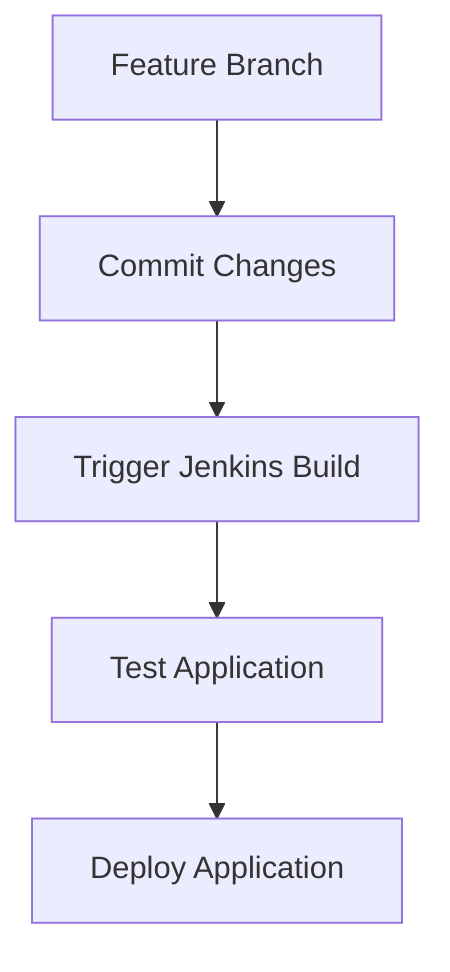
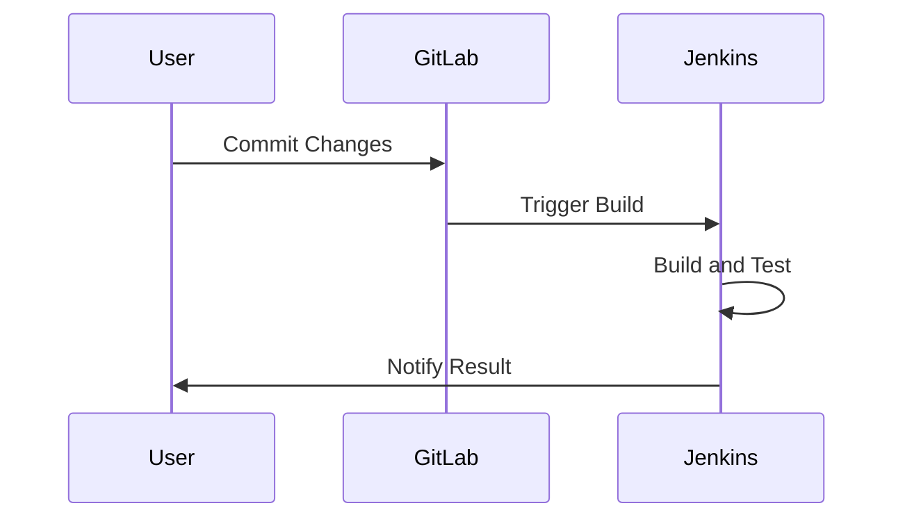

## Introduction to Build Triggers with Jenkins and GitLab

In modern DevOps practices, continuous integration (CI) and continuous delivery (CD) are essential components for ensuring that software is built, tested, and deployed efficiently and reliably. One key aspect of CI/CD is automating build triggers, which ensures that builds are initiated automatically whenever changes are made to the codebase. In this section, we will explore how to automate build triggers using Jenkins and GitLab, focusing on both regular pipelines and multi-branch pipelines.

### Background Theory

#### Continuous Integration (CI)

Continuous Integration (CI) is a development practice where developers integrate their code into a shared repository frequently, usually several times a day. Each integration is verified by an automated build process that includes testing to detect integration errors as quickly as possible. The main benefits of CI include:

- **Early Detection of Bugs**: By integrating and testing code frequently, bugs are detected and fixed earlier in the development cycle.
- **Reduced Integration Problems**: Frequent integration reduces the risk of large integration problems that can occur when developers merge their code infrequently.
- **Improved Code Quality**: Automated tests ensure that the codebase remains stable and high-quality.

#### Continuous Delivery (CD)

Continuous Delivery (CD) extends CI by ensuring that the software can be released to production at any time. This means that the software is always in a deployable state, and the deployment process is automated. CD helps teams to:

- **Shorten Time to Market**: By automating the release process, teams can deliver new features and bug fixes more quickly.
- **Reduce Deployment Risks**: Automated testing and deployment processes reduce the risk of human error during deployments.
- **Improve Customer Satisfaction**: Faster and more reliable releases lead to higher customer satisfaction.

### Jenkins and GitLab Integration

Jenkins is a popular open-source automation server that provides extensive support for building, testing, and deploying software. GitLab is a web-based Git-repository manager that offers a wide range of features for project management, issue tracking, and CI/CD.

Integrating Jenkins with GitLab allows you to leverage the strengths of both tools. GitLab provides a robust platform for managing your code repositories and CI/CD pipelines, while Jenkins offers powerful automation capabilities for building and testing your code.

### Configuring Build Triggers in Jenkins

To configure build triggers in Jenkins, you need to set up a Jenkinsfile that defines the steps of your CI/CD pipeline. The Jenkinsfile is a script written in Groovy that specifies the stages of your pipeline, such as building, testing, and deploying your code.

#### Example Jenkinsfile

```groovy
pipeline {
    agent any

    stages {
        stage('Build') {
            steps {
                echo 'Building...'
                sh 'make'
            }
        }
        stage('Test') {
            steps {
                echo 'Testing...'
                sh 'make test'
            }
        }
        stage('Deploy') {
            steps {
                echo 'Deploying...'
                sh 'make deploy'
            }
        }
    }
}
```

This Jenkinsfile defines three stages: `Build`, `Test`, and `Deploy`. Each stage contains a set of steps that are executed in sequence. The `sh` step runs shell commands to perform the actual build, test, and deploy operations.

#### Setting Up Feature Branches

In the given transcript, the lecturer mentions configuring a feature branch called `feature payment`. To set up a feature branch in Jenkins, you need to define a branch-specific Jenkinsfile that is triggered when changes are made to the feature branch.

##### Example Feature Branch Jenkinsfile

```groovy
pipeline {
    agent any

    environment {
        BRANCH_NAME = 'feature payment'
    }

    stages {
        stage('Build') {
            steps {
                echo "Building ${BRANCH_NAME}..."
                sh 'make'
            }
        }
        stage('Test') {
            steps {
                echo "Testing ${BRANCH_NAME}..."
                sh 'make test'
            }
        }
    }
}
```

In this example, the `environment` block sets the `BRANCH_NAME` variable to `feature payment`. The `Build` and `Test` stages use this variable to indicate which branch is being built and tested.

#### Triggering Builds Automatically

To trigger builds automatically when changes are made to the feature branch, you need to configure Jenkins to listen for webhook events from GitLab. A webhook is a user-defined HTTP callback that is triggered by specific events, such as pushing code to a repository.

##### Configuring Webhooks in GitLab

1. **Navigate to Project Settings**: Go to the settings of your GitLab project.
2. **Webhooks Section**: Navigate to the "Webhooks" section.
3. **Add New Webhook**: Click on "Add webhook".
4. **Configure Webhook**:
   - **URL**: Enter the URL of your Jenkins instance, followed by `/project/<project_name>/gitlab-webhook/`.
   - **Secret Token**: Optionally, provide a secret token for authentication.
   - **Trigger**: Select the events that should trigger the webhook, such as "Push events".

##### Example Webhook Configuration

```json
{
  "url": "http://jenkins.example.com/project/my-project/gitlab-webhook/",
  "secret_token": "my-secret-token",
  "push_events": true,
  "tag_push_events": false,
  "merge_requests_events": false,
  "note_events": false,
  "job_events": false,
  "pipeline_events": false,
  "wiki_page_events": false
}
```

By configuring the webhook, GitLab will send a POST request to the specified URL whenever a push event occurs on the feature branch. Jenkins will then trigger the corresponding pipeline based on the Jenkinsfile defined for the branch.

### Multi-Branch Pipelines

Multi-branch pipelines allow you to manage multiple branches of your codebase within a single Jenkins job. This is particularly useful for managing feature branches, release branches, and other types of branches that may exist in your repository.

#### Configuring Multi-Branch Pipelines

To configure a multi-branch pipeline in Jenkins, you need to create a new job of type "Multibranch Pipeline". This job will scan your GitLab repository for branches and automatically create jobs for each branch that matches a specified pattern.

##### Steps to Configure Multi-Branch Pipeline

1. **Create New Job**: Go to the Jenkins dashboard and click on "New Item".
2. **Enter Job Name**: Provide a name for your job, such as "MyProject-MultiBranch".
3. **Select Multibranch Pipeline**: Choose "Multibranch Pipeline" and click "OK".
4. **Source Code Management**: Under "Branch Sources", select "Git" and enter the URL of your GitLab repository.
5. **Credentials**: Provide the credentials required to access your GitLab repository.
6. **Scan Repository**: Click on "Scan Multibranch Pipeline Now" to start scanning your repository for branches.

##### Example Multi-Branch Pipeline Configuration

```yaml
scm:
  git:
    remote: https://gitlab.example.com/my-project.git
    credentialsId: my-gitlab-credentials
    branches:
      - spec: '**'
```

In this example, the `spec: '**'` pattern matches all branches in the repository. You can customize this pattern to match specific branches, such as `feature/*` for feature branches.

#### Limitations of Multi-Branch Pipelines

The lecturer mentions that the multi-branch pipeline configuration does not work the same way as the regular pipeline. Specifically, the GitLab connection is not configured in the multi-branch pipeline, leading to issues with triggering builds automatically.

##### Why This Happens

The older version of the Jenkins GitLab plugin supported multi-branch pipelines, but this functionality has been deprecated in recent versions. As a result, you need to configure the GitLab connection separately for each branch in the multi-branch pipeline.

##### How to Fix It

To fix this issue, you need to manually configure the GitLab connection for each branch in the multi-branch pipeline. This can be done by editing the configuration of each branch job and setting the GitLab connection.

##### Example Configuration

```yaml
scm:
  git:
    remote: https://gitlab.example.com/my-project.git
    credentialsId: my-gitlab-credentials
    branches:
      - spec: 'feature/*'
        configurationScript: |
          properties([
            [$class: 'GitLabConnectionProperty', gitLabConnectionName: 'my-gitlab-connection']
          ])
```

In this example, the `configurationScript` block sets the GitLab connection for each branch that matches the `feature/*` pattern.

### Real-World Examples and Recent Breaches

#### Example: CVE-2021-22205

CVE-2021-22205 is a critical vulnerability in Jenkins that allows attackers to execute arbitrary code on the Jenkins server. This vulnerability affects Jenkins versions prior to 2.289.1 and 2.277.3.

##### Impact

If an attacker exploits this vulnerability, they can gain full control of the Jenkins server, including the ability to modify build configurations, steal sensitive information, and execute malicious code.

##### Prevention

To prevent this vulnerability, you should:

1. **Update Jenkins**: Ensure that you are running the latest version of Jenkins.
2. **Secure Credentials**: Store credentials securely using Jenkins credentials management.
3. **Limit Permissions**: Restrict permissions for users and jobs to minimize the impact of potential vulnerabilities.

##### Secure Configuration

```yaml
securityRealm:
  local:
    users:
      - id: admin
        password: encrypted-password
        fullName: Admin User
        email: admin@example.com
authzStrategy:
  globalMatrix:
    permissions:
      - permission: hudson.model.Hudson.Administer
        userIds:
          - admin
```

In this example, the `securityRealm` block configures the local user database, and the `authzStrategy` block restricts administrative permissions to the `admin` user.

### How to Prevent / Defend

#### Detecting Vulnerabilities

To detect vulnerabilities in your Jenkins and GitLab setup, you can use various tools and techniques:

1. **Static Analysis Tools**: Use static analysis tools like SonarQube to scan your code for security vulnerabilities.
2. **Dependency Scanning**: Use tools like Snyk to scan your dependencies for known vulnerabilities.
3. **Security Audits**: Regularly perform security audits of your Jenkins and GitLab configurations to identify and fix vulnerabilities.

#### Preventing Vulnerabilities

To prevent vulnerabilities, you should:

1. **Keep Software Updated**: Ensure that all software, including Jenkins and GitLab, is kept up-to-date with the latest security patches.
2. **Use Secure Configurations**: Follow best practices for securing your Jenkins and GitLab configurations, such as using strong passwords and limiting permissions.
3. **Monitor Logs**: Monitor logs for suspicious activity and set up alerts to notify you of potential security incidents.

#### Secure Coding Practices

To ensure secure coding practices, you should:

1. **Follow Best Practices**: Follow established best practices for secure coding, such as input validation and error handling.
2. **Use Secure Libraries**: Use secure libraries and frameworks that have been audited for security vulnerabilities.
3. **Code Reviews**: Perform regular code reviews to identify and fix security vulnerabilities.

### Conclusion

Automating build triggers with Jenkins and GitLab is a crucial aspect of modern DevOps practices. By setting up feature branches and multi-branch pipelines, you can ensure that your code is built, tested, and deployed efficiently and reliably. However, it is important to be aware of the limitations and vulnerabilities associated with these setups and take appropriate measures to prevent and detect security issues.

### Practice Labs

For hands-on experience with Jenkins and GitLab, consider the following practice labs:

- **PortSwigger Web Security Academy**: Offers a variety of labs for learning web security concepts, including CI/CD pipelines.
- **OWASP Juice Shop**: A deliberately insecure web application for practicing web security skills.
- **DVWA (Damn Vulnerable Web Application)**: A PHP/MySQL web application that is vulnerable by design for educational purposes.
- **WebGoat**: An interactive web application that teaches web security lessons.

These labs provide practical experience in setting up and securing CI/CD pipelines using Jenkins and GitLab.

### Diagrams

#### Mermaid Diagrams



This diagram illustrates the workflow for a feature branch in Jenkins, showing the steps involved in committing changes, triggering a build, testing the application, and deploying it.



This sequence diagram shows the interaction between the user, GitLab, and Jenkins when committing changes to a feature branch and triggering a build.

### Summary

In this section, we explored how to automate build triggers with Jenkins and GitLab, covering both regular pipelines and multi-branch pipelines. We discussed the background theory of CI/CD, the configuration of Jenkins and GitLab, and the limitations and vulnerabilities associated with these setups. We also provided real-world examples and practice labs to help you gain hands-on experience with these tools.

---
<!-- nav -->
[[04-Introduction to Build Triggers in Jenkins|Introduction to Build Triggers in Jenkins]] | [[DevOps/DevOps Bootcamp/06-CI CD & Build Tools/06-Automating Build Triggers With Jenkins And GitLab/00-Overview|Overview]] | [[06-Introduction to Continuous Integration and Continuous Delivery (CICD)|Introduction to Continuous Integration and Continuous Delivery (CICD)]]
